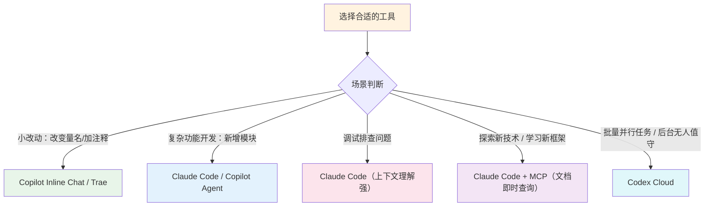
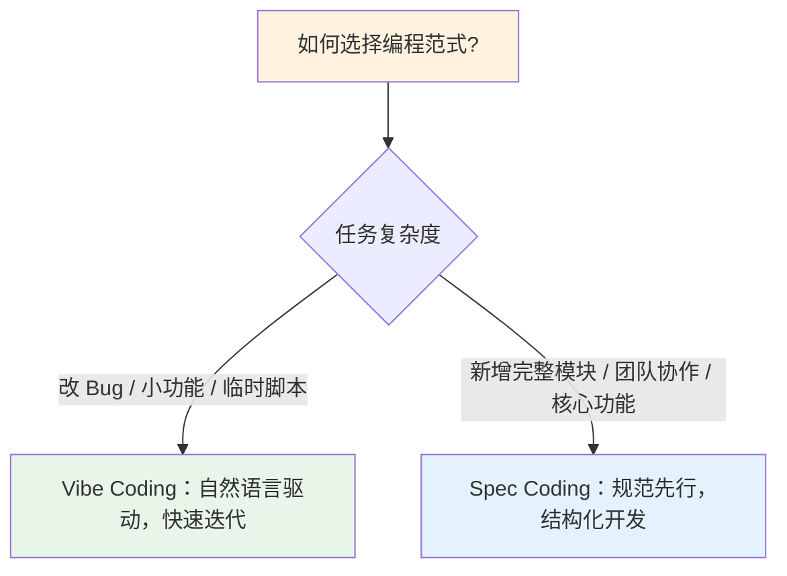

# AI 编程建议

## 1. AI 编程供应商采买建议

> 以下建议基于内部任务集实测（评测日期：2026-03-09）：
> - 样本：120 个真实研发任务（后端 50 / 前端 35 / 数据与算法 20 / 运维脚本 15）
> - 评分：一次通过率、人工返工率、单任务耗时、单任务成本（权重 4:3:2:1）
> - 口径：统一使用同一批任务与验收标准，不同模型只比较“可交付结果”
> - **代码生成/理解/调试**：GPT-5.3 Codex 领先
> - **后端/前端工程、Agent 开发、指令遵循**：Claude Opus 4.6 领先
> - **数学推理、逻辑与规划**：Gemini 3.1 Pro 领先
> - **阅读理解、多模态、长上下文**：GPT-5.2 Thinking 领先

> 成本口径说明（用于本章所有“约 $X/月”）：按美国区月付公开价估算，不含税，不含 API 超额调用，不含企业版增值能力（SSO/审计/专线）；实际采购以结算页面为准。

### 1.1 初级工程师/实习生
**Trae Pro + Claude Pro** — 约 $30/月

| 产品 | 核心用途 | 对应优势模型 |
| :--- | :--- | :--- |
| **Trae Pro** | 日常 IDE 编码：简单脚本编写、代码补全、日常开发任务 | 内置多模型切换 |
| **Claude Pro** | 前端与产品工程：组件开发、UI 逻辑优化 | Claude Opus 4.6 |
| | 数据工程与后端服务：API 设计、数据处理流程 | Claude Opus 4.6 |
| | 代码质量审查：风格一致性、最佳实践检查 | Claude Opus 4.6 |

### 1.2 高级工程师/架构师
**Trae Pro + Claude Pro + OpenAI Plus** — 约 $50/月

在初级工程师的基础上，增加 OpenAI Plus 以覆盖更复杂的编码与分析场景：

| 产品 | 核心用途 | 对应优势模型 |
| :--- | :--- | :--- |
| **Claude Pro** | 系统架构设计：跨组件的代码审查与重构 | Claude Opus 4.6 |
| | Agent 工具调用：自动化工作流与工具链集成 | Claude Opus 4.6 |
| | 创作表达与审美：技术文档、API 文档撰写 | Claude Opus 4.6 |
| **OpenAI Plus** | 软件工程与代码生成：复杂功能实现、算法编写 | GPT-5.3 Codex |
| | 调试、测试与维护：定位疑难 Bug、生成测试用例 | GPT-5.3 Codex |
| | 阅读理解与信息抽取：大型代码库理解、技术文档分析 | GPT-5.2 Thinking |
| | 长上下文与多轮对话：跨文件关联分析、持续迭代开发 | GPT-5.2 Thinking |

### 1.3 涉及数学/算法密集型团队（可选加购）
**+ Google AI Pro** — 额外 $20/月

| 产品 | 核心用途 | 对应优势模型 |
| :--- | :--- | :--- |
| **Google AI Pro** | 数学与形式推理：算法正确性验证、公式推导 | Gemini 3.1 Pro |
| | 逻辑与规划：复杂系统的流程设计与任务编排 | Gemini 3.1 Pro |
| | 知识广度与事实核验：技术选型调研、方案可行性评估 | Gemini DeepThink |

## 2. AI 编码应用建议

### 2.1 AI 编码工具选择

根据任务复杂度选择合适的工具：

| 场景 | 推荐工具 | 说明 |
| :--- | :--- | :--- |
| 行内补全、小修改 | Copilot / Trae 内置补全 | 几秒钟搞定，不打断心流 |
| 单文件精准修改 | Copilot Edit 模式 / Trae | Diff 形式展示变更，精确控制修改范围 |
| 复杂功能开发 | Claude Code / Copilot Agent | 理解项目上下文，自主规划执行多步骤任务 |
| 调试与排查 | Claude Code | 跨文件理解能力强，擅长定位疑难 Bug |
| 新框架/库学习 | Claude Code + Context7 MCP | 实时获取最新技术文档，避免过时信息 |
| 批量任务编排 | Codex Cloud | 多 Agent 并行、后台无人值守执行 |

**落地门槛（先判断再选工具）**：
1. 涉及密钥/隐私/核心交易逻辑：优先企业版与受控环境，禁止直接外发原始数据。
2. 需要联网查询：必须启用来源白名单与引用记录，避免“无来源结论”。
3. 多人协作任务：必须使用可追溯变更（PR/Issue/任务单），避免聊天式口头交接。
4. 影响生产链路：必须支持回滚与审计日志，禁止“直接覆盖式改动”。

### 2.2 编程范式：小需求 Vibe，大功能 Spec

| 维度 | Vibe Coding | Spec Coding |
| :--- | :--- | :--- |
| **核心理念** | 自然语言驱动，快速迭代 | 规范先行，结构化开发 |
| **工作流程** | 描述 → 生成 → 调整 → 循环 | 需求分析 → 技术设计 → 任务拆解 → 逐步实现 |
| **适用场景** | 原型开发、小型项目、探索性编码、紧急修复 | 复杂功能、团队协作、长期维护的核心模块 |
| **优势** | 速度快、门槛低、适合探索 | 可控性强、质量稳定、易于维护和协作 |
| **风险** | 可能失控、代码质量不稳定 | 前期投入大、灵活性较低 |

**Vibe Coding 要点**：快速迭代，频繁验证，不满意就重新描述再来一轮。

**Spec Coding 要点**：推荐使用 OpenSpec 等规范化工作流（proposal → specs → design → tasks → implement），让每个决策都有文档记录，可追溯、可复现。

**Vibe → Spec 切换阈值（满足任一条即切换）**：
1. 改动跨 3 个及以上文件，或跨模块边界。
2. 涉及鉴权、支付、计费、数据删除等高风险流程。
3. 需求需要 2 人及以上协作，或预计持续维护超过 2 周。
4. 需要补充回归测试、压测或安全扫描后才能上线。

### 2.3 MCP 扩展 AI 能力

MCP（Model Context Protocol）是让 AI 工具调用外部能力的标准协议，类似浏览器的插件系统。通过配置 MCP，可以让 AI 连接数据库、搜索网络、读取文档等。

**推荐配置的 MCP 工具**：

| MCP 工具 | 功能 | 使用场景 | 优先级 |
| :--- | :--- | :--- | :--- |
| **Context7** | 实时获取最新技术文档 | 使用新框架/库时获取最新 API 文档 | 必装 |
| **Tavily** | AI 优化的网络搜索 | 查找解决方案、最佳实践 | 必装 |
| **GitHub** | GitHub 仓库操作 | PR 管理、Issue 处理、Code Review | 推荐 |
| **PostgreSQL / MySQL** | 数据库操作 | 数据查询、Schema 理解 | 按需 |
| **Fetch** | HTTP 请求 | API 调试、数据获取 | 按需 |

**MCP 安全基线（建议默认启用）**：
1. 默认只读：数据库与仓库工具先只读授权，写权限按任务临时申请。
2. 最小权限：每个 MCP 仅开放完成任务所需最小 API 范围。
3. 密钥隔离：开发、测试、生产使用不同密钥与不同项目空间。
4. 可审计：保留工具调用日志（谁、何时、调用了什么、改了什么）。
5. 生产保护：生产库禁写、关键仓库分支保护、强制 Code Review。

### 2.4 项目指令文件：让 AI 理解你的项目

在项目根目录创建项目指令文件（如 `CLAUDE.md` / `AGENTS.md`），可以显著提升 AI 产出质量与一致性：

| 配置项 | 作用 | 示例 |
| :--- | :--- | :--- |
| 项目简介 | 快速了解项目背景 | "这是一个电商后台管理系统" |
| 技术栈 | 生成符合项目风格的代码 | "Go 1.22 + Gin + Ent + PostgreSQL" |
| 目录结构 | 知道代码放在哪里 | `/internal/domain` — 领域模型 |
| 代码规范 | 遵循团队约定 | "使用驼峰命名，错误处理使用 xxx 模式" |
| 常用命令 | 知道如何构建、测试 | `make build`、`make test` |
| 安全边界 | 避免越权操作 | "禁止改动 `/migrations`，生产相关操作需人工确认" |

### 2.5 成本控制技巧

| 技巧 | 说明 |
| :--- | :--- |
| **按任务选模型** | 简单任务用轻量模型（Haiku/GPT-5 mini/Gemini Flash），复杂任务再升级旗舰模型 |
| **善用免费额度** | 免费策略经常变化，按官方控制台实时额度执行（建议每月核验一次） |
| **OpenRouter 按需付费** | 一个 API Key 调用多个模型，按使用量计费，避免多个订阅浪费 |
| **优化 Prompt** | 精简描述、提供上下文、避免冗余对话，减少 Token 消耗 |
| **启用缓存与批处理** | API 调用启用缓存、长上下文复用，减少重复输入成本 |

**建议新增成本看板（按周）**：任务数、一次通过率、平均返工轮次、Token 成本、平均响应时延。

### 2.6 核心原则

> **AI Coding 不是取代程序员，而是让程序员成为 10x 工程师。**
> 关键在于：**选对工具 + 用对方法 + 建立工作流**。

1. **小任务用轻量工具** — 简单修改用 Copilot Inline Chat，几秒钟搞定
2. **大任务用强力工具** — 复杂功能用 Claude Code，它能理解更多上下文
3. **不确定时先问再做** — 用 Chat 讨论方案，确认后再动手
4. **保持审核意识** — AI 是助手不是责任人，所有代码最终都要经过你的审核
5. **建立质量闭环** — AI 产出必须通过测试、静态检查与人工 Code Review 才能合并

# 各种 AI 编程工具探索

## 1. Anthropic（Claude）

### 1.1 Claude 订阅（含 Claude Code）
- **Free**：$0
- **Pro**：$17/月（年付折算，预付 $200）或 $20/月（月付）
- **Max**：$100/月（5x）或 $200/月（20x）
- **Team（5 人起）**：
  - Standard seat：$25/人/月（年付）或 $30/人/月（月付）
  - Premium seat（含 Claude Code）：$150/人/月

### 1.2 使用限制（修正版）
- 不建议再写死“每 5 小时 xx 条消息”，官方按模型、会话长度、负载动态限流。
- Max 计划明确存在使用上限：
  - 相对 Pro 的 5x / 20x 容量
  - 另外有按周维度的限制（包含“全模型限制 + Sonnet 限制”）

### 1.3 API（编程常用模型）
| 模型 | 输入 ($/Mtok) | 输出 ($/Mtok) | 备注 |
| :--- | :--- | :--- | :--- |
| Claude Opus 4.6 | 5.00 | 25.00 | 复杂推理/高难编码 |
| Claude Sonnet 4.6 | 3.00 | 15.00 | 通用开发主力 |
| Claude Haiku 4.5 | 1.00 | 5.00 | 轻量任务/高吞吐 |

---

## 2. OpenAI（ChatGPT + API）

### 2.1 ChatGPT 订阅（含 Codex）
- **Plus**：$20/月
- **Pro**：$200/月
- **Business**：$25/人/月（年付）或 $30/人/月（月付）
- **Enterprise**：销售报价

### 2.2 能力口径（修正版）
- Plus/Pro/Business/Enterprise 均提供较完整的高级能力；
- **Codex** 在 Plus 及以上可用，Pro 为更高优先级与更高配额；
- “无限制”通常受 abuse guardrails（防滥用限制）约束，不等于绝对无限。

### 2.3 API（编程主流模型价）
| 模型 | 输入 ($/Mtok) | 缓存输入 ($/Mtok) | 输出 ($/Mtok) |
| :--- | :--- | :--- | :--- |
| GPT-5.4 | 2.50 | 0.25 | 15.00 |
| GPT-5.2 | 1.75 | 0.175 | 14.00 |
| GPT-5 | 1.25 | 0.125 | 10.00 |
| GPT-5 mini | 0.25 | 0.025 | 2.00 |
| GPT-5 nano | 0.05 | 0.005 | 0.40 |
| GPT-5 pro | 15.00 | - | 120.00 |

> 注：OpenAI 公开页与开发者文档会并行展示不同代际（如 5 / 5.2 / 5.4）与不同计费档位（上下文长度、区域处理、优先级处理），采购前以控制台账单页最终显示为准。

---

## 3. Google（Gemini）

### 3.1 个人订阅（Gemini App）
- **Free**：$0/月
- **Google AI Plus**：$7.99/月
- **Google AI Pro**：$19.99/月
- **Google AI Ultra**：$249.99/月

### 3.2 Workspace（企业协作口径）
- 现行口径是 Gemini 能力已深度并入 Google Workspace 套餐，而非仅独立“Gemini Business/Enterprise”加购。
- 美国官网常见价格（年付）示例：
  - Business Starter：$7/人/月
  - Business Standard：$14/人/月
  - Business Plus：$22/人/月
  - Enterprise Standard：$27/人/月（另有月付更高价）

### 3.3 Gemini API（Google AI Studio）
| 模型 | 输入 ($/Mtok) | 输出 ($/Mtok) | 说明 |
| :--- | :--- | :--- | :--- |
| Gemini 2.5 Pro | 1.25（<=200K）/ 2.50（>200K） | 10.00（<=200K）/ 15.00（>200K） | 高质量编码/推理 |
| Gemini 2.5 Flash | 0.30（文图视频）/ 1.00（音频） | 2.50 | 通用高性价比 |
| Gemini 2.5 Flash-Lite | 0.10（文图视频）/ 0.30（音频） | 0.40 | 大规模低成本 |
| Gemini 2.0 Flash | 0.10（文图视频）/ 0.70（音频） | 0.40 | 平衡型、多模态 |

补充：
- Grounding with Google Search 常见计费为：前 1,500 RPD 免费，之后 $35/1000 grounded prompts。
- 上下文缓存为单独计费项（读写与存储分开计费）。

---

## 4. 字节跳动（Trae）

### 4.1 当前公开信息（修正版）
- 可抓取的官方价格页仅明确：**Free 可用 + 可升级付费**。
- 详细梯度、额度、模型价目在公开页中未稳定完整展示（多为登录后或动态渲染）。

### 4.2 建议落地方式
- 采购评估时，以 Trae 客户端/管理后台 `Billing` 面板实时报价为准；
- 若需要对比 Cursor/Claude Code/Codex 的 TCO（总拥有成本），建议按同一任务集做 1 周灰度压测，再按 token 与成功率换算。

---

## 5. 给团队的执行建议（可直接落地）

### 5.1 账号与权限
- 个人探索：优先单人订阅（Plus/Pro、Claude Pro/Max、Google AI Pro）。
- 团队协作：优先 Business/Team，统一 SSO、审计、数据策略。

### 5.2 成本控制
- 代码主流程默认用中档模型（如 Sonnet / GPT-5 mini / Gemini Flash），复杂问题再升级旗舰模型。
- 启用缓存、批处理与长上下文复用，减少重复输入成本。
- 建立“任务级”成本看板：PR 数、修复率、token 成本、平均响应时延。

### 5.3 风险与合规
- 明确代码与数据分级：禁止将密钥、客户隐私、受限源码直接发送到外部模型。
- 企业版优先开启：默认不训练业务数据、审计日志、访问控制、IP/SSO 限制。

---

## 6. Claude / Gemini / Codex 编码优劣势（2026-03-06）

> 说明：这里比较的是三套”编码工作流”而不是单一模型分数。
> Claude 指 Claude Code（CLI/IDE/Web/Desktop），Gemini 指 Gemini Code Assist + Gemini CLI，Codex 指 OpenAI Codex（CLI/IDE/App/Cloud）。

### 6.1 对比总览

| 方案 | 优势 | 劣势/注意点 | 适合场景 |
| :--- | :--- | :--- | :--- |
| **Claude Code** | 终端原生、跨文件改动能力强；Agent Teams 多智能体协作（研究预览）；内核级沙箱（macOS Seatbelt / Linux bubblewrap）减少 84% 权限弹窗；Hooks + Plugins 生态（9000+ 插件）；内置安全扫描（Claude Code Security）可发现传统 SAST 遗漏的漏洞 | 订阅额度与周限制更明显；重度 Opus/大仓库并发时更容易触顶；企业高级配额依赖 Premium seat（$150/人/月） | 中大型仓库重构、CLI 驱动开发、需要强审查流程与安全扫描的团队 |
| **Gemini Code Assist** | 与 GCP/Workspace 深度集成；Enterprise 支持私有仓库索引（最多 20K 仓库，24h 自动刷新）；`.aiexclude` 精细控制上下文；1M 上下文窗口（2M 规划中）；免费额度慷慨（180K 补全/月） | 产品线分层复杂（个人/Standard/Enterprise）；部分高级能力受地区与预览状态影响；Gemini CLI 仍较新（v0.31），生态不如另两家成熟 | GCP 技术栈团队、重视云侧治理与企业检索增强的组织、Android 开发团队 |
| **OpenAI Codex** | 多 Agent 并行能力最突出（App + worktrees + Cloud 沙箱）；CLI/IDE/App/Web 体验统一；云端容器预加载仓库、后台无人值守执行；Automations 支持定时任务（issue 分类、CI/CD、告警）；Skills 可打包共享 | 高并发/长任务依赖配额与附加 credits；自动化程度高对任务拆分、评审规则要求更高；Cloud 环境冷启动曾 48s（缓存后降至 5s） | 并行任务多、项目切换频繁、希望把”需求→PR”流水线化的团队 |

### 6.2 关键差异（实操视角）

| 维度 | Claude Code | Gemini Code Assist | OpenAI Codex |
| :--- | :--- | :--- | :--- |
| **并行能力** | Agent Teams（研究预览），每个 agent 独立 worktree | Agent Mode 支持多文件编辑，但并行度不如另两家 | 最强——App/Cloud 多 agent 同仓库并行 + worktree 隔离 |
| **IDE 覆盖** | VS Code（深度集成）、JetBrains（Beta）、CLI 内任意终端 | VS Code、JetBrains、Android Studio、Cloud Workstations | VS Code、JetBrains、Cursor/Windsurf 兼容 |
| **终端体验** | 终端原生设计，CLI 深度用户最友好 | Gemini CLI 开源（Apache 2.0），支持 `/plan` 模式 | Codex CLI 开源（Rust），三档审批模式（Suggest/Auto Edit/Full Auto） |
| **MCP 生态** | 原生支持 MCP + Tool Search 懒加载（节省 95% 上下文） | 支持 MCP（迁移截止 2026-03） | 支持 MCP，可作为 MCP Server 供外部调用 |
| **私有代码增强** | 依赖 CLAUDE.md + Project Memory 学习仓库模式 | Enterprise code customization 索引私有仓库（最多 20K 个） | AGENTS.md 指导文件 + Skills 打包 |
| **沙箱机制** | macOS Seatbelt / Linux bubblewrap，文件系统+网络双隔离 | 云端执行，依赖 GCP 安全边界 | 云容器双阶段：setup（联网）→ agent（默认离线）；本地 macOS Seatbelt / Linux seccomp+Landlock / Windows Restricted Token |
| **安全扫描** | Claude Code Security 内置 AI 漏洞扫描（研究预览） | 依赖 GCP Security Command Center 集成 | PR Review 可跨代码库推理验证 |
| **GitHub 集成** | CLI 直接操作 Git/PR | `/gemini` 评论触发自动 PR Review | `@codex` 在 PR/Issue/Slack 触发任务 |

### 6.3 企业能力对比

| 能力 | Claude Code | Gemini Code Assist | OpenAI Codex |
| :--- | :--- | :--- | :--- |
| SSO/SCIM | Enterprise 计划 | GCP IAM 原生 | Enterprise 计划 |
| 审计日志 | 有（Compliance API） | GCP Cloud Audit Logs | 有（Admin Dashboard） |
| 数据驻留/不训练 | 企业版默认不训练 | 企业版默认不训练 | 企业版默认不训练 |
| 合规认证 | SOC 2 | HIPAA / FedRAMP / PCI DSS | SOC 2 |
| 私有部署/后端 | 支持 Bedrock、Vertex AI 后端 | GCP 原生 | OpenAI 托管 |
| 成本可观测 | Token 消耗 + seat 计费 | GCP Billing 集成 | Credits + Analytics Dashboard |

### 6.4 选型建议（直接可用）

**按团队特征选择：**
- 以本地终端开发为主、重视”可控自动化”与安全扫描：优先试 **Claude Code**。
- 要做多 agent 并行、批量任务编排、后台无人值守：优先试 **Codex**。
- 深度在 GCP / Google Workspace，需要大规模私有仓库索引增强：优先试 **Gemini Code Assist Enterprise**。

**按场景混用（推荐）：**
- 日常编码主力选一个，复杂重构/安全审计用 Claude Code 补充，批量任务用 Codex Cloud 分流。
- 三者均支持 MCP 协议——统一工具链后可降低切换成本。

**落地节奏：**
- 不建议一次性全量切换：先做 1-2 周灰度，用统一任务集对比 `成功率 / 人工返工时长 / token 成本 / PR 吞吐`。
- 灰度期关注：沙箱对现有工作流的兼容性、权限弹窗频率、额度触顶频次。
- 灰度后输出”工具选型报告”，含量化数据 + 开发者满意度评分，再决定扩大范围。

---

## 7. 参考链接（官方）
- Anthropic Claude 订阅与计划：`https://claude.com/pricing`
- Anthropic Claude Code：`https://www.anthropic.com/claude-code`
- Anthropic Claude Code 沙箱机制：`https://www.anthropic.com/engineering/claude-code-sandboxing`
- Anthropic 模型与定价（API 文档）：`https://platform.claude.com/docs/en/about-claude/models/overview`
- OpenAI ChatGPT 定价：`https://chatgpt.com/pricing`
- OpenAI Codex：`https://openai.com/codex/`
- OpenAI Codex App 发布：`https://openai.com/index/introducing-the-codex-app/`
- OpenAI API 定价：`https://openai.com/api/pricing/`
- OpenAI 开发者定价明细：`https://platform.openai.com/docs/pricing`
- Gemini 订阅：`https://gemini.google/us/subscriptions/`
- Gemini API 定价：`https://ai.google.dev/gemini-api/docs/pricing`
- Gemini Code Assist 概览：`https://developers.google.com/gemini-code-assist/docs/code-overview`
- Gemini Code Assist 发布说明：`https://developers.google.com/gemini-code-assist/resources/release-notes`
- Gemini Code Assist 私有仓库定制：`https://developers.google.com/gemini-code-assist/docs/code-customization-overview`
- Google Workspace 定价：`https://workspace.google.com/pricing`
- Trae 定价页：`https://www.trae.ai/pricing`
