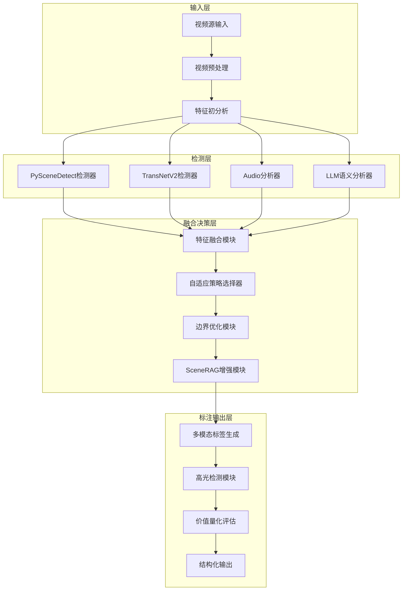
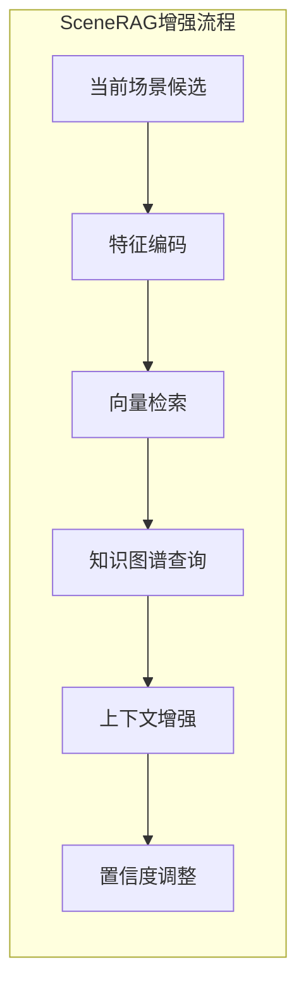
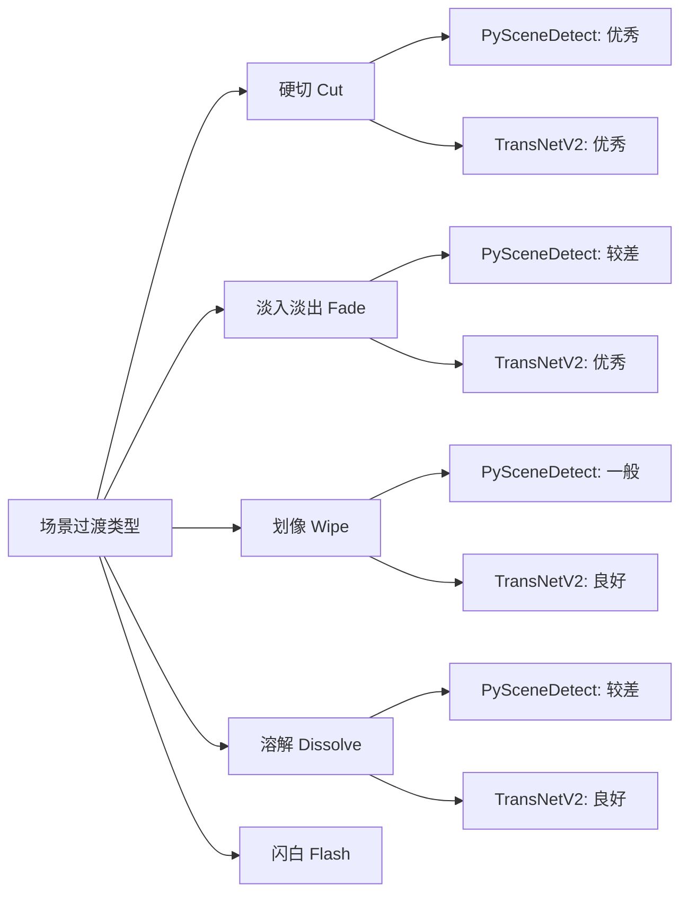
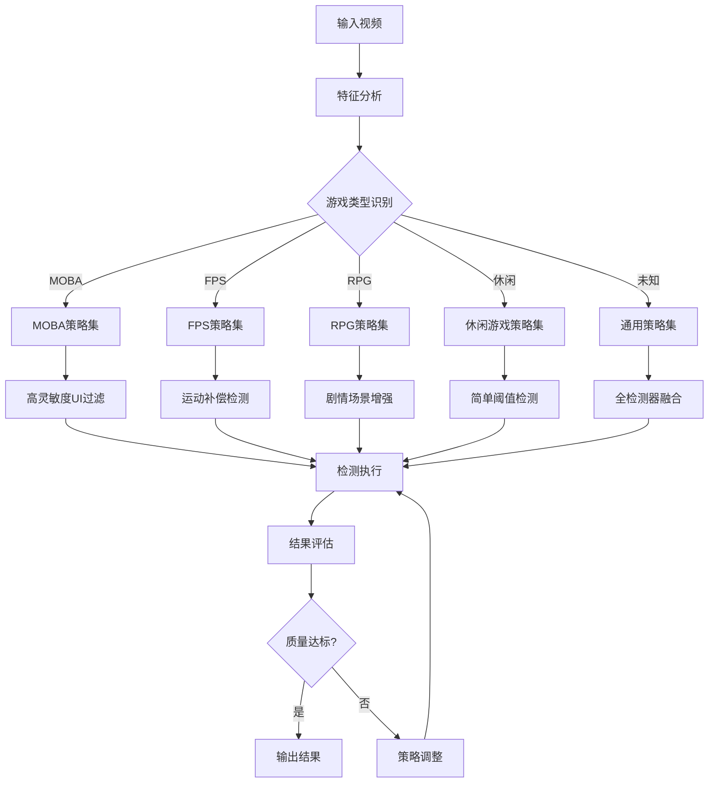
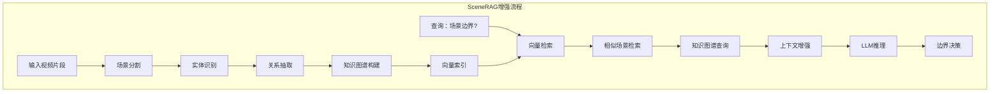
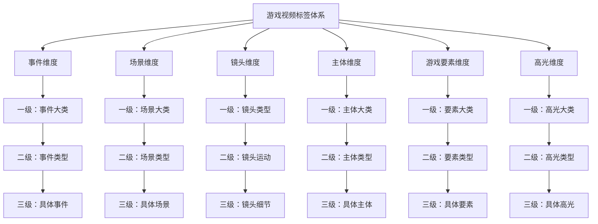
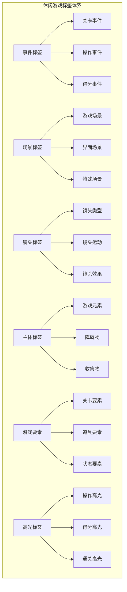
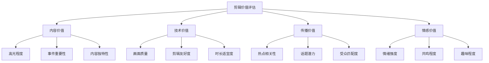

# 小游戏录屏切片智能体：自适应算法与多层级标签体系研究

本报告针对小游戏录屏切片智能体的构建，系统性地研究了两大核心挑战：自适应场景检测算法的设计与多层级标签体系的构建。通过深入分析ffmpeg、PySceneDetect、TransNetV2及大语言模型的技术特性，提出了一种多阶段自适应融合的切片架构，并结合SceneRAG的检索增强生成理念，设计了面向巨量投放游戏类型的完整1-3级标签体系。本研究为游戏视频内容的智能化处理提供了理论框架与工程实现指南。

---

## 第一章 引言与研究背景

### 1.1 研究背景

随着短视频平台与游戏直播行业的蓬勃发展，游戏视频内容的生产与消费呈现爆发式增长。在这一背景下，如何从海量游戏录屏素材中高效提取有价值片段，成为内容创作者和平台方共同关注的核心问题。传统的视频切片工作依赖人工操作，效率低下且标准不一，而现有的自动化工具在面对游戏视频的特殊性时，往往存在场景边界识别不准确、标签体系不完善等缺陷。

游戏视频相比传统影视内容具有独特的特征：场景切换频繁且模式多样（如游戏内UI切换、地图切换、战斗场景转换等）、视觉内容复杂度高、存在大量重复性画面、且不同游戏类型的视觉语言差异显著。这些特征使得通用视频切片方法难以直接迁移应用，亟需构建专门面向游戏领域的智能切片解决方案。

### 1.2 问题定义

本研究聚焦于两大核心问题：

**问题一：自适应场景检测与切片边界识别**

游戏录屏的场景检测面临多重挑战：
- 游戏类型多样性导致的视觉模式差异
- 场景切换类型的复杂性（硬切、淡入淡出、划像等）
- 游戏内UI动态变化与实际场景切换的区分
- 实时性能要求与准确性需求的平衡

现有技术方案各有所长：PySceneDetect作为基于帧差分析的传统方法，在处理突然硬切方面表现良好，但处理渐变过渡时存在局限 [[1]][[2]]；TransNetV2作为深度学习方法，在复杂过渡检测上更具优势 [[3]][[4]]；LLM-based方法能够引入语义理解能力，但计算开销较大。如何设计自适应的融合策略，使系统根据不同游戏视频特征动态选择最优检测方案，成为关键问题。

**问题二：多层级标签体系的构建**

切片后的内容需要有效组织与标注，才能发挥实际价值。针对巨量投放的游戏类型，需要构建一套完整的标签体系，涵盖：
- **事件标签**：游戏内发生的具体事件
- **场景标签**：视觉场景的类型划分
- **镜头标签**：摄像机视角与运动特征
- **主体标签**：画面中的主要对象
- **游戏要素标签**：装备、人物、技能等游戏元素
- **高光标签**：吸引受众的精彩片段

不同游戏类型（如MOBA、FPS、RPG）的事件定义、高光标准存在本质差异，标签体系需要具备足够的灵活性与扩展性。

### 1.3 研究目标与贡献

本报告的研究目标包括：

1. **智能切片架构设计**：提出一个多阶段、自适应的视频切片智能体架构，整合传统方法与LLM技术，实现鲁棒的切片边界检测。

2. **自适应算法设计**：开发动态决策逻辑，根据视频特征自动选择最优检测策略，并设计多源融合算法提升准确性。

3. **完整标签体系构建**：为MOBA、FPS、RPG等主流游戏类型构建1-3级标签体系，并定义剪辑价值量化指标。

4. **工程实现指南**：提供技术实现细节与最佳实践，支撑实际系统开发。

---

## 第二章 切片智能体总体架构设计

### 2.1 设计理念与原则

切片智能体的设计遵循以下核心原则：

**鲁棒性原则**：系统需要能够处理各种类型的游戏视频，包括不同分辨率、帧率、编码格式，以及各类游戏类型特有的视觉模式。鲁棒性是系统实用化的基础保障 [[5]][[6]]。

**自适应性原则**：系统应具备根据输入视频特征自动调整检测策略的能力，而非采用固定参数配置。这要求建立特征分析与策略选择的映射机制。

**准确性原则**：切片边界需要准确清晰，避免漏切、错切、碎片化等问题，确保切片结果的语义完整性。

**可扩展性原则**：架构需要支持新检测方法的接入与新游戏类型的适配，具备模块化特征。

### 2.2 系统总体架构

基于上述原则，我们设计了一个四层架构的切片智能体系统：




### 2.3 各层功能详述

#### 2.3.1 输入层

**视频源输入模块**负责接收多种来源的游戏录屏文件，支持本地文件、流媒体URL、云存储等多种输入方式。该模块实现了格式兼容处理，能够解析主流视频编码格式。

**视频预处理模块**执行关键帧提取、分辨率标准化、帧率检测等操作。根据SceneRAG的实现经验，视频被分割成重叠的片段进行处理，以确保场景边界的完整性 [[7]][[8]]。预处理步骤包括：

```python
# 视频预处理伪代码
def preprocess_video(video_path):
    # 1. 视频元信息提取
    metadata = extract_metadata(video_path)
    
    # 2. 关键帧采样策略
    if metadata.motion_intensity > HIGH_MOTION_THRESHOLD:
        sample_rate = HIGH_MOTION_SAMPLE_RATE
    else:
        sample_rate = STANDARD_SAMPLE_RATE
    
    # 3. 重叠分块（参考SceneRAG）
    chunks = split_into_overlapping_chunks(
        video_path, 
        chunk_duration=300,  # 5分钟
        overlap_duration=30   # 30秒重叠
    )
    
    return metadata, chunks
```


**特征初分析模块**在完整检测前对视频进行快速扫描，提取关键特征用于后续策略选择：

- **视觉复杂度评估**：分析帧间变化频率，判断视频的编辑密度
- **运动强度检测**：评估画面运动程度，影响检测灵敏度设置
- **场景类型识别**：初步判断游戏类型，为后续标签体系选择提供依据
- **音频特征提取**：分析音频能量分布，辅助场景检测 [[9]][[10]]

#### 2.3.2 检测层

检测层是架构的核心，采用多检测器并行工作模式：

**PySceneDetect检测器**作为基础检测器，提供多种检测模式：

- **ContentDetector**：基于帧内容差异检测，适用于大多数硬切场景
- **AdaptiveDetector**：自适应阈值检测，能够动态调整检测灵敏度 [[11]][[12]]
- **ThresholdDetector**：基于亮度阈值检测，适用于特定场景

PySceneDetect的优势在于计算效率高、参数可调性强，是实时处理的理想选择 [[13]][[14]]。然而，其在处理渐变过渡（如淡入淡出）时存在明显局限 [[15]][[16]]。

**TransNetV2检测器**采用深度学习架构，专门针对镜头边界检测任务优化：

TransNetV2能够准确检测包括淡入淡出、划像、溶解等在内的复杂过渡类型 [[17]][[18]]。其网络架构输出每帧的切换概率，提供了更精细的边界信息。研究表明，将TransNetV2与传统方法结合可以显著提升检测效果 [[19]][[20]]。

**Audio分析器**利用音频特征辅助场景检测：

游戏视频中的音频变化往往与场景切换高度相关。例如，背景音乐切换、音效爆发等音频事件可以作为场景边界的有力佐证。音频分析模块提取以下特征：

```python
# 音频特征提取模块
class AudioAnalyzer:
    def extract_features(self, audio_segment):
        features = {
            'energy_profile': self.compute_energy(audio_segment),
            'spectral_centroid': self.compute_spectral_centroid(audio_segment),
            'onset_detection': self.detect_onsets(audio_segment),
            'silence_ratio': self.compute_silence_ratio(audio_segment),
            'key_change': self.detect_key_changes(audio_segment)
        }
        return features
```


**LLM语义分析器**引入高级语义理解能力：

基于多模态大语言模型（如GPT-4Vision、Qwen-VL等），对关键帧进行语义分析，识别场景内容变化 [[21]][[22]]。LLM分析器的优势在于能够理解场景的语义边界，而非仅仅依赖像素级变化。例如，识别"从战斗场景切换到商店界面"、"从游戏画面切换到结算界面"等语义转换。

#### 2.3.3 融合决策层

融合决策层是智能体的"大脑"，负责整合多源检测结果并做出最终决策：

**特征融合模块**将不同检测器的输出进行统一表示：

```python
# 多源检测融合结构
class DetectionResult:
    source: str           # 检测器来源
    timestamp: float       # 时间戳
    confidence: float      # 置信度
    transition_type: str   # 过渡类型
    features: dict         # 附加特征
```


**自适应策略选择器**根据视频特征动态调整检测策略：

系统维护一个策略知识库，记录不同视频特征与最优检测策略的映射关系。策略选择逻辑包括：

```python
# 自适应策略选择器
class AdaptiveStrategySelector:
    def select_strategy(self, video_features):
        # 规则引擎
        if video_features['edit_density'] == 'high':
            if video_features['transition_types'] == 'complex':
                return 'transnet_primary'
            else:
                return 'pyscenedetect_high_sensitivity'
        
        # 机器学习预测器
        strategy = self.ml_predictor.predict(video_features)
        
        # LLM增强决策
        if self.use_llm_enhancement:
            strategy = self.llm_refine(video_features, strategy)
        
        return strategy
```


**边界优化模块**对初步检测结果进行精细化处理：

- **边界合并**：处理多个检测器对同一场景边界给出的不同时间点
- **边界修正**：基于音频同步、视觉连续性进行边界微调
- **虚假边界过滤**：移除因游戏UI变化等产生的非真实场景切换

**SceneRAG增强模块**借鉴SceneRAG的设计理念，通过检索增强生成提升边界检测准确性：

SceneRAG通过构建轻量级知识图谱存储场景、实体和事件，支持多跳检索 [[23]][[24]]。在游戏切片场景中，这一机制可用于：

1. **历史模式检索**：从已标注视频库中检索相似场景模式
2. **游戏规则知识增强**：利用游戏知识图谱辅助理解场景语义
3. **上下文感知**：考虑前后场景的语义连贯性




#### 2.3.4 标注输出层

标注输出层负责生成结构化的切片结果与标签：

**多模态标签生成模块**整合视觉、音频、文本等多模态信息，生成丰富的标签体系。

**高光检测模块**基于预定义规则与机器学习模型，识别具有高传播价值的片段 [[25]][[26]]。

**价值量化评估模块**为每个切片计算剪辑价值分数，指导后续人工筛选。

**结构化输出模块**生成标准化的输出格式，支持JSON、XML、数据库写入等多种形式。

---

## 第三章 自适应场景检测算法设计

### 3.1 问题分析：单一方法的局限性

游戏视频场景检测是一个多因素影响的复杂问题。通过系统分析，我们识别出以下核心挑战：

**挑战一：游戏类型的多样性**

不同游戏类型呈现显著不同的视觉模式：

| 游戏类型 | 场景特征 | 切换模式 | 检测难点 |
|---------|---------|---------|---------|
| MOBA | 固定视角、高频UI变化 | 战斗/非战斗切换 | UI变化误判为场景切换 |
| FPS | 第一人称、快速运动 | 地图/回合切换 | 运动模糊影响检测 |
| RPG | 多视角、剧情动画 | 场景转换、对话切换 | 渐变过渡多样 |
| 休闲游戏 | 简单画面、固定布局 | 关卡切换 | 变化幅度小、难以检测 |


**挑战二：过渡类型的复杂性**

视频场景过渡包含多种类型，不同方法的检测能力存在差异 [[27]][[28]]：




**挑战三：游戏内特殊事件的干扰**

游戏视频中存在大量容易混淆的事件：
- UI界面弹出/消失
- 技能特效全屏覆盖
- 过场动画播放
- 暂停/恢复画面
- 摄像机视角切换

这些事件可能触发检测器的误报，需要语义层面的理解才能正确区分。

### 3.2 自适应算法核心设计

针对上述挑战，我们设计了一个**三阶段自适应检测算法**：

#### 3.2.1 第一阶段：快速初筛

采用轻量级方法进行快速初筛，缩小后续处理的搜索空间：

```python
# 第一阶段：快速初筛
def quick_screening(video_path, sample_interval=10):
    """
    快速初筛阶段
    - 每隔sample_interval帧采样一次
    - 使用简单的帧差法快速定位候选区域
    """
    candidates = []
    prev_frame = None
    
    for frame_idx in range(0, total_frames, sample_interval):
        frame = get_frame(video_path, frame_idx)
        
        if prev_frame is not None:
            # 计算帧差
            diff = compute_frame_difference(prev_frame, frame)
            
            # 快速判断
            if diff > QUICK_THRESHOLD:
                # 记录候选区域（扩展前后范围）
                start = max(0, frame_idx - sample_interval * 2)
                end = min(total_frames, frame_idx + sample_interval * 2)
                candidates.append((start, end, diff))
        
        prev_frame = frame
    
    return merge_overlapping_candidates(candidates)
```


该阶段的目标是用最小计算成本找出所有可能的场景切换区域，为后续精细检测提供目标范围。

#### 3.2.2 第二阶段：多检测器并行精细检测

对初筛出的候选区域，采用多检测器并行工作模式：

```python
# 第二阶段：多检测器并行检测
class MultiDetectorPipeline:
    def __init__(self):
        self.detectors = {
            'pyscenedetect_content': PySceneDetectWrapper('content'),
            'pyscenedetect_adaptive': PySceneDetectWrapper('adaptive'),
            'transnet_v2': TransNetV2Wrapper(),
            'audio_analyzer': AudioSceneAnalyzer()
        }
    
    def detect_parallel(self, video_segment):
        results = {}
        
        # 并行执行检测
        with ThreadPoolExecutor() as executor:
            futures = {
                name: executor.submit(detector.detect, video_segment)
                for name, detector in self.detectors.items()
            }
            
            for name, future in futures.items():
                results[name] = future.result()
        
        return results
```


**PySceneDetect详细配置**：

根据应用场景选择合适的检测器与参数 [[29]][[30]]：

```python
# PySceneDetect详细配置
class PySceneDetectWrapper:
    def get_optimal_config(self, video_features):
        """根据视频特征选择最优配置"""
        
        if video_features['motion_intensity'] > HIGH_MOTION:
            # 高运动场景：使用AdaptiveDetector
            config = {
                'detector': 'adaptive',
                'adaptive_threshold': 3.0,
                'min_scene_len': 15  # 至少15帧
            }
        elif video_features['edit_style'] == 'fast':
            # 快速剪辑风格：使用ContentDetector高灵敏度
            config = {
                'detector': 'content',
                'threshold': 25.0,
                'min_scene_len': 10
            }
        else:
            # 默认配置
            config = {
                'detector': 'content',
                'threshold': 27.0,
                'min_scene_len': 20
            }
        
        return config
```


**TransNetV2集成方案**：

TransNetV2作为深度学习检测器，需要考虑模型加载、推理优化等问题 [[31]][[32]]：

```python
# TransNetV2集成方案
class TransNetV2Wrapper:
    def __init__(self, model_path='transnetv2_weights.pth'):
        self.model = self.load_model(model_path)
        self.input_size = (27, 224, 224)  # 输入尺寸
    
    def detect(self, video_segment):
        # 预处理
        frames = self.preprocess(video_segment)
        
        # 模型推理
        with torch.no_grad():
            predictions = self.model(frames)
        
        # 后处理：提取场景边界
        boundaries = self.extract_boundaries(predictions)
        
        return boundaries
    
    def extract_boundaries(self, predictions, threshold=0.5):
        """从模型输出提取场景边界"""
        # predictions: [N, 3] - 每帧的[硬切概率, 渐变开始概率, 渐变结束概率]
        boundaries = []
        
        # 硬切检测
        cut_frames = np.where(predictions[:, 0] > threshold)[[33]]
        for frame in cut_frames:
            boundaries.append({
                'frame': frame,
                'type': 'cut',
                'confidence': predictions[frame, 0]
            })
        
        # 渐变检测
        grad_start = np.where(predictions[:, 1] > threshold)[[34]]
        grad_end = np.where(predictions[:, 2] > threshold)[[35]]
        
        # 匹配渐变开始与结束
        for start in grad_start:
            matching_end = self.find_matching_end(start, grad_end)
            if matching_end:
                boundaries.append({
                    'frame_start': start,
                    'frame_end': matching_end,
                    'type': 'gradual',
                    'confidence': (predictions[start, 1] + predictions[matching_end, 2]) / 2
                })
        
        return boundaries
```


#### 3.2.3 第三阶段：自适应融合与决策

这是算法的核心创新点，采用**多层次融合策略**：

**层次一：逻辑融合**

最基础的融合策略，对多检测器结果进行逻辑运算 [[36]][[37]]：

```python
# 逻辑融合策略
class LogicalFusion:
    def union_fusion(self, results_list, time_tolerance=1.0):
        """并集融合：任一检测器识别即保留"""
        all_boundaries = []
        for results in results_list:
            all_boundaries.extend(results)
        
        return self.merge_close_boundaries(all_boundaries, time_tolerance)
    
    def intersection_fusion(self, results_list, time_tolerance=1.0):
        """交集融合：多数检测器识别才保留"""
        boundary_votes = defaultdict(int)
        
        for results in results_list:
            unique_boundaries = set()
            for boundary in results:
                # 将时间戳量化到时间桶
                bucket = round(boundary['timestamp'] / time_tolerance)
                unique_boundaries.add(bucket)
            
            for bucket in unique_boundaries:
                boundary_votes[bucket] += 1
        
        # 只保留投票数超过阈值的边界
        threshold = len(results_list) * 0.5  # 多数同意
        confirmed = [bucket * time_tolerance for bucket, votes in boundary_votes.items() 
                     if votes >= threshold]
        
        return confirmed
```


**层次二：加权融合**

为不同检测器分配权重，基于其在特定场景类型上的历史表现：

```python
# 加权融合策略
class WeightedFusion:
    def __init__(self):
        # 检测器权重矩阵（基于历史性能数据）
        # 格式：{过渡类型: {检测器: 权重}}
        self.weights = {
            'cut': {
                'pyscenedetect_content': 0.9,
                'pyscenedetect_adaptive': 0.85,
                'transnet_v2': 0.95
            },
            'fade': {
                'pyscenedetect_content': 0.3,
                'pyscenedetect_adaptive': 0.5,
                'transnet_v2': 0.9
            },
            'dissolve': {
                'pyscenedetect_content': 0.2,
                'pyscenedetect_adaptive': 0.4,
                'transnet_v2': 0.85
            },
            'wipe': {
                'pyscenedetect_content': 0.5,
                'pyscenedetect_adaptive': 0.6,
                'transnet_v2': 0.75
            }
        }
    
    def weighted_decision(self, results_by_detector, transition_type):
        """基于权重的融合决策"""
        final_boundaries = []
        
        # 对每个候选边界计算加权得分
        for candidate in self.get_all_candidates(results_by_detector):
            score = 0
            total_weight = 0
            
            for detector, result in results_by_detector.items():
                if self.is_near_boundary(result, candidate):
                    weight = self.weights[transition_type].get(detector, 0.5)
                    score += result['confidence'] * weight
                    total_weight += weight
            
            if total_weight > 0:
                normalized_score = score / total_weight
                if normalized_score > FUSION_THRESHOLD:
                    final_boundaries.append({
                        'timestamp': candidate,
                        'confidence': normalized_score,
                        'type': transition_type
                    })
        
        return final_boundaries
```


**层次三：机器学习融合**

训练一个融合模型，自动学习最优融合策略 [[38]]：

```python
# 机器学习融合模型
class MLFusionModel:
    def __init__(self):
        self.model = self.build_model()
        self.feature_extractor = FeatureExtractor()
    
    def build_model(self):
        """构建融合分类模型"""
        model = nn.Sequential(
            nn.Linear(15, 64),  # 输入：多检测器特征
            nn.ReLU(),
            nn.Dropout(0.3),
            nn.Linear(64, 32),
            nn.ReLU(),
            nn.Linear(32, 2)  # 输出：[是否为真实边界, 边界类型]
        )
        return model
    
    def extract_features(self, frame_idx, video_data, detector_results):
        """提取融合特征"""
        features = []
        
        # 1. 各检测器的原始得分
        for detector in ['pyscenedetect_content', 'pyscenedetect_adaptive', 'transnet_v2']:
            features.append(detector_results[detector].get_score(frame_idx))
        
        # 2. 帧特征
        frame = video_data.get_frame(frame_idx)
        features.extend([
            compute_histogram_difference(frame, video_data.get_frame(frame_idx - 1)),
            compute_motion_intensity(frame, video_data.prev_frames),
            compute_edge_change_ratio(frame, video_data.get_frame(frame_idx - 1))
        ])
        
        # 3. 上下文特征
        features.extend([
            self.compute_neighbor_consistency(detector_results, frame_idx),
            self.compute_temporal_pattern(video_data, frame_idx)
        ])
        
        return np.array(features)
    
    def predict(self, features):
        """预测是否为真实场景边界"""
        with torch.no_grad():
            output = self.model(torch.FloatTensor(features))
            is_boundary = output[[39]] > 0.5
            boundary_type = output[[40]]
        
        return is_boundary, boundary_type
```


**层次四：LLM语义验证**

对于高价值或不确定的边界，引入LLM进行语义层面验证 [[41]]：

```python
# LLM语义验证模块
class LLMSemanticValidator:
    def __init__(self, model_name='gpt-4-vision'):
        self.llm = load_multimodal_llm(model_name)
    
    def validate_boundary(self, frames_before, frames_after, context):
        """使用LLM验证边界是否为语义场景切换"""
        
        # 构建提示词
        prompt = f"""
        你是一个游戏视频场景分析专家。请判断以下帧序列是否代表一个真实的场景切换。
        
        游戏类型：{context['game_type']}
        已检测信息：{context['detector_info']}
        
        帧序列A（切换前最后3帧）：{frames_before}
        帧序列B（切换后最初3帧）：{frames_after}
        
        请分析：
        1. 这是否是一个有意义的场景切换？
        2. 如果是，请描述场景变化类型（例如：战斗结束、进入菜单、地图切换等）
        3. 置信度（0-1）
        
        以JSON格式输出结果。
        """
        
        response = self.llm.generate(prompt, images=[frames_before[-1], frames_after[[42]]
        
        return self.parse_response(response)
    
    def batch_validate(self, candidates, video_data, context):
        """批量验证候选边界"""
        # 智能采样：只验证置信度中等或有争议的边界
        to_validate = [
            c for c in candidates 
            if 0.4 < c['confidence'] < 0.8 or c['has_conflict']
        ]
        
        results = []
        for candidate in to_validate:
            frames_before = video_data.get_frames(candidate['frame'] - 3, candidate['frame'])
            frames_after = video_data.get_frames(candidate['frame'], candidate['frame'] + 3)
            
            validation = self.validate_boundary(frames_before, frames_after, context)
            results.append({
                'candidate': candidate,
                'validation': validation
            })
        
        return results
```


### 3.3 自适应策略选择机制

系统需要根据输入视频的特征自动选择最优的检测策略组合：




**游戏类型识别模块**：

```python
# 游戏类型识别
class GameTypeRecognizer:
    def __init__(self):
        self.feature_extractors = {
            'ui_pattern': UIPatternExtractor(),
            'motion_pattern': MotionPatternExtractor(),
            'color_histogram': ColorHistogramExtractor(),
            'text_ocr': TextOCRExtractor()
        }
        self.classifier = self.load_classifier()
    
    def recognize(self, video_sample):
        """识别游戏类型"""
        features = {}
        
        # 提取多维度特征
        for name, extractor in self.feature_extractors.items():
            features[name] = extractor.extract(video_sample)
        
        # 分类预测
        game_type_probs = self.classifier.predict_proba(features)
        
        # 规则增强
        game_type = self.apply_heuristics(game_type_probs, features)
        
        return game_type
    
    def apply_heuristics(self, probs, features):
        """应用启发式规则"""
        # 规则1：MOBA特征 - 存在小地图、多个英雄血条
        if features['ui_pattern'].has_minimap and features['ui_pattern'].hero_count > 2:
            return 'MOBA'
        
        # 规则2：FPS特征 - 第一人称视角、准心存在
        if features['ui_pattern'].has_crosshair and features['motion_pattern'].is_first_person:
            return 'FPS'
        
        # 规则3：RPG特征 - 对话框、剧情UI
        if features['ui_pattern'].has_dialog_box and features['text_ocr'].has_dialog_text:
            return 'RPG'
        
        # 默认返回概率最高的类型
        return probs.argmax()
```


### 3.4 完整自适应算法流程

将上述组件整合为完整的自适应检测流程：

```python
# 完整自适应场景检测算法
class AdaptiveSceneDetector:
    def __init__(self, config=None):
        self.config = config or self.default_config()
        self.quick_screener = QuickScreener()
        self.multi_detector = MultiDetectorPipeline()
        self.fusion_engine = FusionEngine()
        self.strategy_selector = AdaptiveStrategySelector()
        self.llm_validator = LLMSemanticValidator()
        self.game_recognizer = GameTypeRecognizer()
    
    def detect(self, video_path):
        """主检测流程"""
        results = {
            'boundaries': [],
            'metadata': {},
            'confidence_scores': []
        }
        
        # Step 1: 视频预处理与特征分析
        video_data = self.preprocess(video_path)
        video_features = self.analyze_features(video_data)
        game_type = self.game_recognizer.recognize(video_data.sample_frames)
        
        # Step 2: 策略选择
        strategy = self.strategy_selector.select(video_features, game_type)
        
        # Step 3: 快速初筛
        candidates = self.quick_screener.screen(video_path, strategy.screening_params)
        
        # Step 4: 多检测器精细检测
        detector_results = {}
        for region in candidates:
            segment = video_data.get_segment(region)
            detector_results[region] = self.multi_detector.detect_parallel(
                segment, 
                strategy.detector_config
            )
        
        # Step 5: 自适应融合
        fused_boundaries = self.fusion_engine.fuse(
            detector_results,
            strategy.fusion_config,
            video_features
        )
        
        # Step 6: LLM验证（可选，对高价值内容）
        if strategy.use_llm_validation:
            validated_boundaries = self.llm_validator.batch_validate(
                fused_boundaries,
                video_data,
                {'game_type': game_type, 'strategy': strategy}
            )
            fused_boundaries = self.apply_validation(fused_boundaries, validated_boundaries)
        
        # Step 7: 后处理
        final_boundaries = self.post_process(fused_boundaries, video_data)
        
        results['boundaries'] = final_boundaries
        results['metadata'] = {
            'game_type': game_type,
            'strategy_used': strategy.name,
            'total_scenes': len(final_boundaries)
        }
        
        return results
    
    def post_process(self, boundaries, video_data):
        """后处理：边界优化、过滤、排序"""
        processed = []
        
        for boundary in boundaries:
            # 边界对齐（对齐到关键帧）
            aligned = self.align_to_keyframe(boundary, video_data)
            
            # 边界合并（处理过近的边界）
            merged = self.merge_nearby_boundaries(aligned, min_distance=1.0)
            
            # 虚假边界过滤
            if not self.is_false_boundary(merged, video_data):
                processed.append(merged)
        
        return sorted(processed, key=lambda x: x['timestamp'])
    
    def is_false_boundary(self, boundary, video_data):
        """判断是否为虚假边界"""
        # 检查1：UI变化检测
        if self.is_ui_change_only(boundary, video_data):
            # 对于某些游戏类型，UI变化不应视为场景切换
            if video_data.game_type in ['MOBA']:
                return True
        
        # 检查2：持续时长过短
        scene_duration = self.compute_scene_duration(boundary)
        if scene_duration < MIN_SCENE_DURATION:
            return True
        
        # 检查3：视觉一致性
        if self.is_visual_continuous(boundary, video_data):
            return True
        
        return False
```


---

## 第四章 多模态融合与SceneRAG增强

### 4.1 多模态信息融合策略

游戏视频包含丰富的多模态信息：视觉、音频、文本（字幕/OCR）、游戏状态数据。有效融合这些信息可以显著提升场景检测与高光识别的准确性 [[43]][[44]]。

#### 4.1.1 视觉模态处理

视觉是最核心的模态，处理流程包括：

```python
# 视觉模态处理
class VisualModalityProcessor:
    def __init__(self):
        self.feature_extractors = {
            'appearance': AppearanceFeatureExtractor(),
            'motion': MotionFeatureExtractor(),
            'semantic': SemanticFeatureExtractor()  # 使用预训练CNN
        }
    
    def process(self, frames):
        features = {}
        
        # 外观特征：颜色、纹理、边缘
        features['appearance'] = self.feature_extractors['appearance'].extract(frames)
        
        # 运动特征：光流、运动向量
        features['motion'] = self.feature_extractors['motion'].extract(frames)
        
        # 语义特征：使用预训练模型提取深度特征
        features['semantic'] = self.feature_extractors['semantic'].extract(frames)
        
        return features
    
    def compute_scene_change_score(self, frame_t, frame_t_plus_1):
        """计算场景变化得分"""
        scores = {}
        
        # 像素级差异
        scores['pixel_diff'] = np.mean(np.abs(frame_t - frame_t_plus_1))
        
        # 直方图差异
        scores['hist_diff'] = cv2.compareHist(
            self.compute_histogram(frame_t),
            self.compute_histogram(frame_t_plus_1),
            cv2.HISTCMP_CORREL
        )
        
        # 深度特征差异
        feat_t = self.feature_extractors['semantic'].extract(frame_t)
        feat_t_plus_1 = self.feature_extractors['semantic'].extract(frame_t_plus_1)
        scores['semantic_diff'] = cosine_distance(feat_t, feat_t_plus_1)
        
        # 综合得分
        total_score = (
            scores['pixel_diff'] * 0.2 +
            (1 - scores['hist_diff']) * 0.3 +
            scores['semantic_diff'] * 0.5
        )
        
        return total_score, scores
```


#### 4.1.2 音频模态处理

音频信息在游戏高光检测中尤为重要，精彩操作往往伴随激昂的音效或解说 [[45]][[46]]：

```python
# 音频模态处理
class AudioModalityProcessor:
    def __init__(self, sample_rate=22050):
        self.sample_rate = sample_rate
        self.audio_features = [
            'mfcc',           # 梅尔频率倒谱系数
            'spectral',       # 频谱特征
            'energy',         # 能量特征
            'onset',          # 起始检测
            'beat',           # 节拍检测
            'pitch'           # 音高检测
        ]
    
    def process(self, audio_segment):
        features = {}
        
        # MFCC特征
        features['mfcc'] = librosa.feature.mfcc(
            y=audio_segment, 
            sr=self.sample_rate, 
            n_mfcc=13
        )
        
        # 频谱质心（反映声音"亮度"）
        features['spectral_centroid'] = librosa.feature.spectral_centroid(
            y=audio_segment, 
            sr=self.sample_rate
        )
        
        # 频谱滚降
        features['spectral_rolloff'] = librosa.feature.spectral_rolloff(
            y=audio_segment, 
            sr=self.sample_rate
        )
        
        # 能量特征
        features['rms'] = librosa.feature.rms(y=audio_segment)
        
        # 起始检测（音符/事件起始）
        features['onset'] = librosa.onset.onset_detect(
            y=audio_segment, 
            sr=self.sample_rate
        )
        
        # 节拍检测
        tempo, beats = librosa.beat.beat_track(
            y=audio_segment, 
            sr=self.sample_rate
        )
        features['tempo'] = tempo
        features['beats'] = beats
        
        return features
    
    def detect_audio_events(self, features):
        """检测音频事件"""
        events = []
        
        # 音量突变检测（可能是高光时刻）
        energy = features['rms'][[47]]
        energy_diff = np.diff(energy)
        volume_spikes = np.where(energy_diff > np.std(energy_diff) * 2)[[48]]
        
        for spike in volume_spikes:
            events.append({
                'type': 'volume_spike',
                'timestamp': spike / len(energy) * self.duration,
                'intensity': energy_diff[spike]
            })
        
        # 节奏变化检测
        tempo = features['tempo']
        if len(features['beats']) > 0:
            beat_intervals = np.diff(features['beats'])
            rhythm_changes = np.where(np.abs(np.diff(beat_intervals)) > np.std(beat_intervals) * 2)[[49]]
            
            for change in rhythm_changes:
                events.append({
                    'type': 'rhythm_change',
                    'timestamp': change / len(features['beats']) * self.duration
                })
        
        return events
```


#### 4.1.3 文本模态处理

游戏视频中的文本信息包括：UI文本、聊天信息、字幕、OCR识别文本等：

```python
# 文本模态处理
class TextModalityProcessor:
    def __init__(self):
        self.ocr_engine = PaddleOCR()
        self.text_encoder = SentenceTransformer('all-MiniLM-L6-v2')
    
    def process(self, frames):
        text_features = {
            'ui_texts': [],
            'subtitles': [],
            'game_info': []
        }
        
        for frame in frames:
            # OCR识别
            ocr_result = self.ocr_engine.ocr(frame)
            
            # 文本分类
            for text, bbox in ocr_result:
                text_type = self.classify_text(text, bbox, frame.shape)
                
                if text_type == 'ui':
                    text_features['ui_texts'].append({
                        'text': text,
                        'position': bbox,
                        'embedding': self.text_encoder.encode(text)
                    })
                elif text_type == 'subtitle':
                    text_features['subtitles'].append({
                        'text': text,
                        'embedding': self.text_encoder.encode(text)
                    })
                elif text_type == 'game_info':
                    text_features['game_info'].append({
                        'text': text,
                        'type': self.parse_game_info_type(text)
                    })
        
        return text_features
    
    def classify_text(self, text, bbox, frame_shape):
        """分类文本类型"""
        h, w = frame_shape[:2]
        x_center = (bbox[[50]] + bbox[[51]][[52]] / 2
        y_center = (bbox[[53]][[54]] + bbox[[55]][[56]] / 2
        
        # 字幕通常在底部中央
        if y_center > h * 0.85 and abs(x_center - w/2) < w * 0.3:
            return 'subtitle'
        
        # UI文本通常在边角
        if x_center < w * 0.2 or x_center > w * 0.8:
            return 'ui'
        
        # 游戏信息（如比分、时间）
        if self.is_game_info_pattern(text):
            return 'game_info'
        
        return 'other'
    
    def is_game_info_pattern(self, text):
        """判断是否为游戏信息文本"""
        # 数字模式（如比分、时间）
        if re.match(r'^\d+[:\-]\d+$', text):
            return True
        # 游戏特定关键词
        game_keywords = ['KDA', 'Gold', 'Level', 'HP', 'MP', 'Score']
        if any(kw in text for kw in game_keywords):
            return True
        return False
```


#### 4.1.4 多模态融合架构

将各模态特征进行融合：

```python
# 多模态融合架构
class MultimodalFusion:
    def __init__(self, fusion_type='attention'):
        self.fusion_type = fusion_type
        self.modality_processors = {
            'visual': VisualModalityProcessor(),
            'audio': AudioModalityProcessor(),
            'text': TextModalityProcessor()
        }
        
        if fusion_type == 'attention':
            self.fusion_layer = CrossModalAttention()
        elif fusion_type == 'concat':
            self.fusion_layer = ConcatenationFusion()
    
    def fuse(self, video_segment):
        """融合多模态特征"""
        # 提取各模态特征
        features = {}
        
        features['visual'] = self.modality_processors['visual'].process(
            video_segment['frames']
        )
        
        features['audio'] = self.modality_processors['audio'].process(
            video_segment['audio']
        )
        
        features['text'] = self.modality_processors['text'].process(
            video_segment['frames']
        )
        
        # 融合
        if self.fusion_type == 'attention':
            fused = self.attention_fusion(features)
        else:
            fused = self.concat_fusion(features)
        
        return fused
    
    def attention_fusion(self, features):
        """基于注意力机制的融合"""
        # 将各模态特征投影到统一空间
        visual_proj = self.project_features(features['visual'], 'visual')
        audio_proj = self.project_features(features['audio'], 'audio')
        text_proj = self.project_features(features['text'], 'text')
        
        # 计算跨模态注意力
        attention_weights = self.compute_cross_attention(
            visual_proj, audio_proj, text_proj
        )
        
        # 加权融合
        fused = (
            attention_weights['visual'] * visual_proj +
            attention_weights['audio'] * audio_proj +
            attention_weights['text'] * text_proj
        )
        
        return fused
    
    def compute_cross_attention(self, v, a, t):
        """计算跨模态注意力权重"""
        # 模态重要性得分
        v_score = self.compute_modality_importance(v)
        a_score = self.compute_modality_importance(a)
        t_score = self.compute_modality_importance(t)
        
        # Softmax归一化
        scores = torch.softmax(torch.tensor([v_score, a_score, t_score]), dim=0)
        
        return {
            'visual': scores[[57]].item(),
            'audio': scores[[58]].item(),
            'text': scores[[59]].item()
        }
```


### 4.2 SceneRAG增强机制

SceneRAG（Scene-level Retrieval-Augmented Generation）为视频理解提供了新的思路 [[60]][[61]]。我们将其理念应用于游戏视频切片场景。

#### 4.2.1 SceneRAG核心思想

SceneRAG的核心在于：

1. **场景级分割**：将长视频分割为语义连贯的场景片段
2. **知识图谱构建**：提取场景中的实体、事件、关系
3. **检索增强生成**：利用外部知识增强理解与推理

在游戏视频切片场景中，SceneRAG可用于：




#### 4.2.2 游戏知识图谱构建

为游戏场景构建领域知识图谱：

```python
# 游戏知识图谱构建
class GameKnowledgeGraph:
    def __init__(self, game_type):
        self.game_type = game_type
        self.graph = nx.DiGraph()
        self.entity_types = self.get_entity_types(game_type)
        self.relation_types = self.get_relation_types(game_type)
    
    def get_entity_types(self, game_type):
        """根据游戏类型定义实体类型"""
        entity_types = {
            'MOBA': ['Hero', 'Skill', 'Item', 'Building', 'Monster', 'Event'],
            'FPS': ['Weapon', 'Map', 'Character', 'Objective', 'Event'],
            'RPG': ['Character', 'NPC', 'Quest', 'Item', 'Location', 'Event'],
            'Casual': ['Object', 'Level', 'Score', 'Event']
        }
        return entity_types.get(game_type, ['Entity', 'Event'])
    
    def get_relation_types(self, game_type):
        """根据游戏类型定义关系类型"""
        relation_types = {
            'MOBA': ['kills', 'assists', 'destroys', 'uses', 'obtains', 'encounters'],
            'FPS': ['shoots', 'eliminates', 'captures', 'defends', 'uses'],
            'RPG': ['talks_to', 'accepts', 'completes', 'equips', 'enters'],
            'Casual': ['collects', 'completes', 'achieves']
        }
        return relation_types.get(game_type, ['relates_to'])
    
    def extract_entities(self, frame, ocr_texts):
        """从帧和OCR文本中提取实体"""
        entities = []
        
        # 视觉实体检测
        visual_entities = self.detect_visual_entities(frame)
        entities.extend(visual_entities)
        
        # 文本实体识别
        for text in ocr_texts:
            text_entities = self.extract_text_entities(text['text'])
            entities.extend(text_entities)
        
        return entities
    
    def extract_events(self, scene_info):
        """从场景信息中提取事件"""
        events = []
        
        # 基于规则的事件检测
        for event_type in self.event_patterns:
            pattern = self.event_patterns[event_type]
            if self.match_pattern(scene_info, pattern):
                events.append({
                    'type': event_type,
                    'timestamp': scene_info['timestamp'],
                    'participants': self.extract_participants(scene_info),
                    'context': scene_info['context']
                })
        
        return events
    
    def build_graph(self, scenes):
        """构建知识图谱"""
        for scene in scenes:
            # 添加实体节点
            entities = self.extract_entities(scene['frame'], scene['texts'])
            for entity in entities:
                self.graph.add_node(entity['id'], 
                                   type=entity['type'],
                                   attributes=entity['attributes'])
            
            # 添加事件节点
            events = self.extract_events(scene)
            for event in events:
                self.graph.add_node(event['id'], type='Event', attributes=event)
                
                # 添加实体-事件关系
                for participant in event['participants']:
                    self.graph.add_edge(participant, event['id'], 
                                       relation=event['type'])
            
            # 添加场景间关系
            if scene.get('prev_scene'):
                self.graph.add_edge(scene['prev_scene'], scene['id'],
                                   relation='follows')
        
        return self.graph
```


#### 4.2.3 检索增强的场景边界判断

利用知识图谱进行检索增强：

```python
# 检索增强场景边界判断
class RAGSceneBoundaryDetector:
    def __init__(self, knowledge_graph, vector_store):
        self.kg = knowledge_graph
        self.vector_store = vector_store
        self.llm = load_llm()
    
    def detect_with_rag(self, candidate_boundary, context):
        """使用RAG增强的场景边界检测"""
        
        # Step 1: 构建查询
        query = self.build_query(candidate_boundary, context)
        
        # Step 2: 向量检索相似场景
        similar_scenes = self.vector_store.retrieve_similar(
            query['embedding'],
            top_k=5
        )
        
        # Step 3: 知识图谱查询
        kg_context = self.query_knowledge_graph(
            candidate_boundary,
            similar_scenes
        )
        
        # Step 4: LLM推理
        prompt = self.build_rag_prompt(query, similar_scenes, kg_context)
        response = self.llm.generate(prompt)
        
        # Step 5: 解析结果
        result = self.parse_response(response)
        
        return result
    
    def build_query(self, boundary, context):
        """构建检索查询"""
        query = {
            'timestamp': boundary['timestamp'],
            'visual_features': context['visual_features'],
            'audio_features': context['audio_features'],
            'game_type': context['game_type'],
            'detector_scores': boundary['detector_scores']
        }
        
        # 编码为向量
        query['embedding'] = self.encode_query(query)
        
        return query
    
    def query_knowledge_graph(self, boundary, similar_scenes):
        """查询知识图谱获取上下文"""
        kg_context = {
            'related_entities': [],
            'related_events': [],
            'game_rules': [],
            'historical_patterns': []
        }
        
        # 查询相关实体
        for scene in similar_scenes:
            entities = self.kg.get_entities_in_scene(scene['id'])
            kg_context['related_entities'].extend(entities)
        
        # 查询相关事件
        for scene in similar_scenes:
            events = self.kg.get_events_in_scene(scene['id'])
            kg_context['related_events'].extend(events)
        
        # 查询游戏规则
        game_type = boundary.get('game_type')
        kg_context['game_rules'] = self.kg.get_game_rules(game_type)
        
        # 历史模式
        kg_context['historical_patterns'] = self.get_historical_patterns(
            boundary['timestamp']
        )
        
        return kg_context
    
    def build_rag_prompt(self, query, similar_scenes, kg_context):
        """构建RAG提示词"""
        prompt = f"""
你是一个游戏视频场景分析专家。请判断以下时间点是否为真实的场景边界。

## 当前候选边界信息
- 时间戳：{query['timestamp']}秒
- 游戏类型：{query['game_type']}
- 检测器得分：{query['detector_scores']}
- 视觉特征摘要：{self.summarize_visual(query['visual_features'])}
- 音频特征摘要：{self.summarize_audio(query['audio_features'])}

## 相似场景参考（来自知识库）
{self.format_similar_scenes(similar_scenes)}

## 游戏知识背景
{self.format_kg_context(kg_context)}

## 决策指南
1. 如果视觉和音频特征都表明存在明显场景变化，且相似场景中有确认的边界模式，则判定为真边界
2. 如果检测器得分较高，但相似场景显示这是游戏内常见UI变化（非真实场景切换），则判定为假边界
3. 如果知识图谱显示该时间点涉及重要游戏事件（如击杀、团战结束），则增加边界可能性

请以JSON格式输出：
{{
    "is_boundary": true/false,
    "confidence": 0.0-1.0,
    "boundary_type": "cut/fade/dissolve/none",
    "reason": "判断理由"
}}
"""
        return prompt
```


---

## 第五章 游戏视频标签体系设计

### 5.1 标签体系设计原则

游戏视频标签体系的设计需要遵循以下原则：

**层次性原则**：标签应按照从宏观到微观的逻辑组织，形成1-3级的层次结构 [[62]][[63]]。

**游戏类型适配原则**：不同游戏类型的事件定义、高光标准存在差异，标签体系需要支持类型级别的差异化。

**可扩展原则**：体系需要能够容纳新游戏类型、新事件的加入，具备良好的扩展性。

**语义明确原则**：标签定义需要清晰、无歧义，便于标注人员理解和模型学习。

### 5.2 总体标签框架

我们设计了一个六维度的标签体系框架：




### 5.3 MOBA游戏标签体系

MOBA（Multiplayer Online Battle Arena）游戏以《王者荣耀》、《英雄联盟》为代表，是巨量投放的核心品类 [[64]][[65]]。

#### 5.3.1 MOBA事件标签

| 一级标签 | 二级标签 | 三级标签 | 标签说明 | 剪辑价值 |
|---------|---------|---------|---------|---------|
| 战斗事件 | 击杀事件 | 单杀 | 单独击杀敌方英雄 | ★★★☆☆ |
| 战斗事件 | 击杀事件 | 双杀 | 连续击杀2名敌方英雄 | ★★★★☆ |
| 战斗事件 | 击杀事件 | 三杀 | 连续击杀3名敌方英雄 | ★★★★★ |
| 战斗事件 | 击杀事件 | 四杀 | 连续击杀4名敌方英雄 | ★★★★★ |
| 战斗事件 | 击杀事件 | 五杀/团灭 | 连续击杀5名敌方英雄 | ★★★★★ |
| 战斗事件 | 击杀事件 | 一血 | 全场第一个击杀 | ★★★★☆ |
| 战斗事件 | 死亡事件 | 被击杀 | 被敌方英雄击杀 | ★★☆☆☆ |
| 战斗事件 | 死亡事件 | 送人头 | 故意或明显失误被击杀 | ★☆☆☆☆ |
| 战斗事件 | 助攻事件 | 普通助攻 | 参与击杀但非最后一下 | ★★☆☆☆ |
| 战斗事件 | 助攻事件 | 关键助攻 | 决定性团战的助攻 | ★★★☆☆ |
| 战斗事件 | 团战事件 | 小规模团战 | 3人以下参与的战斗 | ★★★☆☆ |
| 战斗事件 | 团战事件 | 中规模团战 | 3-5人参与的战斗 | ★★★★☆ |
| 战斗事件 | 团战事件 | 大规模团战 | 5人以上参与的战斗 | ★★★★★ |
| 战斗事件 | 团战事件 | 团战胜利 | 团战取得胜利 | ★★★★☆ |
| 战斗事件 | 团战事件 | 团战失败 | 团战失败 | ★★☆☆☆ |
| 资源事件 | 野怪事件 | 击杀普通野怪 | 击杀普通野怪 | ★☆☆☆☆ |
| 资源事件 | 野怪事件 | 击杀暴君/主宰 | 击杀地图BOSS | ★★★☆☆ |
| 资源事件 | 野怪事件 | 抢龙 | 抢夺敌方正在击杀的BOSS | ★★★★★ |
| 资源事件 | 推塔事件 | 推掉外塔 | 摧毁敌方外塔 | ★★★☆☆ |
| 资源事件 | 推塔事件 | 推掉高地塔 | 摧毁敌方高地塔 | ★★★★☆ |
| 资源事件 | 推塔事件 | 推掉水晶 | 摧毁敌方水晶 | ★★★★★ |
| 资源事件 | 防守事件 | 守住塔 | 成功防守防御塔 | ★★★☆☆ |
| 资源事件 | 防守事件 | 清兵线 | 清理敌方兵线 | ★★☆☆☆ |
| 经济事件 | 发育事件 | 补刀 | 成功击杀小兵获得金币 | ★☆☆☆☆ |
| 经济事件 | 发育事件 | 抢经济 | 从敌方区域获取资源 | ★★☆☆☆ |
| 经济事件 | 经济领先 | 经济优势 | 经济领先敌方 | ★★☆☆☆ |
| 经济事件 | 经济落后 | 经济劣势 | 经济落后敌方 | ★☆☆☆☆ |
| 技能事件 | 大招事件 | 大招击杀 | 使用大招击杀敌人 | ★★★★☆ |
| 技能事件 | 大招事件 | 大招空放 | 大招没有命中 | ★☆☆☆☆ |
| 技能事件 | 连招事件 | 技能连招 | 技能连续命中 | ★★★☆☆ |
| 技能事件 | 闪现事件 | 闪现击杀 | 使用闪现后击杀 | ★★★★☆ |
| 技能事件 | 闪现事件 | 闪现逃生 | 使用闪现逃离危险 | ★★★☆☆ |
| 特殊事件 | 第一滴血 | 首杀 | 全场第一个击杀 | ★★★★☆ |
| 特殊事件 | 超神事件 | 超神 | 连续击杀不断 | ★★★★★ |
| 特殊事件 | 终结事件 | 终结超神 | 击杀连续击杀的敌人 | ★★★★☆ |


#### 5.3.2 MOBA场景标签

| 一级标签 | 二级标签 | 三级标签 | 标签说明 | 剪辑价值 |
|---------|---------|---------|---------|---------|
| 游戏场景 | 战斗场景 | 线上对线 | 在线路上与敌方对峙 | ★★☆☆☆ |
| 游戏场景 | 战斗场景 | 野区遭遇 | 在野区遭遇敌人 | ★★★☆☆ |
| 游戏场景 | 战斗场景 | 河道争夺 | 在河道区域发生战斗 | ★★★☆☆ |
| 游戏场景 | 战斗场景 | 高地攻防 | 在高地区域攻防 | ★★★★☆ |
| 游戏场景 | 战斗场景 | 基地攻防 | 在基地区域攻防 | ★★★★★ |
| 游戏场景 | 发育场景 | 线上发育 | 在线路上补刀发育 | ★☆☆☆☆ |
| 游戏场景 | 发育场景 | 野区刷野 | 在野区击杀野怪 | ★☆☆☆☆ |
| 游戏场景 | 发育场景 | 游走支援 | 移动支援队友 | ★★☆☆☆ |
| 游戏场景 | 资源场景 | 暴君区域 | 暴君刷新区域 | ★★★☆☆ |
| 游戏场景 | 资源场景 | 主宰区域 | 主宰刷新区域 | ★★★☆☆ |
| 游戏场景 | 资源场景 | 防御塔区域 | 防御塔附近区域 | ★★☆☆☆ |
| 界面场景 | 装备界面 | 购买装备 | 在商店购买装备 | ★☆☆☆☆ |
| 界面场景 | 装备界面 | 出装展示 | 展示出装方案 | ★★☆☆☆ |
| 界面场景 | 英雄界面 | 英雄选择 | 选择英雄界面 | ★☆☆☆☆ |
| 界面场景 | 英雄界面 | 英雄信息 | 查看英雄信息 | ★☆☆☆☆ |
| 界面场景 | 结算界面 | 胜利结算 | 游戏胜利结算 | ★★★★☆ |
| 界面场景 | 结算界面 | 失败结算 | 游戏失败结算 | ★★☆☆☆ |
| 界面场景 | 暂停界面 | 游戏暂停 | 游戏暂停中 | ☆☆☆☆☆ |
| 特殊场景 | 过场动画 | 游戏开场 | 游戏开场动画 | ★★☆☆☆ |
| 特殊场景 | 过场动画 | 回城动画 | 英雄回城动画 | ★☆☆☆☆ |
| 特殊场景 | 特效场景 | 技能特效 | 技能释放特效展示 | ★★★☆☆ |
| 特殊场景 | 特效场景 | 击杀特效 | 击杀时特效展示 | ★★★★☆ |


#### 5.3.3 MOBA镜头标签

| 一级标签 | 二级标签 | 三级标签 | 标签说明 | 剪辑价值 |
|---------|---------|---------|---------|---------|
| 镜头类型 | 游戏视角 | 英雄跟随 | 镜头跟随英雄移动 | ★★★☆☆ |
| 镜头类型 | 游戏视角 | 自由视角 | 玩家自由控制视角 | ★★★☆☆ |
| 镜头类型 | 游戏视角 | 小地图视角 | 查看小地图 | ★☆☆☆☆ |
| 镜头类型 | 观战视角 | 上帝视角 | 从上方俯视场景 | ★★★☆☆ |
| 镜头类型 | 观战视角 | 跟随视角 | 跟随特定英雄 | ★★★☆☆ |
| 镜头类型 | 特写镜头 | 英雄特写 | 英雄面部或全身特写 | ★★★★☆ |
| 镜头类型 | 特写镜头 | 技能特写 | 技能释放特写 | ★★★★☆ |
| 镜头类型 | 特写镜头 | 物品特写 | 装备或物品特写 | ★★☆☆☆ |
| 镜头运动 | 静态镜头 | 固定不动 | 镜头保持静止 | ★★☆☆☆ |
| 镜头运动 | 移动镜头 | 平移运动 | 镜头水平移动 | ★★☆☆☆ |
| 镜头运动 | 移动镜头 | 垂直运动 | 镜头垂直移动 | ★★☆☆☆ |
| 镜头运动 | 缩放镜头 | 放大镜头 | 镜头拉近放大 | ★★★☆☆ |
| 镜头运动 | 缩放镜头 | 缩小镜头 | 镜头拉远缩小 | ★★★☆☆ |
| 镜头运动 | 快速运动 | 快速切换 | 快速切换视角 | ★★★★☆ |
| 镜头运动 | 快速运动 | 跟随运动 | 跟随目标快速移动 | ★★★☆☆ |


#### 5.3.4 MOBA主体标签

| 一级标签 | 二级标签 | 三级标签 | 标签说明 | 剪辑价值 |
|---------|---------|---------|---------|---------|
| 英雄角色 | 战士英雄 | 近战战士 | 近战物理输出英雄 | ★★★☆☆ |
| 英雄角色 | 战士英雄 | 突进战士 | 具有突进能力的战士 | ★★★★☆ |
| 英雄角色 | 法师英雄 | 爆发法师 | 高爆发魔法伤害 | ★★★★☆ |
| 英雄角色 | 法师英雄 | 控制法师 | 具有控制技能的法师 | ★★★☆☆ |
| 英雄角色 | 法师英雄 | 消耗法师 | 远程消耗型法师 | ★★★☆☆ |
| 英雄角色 | 射手英雄 | 站桩射手 | 固定位置输出的射手 | ★★★☆☆ |
| 英雄角色 | 射手英雄 | 灵活射手 | 具有位移的射手 | ★★★★☆ |
| 英雄角色 | 辅助英雄 | 奶妈辅助 | 治疗型辅助 | ★★☆☆☆ |
| 英雄角色 | 辅助英雄 | 控制辅助 | 控制型辅助 | ★★★☆☆ |
| 英雄角色 | 辅助英雄 | 功能辅助 | 提供功能性的辅助 | ★★☆☆☆ |
| 英雄角色 | 坦克英雄 | 纯肉坦克 | 纯防御装备的坦克 | ★★☆☆☆ |
| 英雄角色 | 坦克英雄 | 功能坦克 | 具有功能性的坦克 | ★★★☆☆ |
| 英雄角色 | 刺客英雄 | 物理刺客 | 物理输出刺客 | ★★★★★ |
| 英雄角色 | 刺客英雄 | 法术刺客 | 法术输出刺客 | ★★★★★ |
| 非英雄角色 | 小兵 | 近战小兵 | 近战兵线单位 | ☆☆☆☆☆ |
| 非英雄角色 | 小兵 | 远程小兵 | 远程兵线单位 | ☆☆☆☆☆ |
| 非英雄角色 | 小兵 | 炮车 | 炮车单位 | ☆☆☆☆☆ |
| 非英雄角色 | 野怪 | 普通野怪 | 普通野区怪物 | ★☆☆☆☆ |
| 非英雄角色 | 野怪 | 精英野怪 | 精英野区怪物 | ★★☆☆☆ |
| 非英雄角色 | BOSS | 暴君/主宰 | 地图BOSS | ★★★☆☆ |
| 非英雄角色 | 建筑 | 防御塔 | 防御塔建筑 | ★★☆☆☆ |
| 非英雄角色 | 建筑 | 水晶/基地 | 核心建筑 | ★★★★☆ |


#### 5.3.5 MOBA游戏要素标签

| 一级标签 | 二级标签 | 三级标签 | 标签说明 | 剪辑价值 |
|---------|---------|---------|---------|---------|
| 装备要素 | 攻击装备 | 物理攻击装 | 增加物理攻击力 | ★★☆☆☆ |
| 装备要素 | 攻击装备 | 法术攻击装 | 增加法术攻击力 | ★★☆☆☆ |
| 装备要素 | 攻击装备 | 攻速装备 | 增加攻击速度 | ★★☆☆☆ |
| 装备要素 | 攻击装备 | 暴击装备 | 增加暴击率 | ★★★☆☆ |
| 装备要素 | 防御装备 | 物理防御装 | 增加物理防御 | ★★☆☆☆ |
| 装备要素 | 防御装备 | 法术防御装 | 增加法术防御 | ★★☆☆☆ |
| 装备要素 | 防御装备 | 生命值装备 | 增加生命值 | ★☆☆☆☆ |
| 装备要素 | 移动装备 | 鞋子 | 增加移动速度 | ★☆☆☆☆ |
| 装备要素 | 移动装备 | 传送装备 | 具有传送功能 | ★★☆☆☆ |
| 装备要素 | 打野装备 | 打野刀 | 打野专用装备 | ★☆☆☆☆ |
| 装备要素 | 辅助装备 | 辅助装 | 辅助专用装备 | ★☆☆☆☆ |
| 技能要素 | 主动技能 | 一技能 | 英雄一技能 | ★★★☆☆ |
| 技能要素 | 主动技能 | 二技能 | 英雄二技能 | ★★★☆☆ |
| 技能要素 | 主动技能 | 三技能 | 英雄三技能 | ★★★★☆ |
| 技能要素 | 主动技能 | 大招 | 英雄终极技能 | ★★★★★ |
| 技能要素 | 被动技能 | 被动技能 | 英雄被动效果 | ★★☆☆☆ |
| 技能要素 | 召唤师技能 | 闪现 | 瞬间移动技能 | ★★★★☆ |
| 技能要素 | 召唤师技能 | 治疗 | 回复生命技能 | ★★★☆☆ |
| 技能要素 | 召唤师技能 | 惩戒 | 打野专用技能 | ★★☆☆☆ |
| 技能要素 | 召唤师技能 | 净化 | 解除控制技能 | ★★★☆☆ |
| 地图要素 | 路线 | 上路 | 地图上路区域 | ★★☆☆☆ |
| 地图要素 | 路线 | 中路 | 地图中路区域 | ★★★☆☆ |
| 地图要素 | 路线 | 下路 | 地图下路区域 | ★★☆☆☆ |
| 地图要素 | 野区 | 己方野区 | 己方野区区域 | ★★☆☆☆ |
| 地图要素 | 野区 | 敌方野区 | 敌方野区区域 | ★★★☆☆ |
| 地图要素 | 河道 | 上河道 | 上半区河道 | ★★★☆☆ |
| 地图要素 | 河道 | 下河道 | 下半区河道 | ★★★☆☆ |
| 状态要素 | 增益状态 | 增加攻击 | 攻击力增益 | ★★★☆☆ |
| 状态要素 | 增益状态 | 增加防御 | 防御力增益 | ★★☆☆☆ |
| 状态要素 | 增益状态 | 加速状态 | 移动速度增益 | ★★☆☆☆ |
| 状态要素 | 减益状态 | 减速状态 | 移动速度减益 | ★★★☆☆ |
| 状态要素 | 减益状态 | 眩晕状态 | 无法行动 | ★★★★☆ |
| 状态要素 | 减益状态 | 沉默状态 | 无法使用技能 | ★★★☆☆ |


#### 5.3.6 MOBA高光标签

高光标签是标签体系的核心，直接关联切片的传播价值 [[66]][[67]][[68]]：

| 一级标签 | 二级标签 | 三级标签 | 标签说明 | 剪辑价值 |
|---------|---------|---------|---------|---------|
| 操作高光 | 击杀高光 | 五连绝世 | 连续击杀5名敌人 | ★★★★★ |
| 操作高光 | 击杀高光 | 四连超凡 | 连续击杀4名敌人 | ★★★★★ |
| 操作高光 | 击杀高光 | 三连决胜 | 连续击杀3名敌人 | ★★★★★ |
| 操作高光 | 击杀高光 | 双杀精彩 | 精彩双杀操作 | ★★★★☆ |
| 操作高光 | 击杀高光 | 极限单杀 | 残血极限单杀 | ★★★★★ |
| 操作高光 | 击杀高光 | 越塔强杀 | 越防御塔击杀 | ★★★★☆ |
| 操作高光 | 击杀高光 | 塔下反杀 | 被越塔时反杀 | ★★★★★ |
| 操作高光 | 逃生高光 | 极限逃生 | 残血极限逃生 | ★★★★☆ |
| 操作高光 | 逃生高光 | 一血逃生 | 残血逃离包围 | ★★★★☆ |
| 操作高光 | 逃生高光 | 闪现躲技能 | 闪现躲避关键技能 | ★★★★☆ |
| 操作高光 | 技能高光 | 精准技能 | 技能精准命中 | ★★★★☆ |
| 操作高光 | 技能高光 | 预判成功 | 预判敌人走位成功 | ★★★★☆ |
| 操作高光 | 技能高光 | 连招流畅 | 技能连招丝滑 | ★★★★☆ |
| 操作高光 | 技能高光 | 百步穿杨 | 远距离技能命中 | ★★★★★ |
| 团队高光 | 配合高光 | 完美配合 | 团队完美配合 | ★★★★☆ |
| 团队高光 | 配合高光 | 极限救援 | 残血救援队友 | ★★★★☆ |
| 团队高光 | 配合高光 | 闪现挡技能 | 闪现为队友挡技能 | ★★★★★ |
| 团队高光 | 配合高光 | 控制衔接 | 控制技能完美衔接 | ★★★★☆ |
| 团队高光 | 团战高光 | 团战完美 | 团战完美发挥 | ★★★★★ |
| 团队高光 | 团战高光 | 关团先手 | 完美开团 | ★★★★☆ |
| 团队高光 | 团战高光 | 后排切死 | 切死敌方后排 | ★★★★☆ |
| 团队高光 | 团战高光 | 保护后排 | 保护己方后排 | ★★★☆☆ |
| 战术高光 | 资源高光 | 抢龙成功 | 成功抢夺BOSS | ★★★★★ |
| 战术高光 | 资源高光 | 偷龙成功 | 成功偷取BOSS | ★★★★★ |
| 战术高光 | 资源高光 | 偷塔成功 | 偷偷推掉敌方塔 | ★★★★☆ |
| 战术高光 | 战术高光 | 兵线运营 | 完美兵线运营 | ★★★☆☆ |
| 战术高光 | 战术高光 | 视野控制 | 完美视野控制 | ★★★☆☆ |
| 数据高光 | 经济高光 | 经济领先 | 经济大幅领先 | ★★☆☆☆ |
| 数据高光 | 经济高光 | 最高经济 | 全场最高经济 | ★★★☆☆ |
| 数据高光 | 伤害高光 | 最高伤害 | 全场最高伤害 | ★★★★☆ |
| 数据高光 | 伤害高光 | 承伤最高 | 承受伤害最高 | ★★★☆☆ |
| 数据高光 | 参团高光 | 参团率最高 | 参团率最高 | ★★★☆☆ |
| 数据高光 | KDA高光 | KDA完美 | KDA数据完美 | ★★★★☆ |
| 娱乐高光 | 趣味高光 | 搞笑操作 | 有趣的操作失误 | ★★★☆☆ |
| 娱乐高光 | 趣味高光 | 精彩瞬间 | 精彩但非关键的操作 | ★★★☆☆ |
| 娱乐高光 | 趣味高光 | 彩蛋发现 | 发现游戏彩蛋 | ★★☆☆☆ |


### 5.4 FPS游戏标签体系

FPS（First-Person Shooter）游戏以《使命召唤》、《和平精英》、《穿越火线》为代表。

#### 5.4.1 FPS事件标签

| 一级标签 | 二级标签 | 三级标签 | 标签说明 | 剪辑价值 |
|---------|---------|---------|---------|---------|
| 战斗事件 | 击杀事件 | 爆头击杀 | 击中头部击杀 | ★★★★★ |
| 战斗事件 | 击杀事件 | 远距离击杀 | 远距离狙击击杀 | ★★★★★ |
| 战斗事件 | 击杀事件 | 连续击杀 | 连续击杀多人 | ★★★★☆ |
| 战斗事件 | 击杀事件 | 残血击杀 | 自身残血时击杀 | ★★★★☆ |
| 战斗事件 | 击杀事件 | 盲狙击杀 | 不开镜狙击击杀 | ★★★★★ |
| 战斗事件 | 击杀事件 | 穿墙击杀 | 穿透墙壁击杀 | ★★★★★ |
| 战斗事件 | 击杀事件 | 翻滚击杀 | 翻滚/跳跃中击杀 | ★★★★☆ |
| 战斗事件 | 击杀事件 | 手雷击杀 | 使用手雷击杀 | ★★★★☆ |
| 战斗事件 | 击杀事件 | 近战击杀 | 近战武器击杀 | ★★★★☆ |
| 战斗事件 | 死亡事件 | 被击杀 | 被敌方击杀 | ★☆☆☆☆ |
| 战斗事件 | 死亡事件 | 被爆头 | 被击中头部死亡 | ★★☆☆☆ |
| 战斗事件 | 死亡事件 | 团灭 | 全队被消灭 | ★★☆☆☆ |
| 战斗事件 | 救助事件 | 队友救助 | 救助倒地队友 | ★★★☆☆ |
| 战斗事件 | 救助事件 | 被救助 | 被队友救助 | ★★☆☆☆ |
| 战斗事件 | 伤害事件 | 高伤害输出 | 短时间高伤害 | ★★★★☆ |
| 战斗事件 | 伤害事件 | 伤害反弹 | 伤害反弹击杀 | ★★★★☆ |
| 目标事件 | 占领事件 | 占领点位 | 占领目标区域 | ★★★☆☆ |
| 目标事件 | 占领事件 | 防守点位 | 防守目标区域 | ★★★☆☆ |
| 目标事件 | 拆弹事件 | 拆除炸弹 | 成功拆除炸弹 | ★★★★☆ |
| 目标事件 | 拆弹事件 | 安装炸弹 | 成功安装炸弹 | ★★★☆☆ |
| 目标事件 | 护送事件 | 护送目标 | 护送运输目标 | ★★★☆☆ |
| 目标事件 | 护送事件 | 阻止目标 | 阻止敌方目标 | ★★★☆☆ |
| 生存事件 | 存活事件 | 最终存活 | 最后一人存活 | ★★★★☆ |
| 生存事件 | 存活事件 | 吃鸡获胜 | 大逃杀模式获胜 | ★★★★★ |
| 生存事件 | 存活事件 | 极限存活 | 残血极限存活 | ★★★★★ |
| 生存事件 | 存活事件 | 躲避追杀 | 成功躲避追杀 | ★★★★☆ |
| 物品事件 | 拾取事件 | 拾取武器 | 拾取武器装备 | ★★☆☆☆ |
| 物品事件 | 拾取事件 | 拾取道具 | 拾取道具物品 | ★★☆☆☆ |
| 物品事件 | 拾取事件 | 空投拾取 | 拾取空投物资 | ★★★☆☆ |
| 物品事件 | 使用事件 | 使用道具 | 使用道具物品 | ★★☆☆☆ |
| 物品事件 | 使用事件 | 换弹夹 | 更换弹夹 | ★★☆☆☆ |
| 载具事件 | 驾驶事件 | 驾驶载具 | 驾驶交通工具 | ★★☆☆☆ |
| 载具事件 | 驾驶事件 | 载具击杀 | 使用载具击杀 | ★★★★☆ |
| 载具事件 | 驾驶事件 | 载具爆炸 | 载具被摧毁 | ★★★☆☆ |


#### 5.4.2 FPS场景标签

| 一级标签 | 二级标签 | 三级标签 | 标签说明 | 剪辑价值 |
|---------|---------|---------|---------|---------|
| 地图场景 | 室内场景 | 建筑内部 | 室内建筑场景 | ★★★☆☆ |
| 地图场景 | 室内场景 | 房间/走廊 | 小型室内空间 | ★★★☆☆ |
| 地图场景 | 室内场景 | 地下空间 | 地下室/隧道 | ★★★☆☆ |
| 地图场景 | 室外场景 | 开阔地带 | 户外开阔区域 | ★★★☆☆ |
| 地图场景 | 室外场景 | 街道/广场 | 户外街道广场 | ★★★☆☆ |
| 地图场景 | 室外场景 | 山地/野外 | 野外自然环境 | ★★★☆☆ |
| 地图场景 | 特殊场景 | 高空场景 | 高处俯视场景 | ★★★★☆ |
| 地图场景 | 特殊场景 | 水下场景 | 水下环境 | ★★★☆☆ |
| 地图场景 | 特殊场景 | 特殊地点 | 任务特殊地点 | ★★★☆☆ |
| 战斗场景 | 交火场景 | 正面交火 | 正面对战 | ★★★★☆ |
| 战斗场景 | 交火场景 | 伏击战 | 埋伏攻击 | ★★★★☆ |
| 战斗场景 | 交火场景 | 狙击战 | 远距离狙击对战 | ★★★★★ |
| 战斗场景 | 交火场景 | 近战交火 | 近距离交战 | ★★★★☆ |
| 战斗场景 | 交火场景 | 巷战 | 街道近距离作战 | ★★★★☆ |
| 战斗场景 | 战术场景 | 掩体后射击 | 在掩体后射击 | ★★★☆☆ |
| 战斗场景 | 战术场景 | 战术移动 | 战术走位 | ★★★☆☆ |
| 战斗场景 | 战术场景 | 撤退/转移 | 撤退转移 | ★★☆☆☆ |
| 战斗场景 | 战术场景 | 救援场景 | 救援队友场景 | ★★★☆☆ |
| 界面场景 | 装备界面 | 武器选择 | 选择武器界面 | ★☆☆☆☆ |
| 界面场景 | 装备界面 | 配件安装 | 安装武器配件 | ★☆☆☆☆ |
| 界面场景 | 装备界面 | 背包管理 | 管理背包物品 | ★☆☆☆☆ |
| 界面场景 | 地图界面 | 大地图 | 查看大地图 | ★☆☆☆☆ |
| 界面场景 | 地图界面 | 小地图 | 查看小地图 | ★☆☆☆☆ |
| 界面场景 | 计分界面 | 排行榜 | 查看排行榜 | ★★☆☆☆ |
| 界面场景 | 计分界面 | 结算界面 | 游戏结算 | ★★★☆☆ |
| 特殊场景 | 跳伞场景 | 跳伞开始 | 开始跳伞 | ★★☆☆☆ |
| 特殊场景 | 跳伞场景 | 空中滑翔 | 空中滑翔 | ★★★☆☆ |
| 特殊场景 | 跳伞场景 | 落地 | 落地着陆 | ★★☆☆☆ |
| 特殊场景 | 安全区 | 安全区内 | 在安全区域内 | ★★☆☆☆ |
| 特殊场景 | 安全区 | 跑毒 | 在毒圈外移动 | ★★★☆☆ |
| 特殊场景 | 安全区 | 决赛圈 | 最后的圈 | ★★★★★ |


#### 5.4.3 FPS镜头标签

| 一级标签 | 二级标签 | 三级标签 | 标签说明 | 剪辑价值 |
|---------|---------|---------|---------|---------|
| 镜头类型 | 主观视角 | 第一人称 | 玩家第一人称视角 | ★★★★☆ |
| 镜头类型 | 主观视角 | 瞄准视角 | 开镜瞄准视角 | ★★★★★ |
| 镜头类型 | 主观视角 | 侧瞄视角 | 侧瞄准视角 | ★★★★☆ |
| 镜头类型 | 第三人称 | 第三人称 | 第三人称视角 | ★★★☆☆ |
| 镜头类型 | 第三人称 | 过肩视角 | 过肩第三人称 | ★★★☆☆ |
| 镜头类型 | 观战视角 | 死亡观战 | 死亡后观战队友 | ★★☆☆☆ |
| 镜头类型 | 观战视角 | 回放视角 | 回放镜头 | ★★★☆☆ |
| 镜头类型 | 击杀回放 | 击杀视角 | 被击杀时敌方视角 | ★★★☆☆ |
| 镜头类型 | 特写镜头 | 武器特写 | 武器展示特写 | ★★★☆☆ |
| 镜头类型 | 特写镜头 | 击杀特写 | 击杀特写镜头 | ★★★★★ |
| 镜头运动 | 快速运动 | 快速转体 | 快速转动视角 | ★★★★☆ |
| 镜头运动 | 快速运动 | 快速瞄准 | 快速移动瞄准 | ★★★★☆ |
| 镜头运动 | 快速运动 | 跟枪运动 | 跟随目标移动 | ★★★★☆ |
| 镜头运动 | 慢速运动 | 潜行移动 | 慢速潜行 | ★★★☆☆ |
| 镜头运动 | 慢速运动 | 瞄准调整 | 慢速瞄准调整 | ★★★☆☆ |
| 镜头运动 | 震动效果 | 后坐力震动 | 开枪后坐力震动 | ★★★☆☆ |
| 镜头运动 | 震动效果 | 爆炸震动 | 爆炸震动效果 | ★★★☆☆ |
| 镜头运动 | 震动效果 | 受击震动 | 被击中震动 | ★★★☆☆ |


#### 5.4.4 FPS主体标签

| 一级标签 | 二级标签 | 三级标签 | 标签说明 | 剪辑价值 |
|---------|---------|---------|---------|---------|
| 玩家角色 | 己方角色 | 主控角色 | 玩家控制的角色 | ★★★★☆ |
| 玩家角色 | 己方角色 | 队友角色 | 队友控制的角色 | ★★★☆☆ |
| 玩家角色 | 敌方角色 | 敌方玩家 | 敌方玩家角色 | ★★★★☆ |
| 玩家角色 | 敌方角色 | 敌方AI | AI控制的敌人 | ★★☆☆☆ |
| 武器装备 | 主武器 | 突击步枪 | 自动步枪类 | ★★★☆☆ |
| 武器装备 | 主武器 | 狙击步枪 | 狙击枪类 | ★★★★☆ |
| 武器装备 | 主武器 | 冲锋枪 | 冲锋枪类 | ★★★☆☆ |
| 武器装备 | 主武器 | 轻机枪 | 机枪类 | ★★★☆☆ |
| 武器装备 | 主武器 | 霰弹枪 | 散弹枪类 | ★★★★☆ |
| 武器装备 | 副武器 | 手枪 | 手枪类 | ★★★☆☆ |
| 武器装备 | 副武器 | 发射器 | 火箭筒等 | ★★★☆☆ |
| 武器装备 | 近战武器 | 匕首/刀 | 近战刀具 | ★★★★☆ |
| 武器装备 | 近战武器 | 特殊近战 | 特殊近战武器 | ★★★★☆ |
| 武器装备 | 投掷物 | 手雷 | 爆炸手雷 | ★★★☆☆ |
| 武器装备 | 投掷物 | 闪光弹 | 闪光手雷 | ★★★☆☆ |
| 武器装备 | 投掷物 | 烟雾弹 | 烟雾手雷 | ★★★☆☆ |
| 武器装备 | 投掷物 | 燃烧弹 | 燃烧手雷 | ★★★☆☆ |
| 武器装备 | 配件 | 瞄准镜 | 各类瞄准镜 | ★★☆☆☆ |
| 武器装备 | 配件 | 枪口配件 | 消音器/补偿器 | ★★☆☆☆ |
| 武器装备 | 配件 | 握把配件 | 垂直/直角握把 | ★★☆☆☆ |
| 武器装备 | 配件 | 弹夹配件 | 扩容/快速弹夹 | ★★☆☆☆ |
| 载具单位 | 陆地载具 | 汽车/卡车 | 地面车辆 | ★★★☆☆ |
| 载具单位 | 陆地载具 | 摩托车 | 摩托车 | ★★★☆☆ |
| 载具单位 | 陆地载具 | 坦克/装甲 | 坦克装甲车 | ★★★★☆ |
| 载具单位 | 空中载具 | 直升机 | 直升机 | ★★★★☆ |
| 载具单位 | 空中载具 | 飞机 | 固定翼飞机 | ★★★★☆ |
| 载具单位 | 水上载具 | 快艇 | 水上快艇 | ★★★☆☆ |
| 载具单位 | 水上载具 | 船 | 普通船只 | ★★☆☆☆ |
| 环境物体 | 可破坏物 | 门/窗户 | 可破坏的门窗 | ★★☆☆☆ |
| 环境物体 | 可破坏物 | 箱子/木桶 | 可破坏的容器 | ★★☆☆☆ |
| 环境物体 | 掩体 | 固定掩体 | 不可破坏掩体 | ★★☆☆☆ |
| 环境物体 | 掩体 | 可破坏掩体 | 可破坏掩体 | ★★☆☆☆ |


#### 5.4.5 FPS游戏要素标签

| 一级标签 | 二级标签 | 三级标签 | 标签说明 | 剪辑价值 |
|---------|---------|---------|---------|---------|
| 武器要素 | 武器属性 | 伤害值 | 武器伤害 | ★★★☆☆ |
| 武器要素 | 武器属性 | 射速 | 武器射速 | ★★☆☆☆ |
| 武器要素 | 武器属性 | 精准度 | 武器精准度 | ★★★☆☆ |
| 武器要素 | 武器属性 | 后坐力 | 武器后坐力 | ★★★☆☆ |
| 武器要素 | 武器属性 | 弹容量 | 弹夹容量 | ★★☆☆☆ |
| 武器要素 | 武器状态 | 满弹状态 | 弹夹满状态 | ★☆☆☆☆ |
| 武器要素 | 武器状态 | 换弹状态 | 正在换弹 | ★★☆☆☆ |
| 武器要素 | 武器状态 | 空弹状态 | 弹夹空状态 | ★★☆☆☆ |
| 弹药要素 | 弹药数量 | 主武器弹药 | 主武器弹药数 | ★★☆☆☆ |
| 弹药要素 | 弹药数量 | 副武器弹药 | 副武器弹药数 | ★★☆☆☆ |
| 弹药要素 | 弹药数量 | 投掷物数量 | 投掷物数量 | ★★☆☆☆ |
| 防护要素 | 防护装备 | 头盔 | 防护头盔 | ★★☆☆☆ |
| 防护要素 | 防护装备 | 防弹衣 | 防弹背心 | ★★☆☆☆ |
| 防护要素 | 防护等级 | 一级防护 | 最低级防护 | ★☆☆☆☆ |
| 防护要素 | 防护等级 | 二级防护 | 中级防护 | ★☆☆☆☆ |
| 防护要素 | 防护等级 | 三级防护 | 高级防护 | ★★☆☆☆ |
| 医疗要素 | 医疗物品 | 绷带 | 快速回血 | ★★☆☆☆ |
| 医疗要素 | 医疗物品 | 急救包 | 中量回血 | ★★☆☆☆ |
| 医疗要素 | 医疗物品 | 医疗箱 | 大量回血 | ★★☆☆☆ |
| 医疗要素 | 医疗物品 | 止痛药 | 持续回血 | ★★☆☆☆ |
| 医疗要素 | 医疗物品 | 能量饮料 | 持续回血 | ★★☆☆☆ |
| 地图要素 | 地图区域 | 安全区 | 当前安全区域 | ★★★☆☆ |
| 地图要素 | 地图区域 | 毒圈/轰炸区 | 危险区域 | ★★★☆☆ |
| 地图要素 | 地图区域 | 空投区域 | 空投落点 | ★★★☆☆ |
| 地图要素 | 地图区域 | 刷新点 | 物品刷新点 | ★★☆☆☆ |
| 地图要素 | 地图标记 | 敌人标记 | 敌人位置标记 | ★★★☆☆ |
| 地图要素 | 地图标记 | 物资标记 | 物资位置标记 | ★★☆☆☆ |
| 地图要素 | 地图标记 | 目标标记 | 目标位置标记 | ★★★☆☆ |
| 状态要素 | 角色状态 | 满血状态 | 生命值满 | ★☆☆☆☆ |
| 状态要素 | 角色状态 | 受伤状态 | 生命值受损 | ★★☆☆☆ |
| 状态要素 | 角色状态 | 倒地状态 | 倒地等待救援 | ★★★☆☆ |
| 状态要素 | 角色状态 | 死亡状态 | 角色死亡 | ★☆☆☆☆ |
| 状态要素 | 角色状态 | 潜行状态 | 蹲下/趴下 | ★★☆☆☆ |
| 状态要素 | 增益状态 | 加速状态 | 移动速度增益 | ★★☆☆☆ |
| 状态要素 | 减益状态 | 减速状态 | 移动速度减益 | ★★★☆☆ |
| 状态要素 | 减益状态 | 眩晕状态 | 无法行动 | ★★★☆☆ |
| 状态要素 | 减益状态 | 燃烧状态 | 持续受伤 | ★★★☆☆ |


#### 5.4.6 FPS高光标签

| 一级标签 | 二级标签 | 三级标签 | 标签说明 | 剪辑价值 |
|---------|---------|---------|---------|---------|
| 射击高光 | 精准高光 | 爆头连杀 | 连续爆头击杀 | ★★★★★ |
| 射击高光 | 精准高光 | 远距离爆头 | 远距离爆头击杀 | ★★★★★ |
| 射击高光 | 精准高光 | 空中击杀 | 敌人空中时击杀 | ★★★★★ |
| 射击高光 | 精准高光 | 移动中击杀 | 自身移动时击杀 | ★★★★☆ |
| 射击高光 | 精准高光 | 盲射击杀 | 不开镜击杀 | ★★★★★ |
| 射击高光 | 连杀高光 | 双杀 | 连续击杀2人 | ★★★★☆ |
| 射击高光 | 连杀高光 | 三杀 | 连续击杀3人 | ★★★★★ |
| 射击高光 | 连杀高光 | 四杀 | 连续击杀4人 | ★★★★★ |
| 射击高光 | 连杀高光 | 五杀及以上 | 连续击杀5人以上 | ★★★★★ |
| 射击高光 | 特殊高光 | 穿墙击杀 | 穿透墙壁击杀 | ★★★★★ |
| 射击高光 | 特殊高光 | 穿烟击杀 | 穿透烟雾击杀 | ★★★★★ |
| 射击高光 | 特殊高光 | 翻滚击杀 | 翻滚跳跃时击杀 | ★★★★☆ |
| 射击高光 | 特殊高光 | 侧面击杀 | 侧瞄准击杀 | ★★★★☆ |
| 战术高光 | 战术高光 | 闪身击杀 | 闪身出来击杀 | ★★★★☆ |
| 战术高光 | 战术高光 | 预瞄击杀 | 预判敌人位置击杀 | ★★★★☆ |
| 战术高光 | 战术高光 | 转点击杀 | 快速转点后击杀 | ★★★★☆ |
| 战术高光 | 战术高光 | 极限反杀 | 残血反杀敌人 | ★★★★★ |
| 战术高光 | 战术高光 | 1v多获胜 | 一人对抗多人获胜 | ★★★★★ |
| 道具高光 | 手雷高光 | 手雷精准 | 手雷精准命中 | ★★★★☆ |
| 道具高光 | 手雷高光 | 手雷双杀/多杀 | 手雷击杀多人 | ★★★★★ |
| 道具高光 | 手雷高光 | 极限手雷 | 关键时刻手雷击杀 | ★★★★★ |
| 道具高光 | 烟雾高光 | 烟雾救人 | 烟雾中救队友 | ★★★★☆ |
| 道具高光 | 烟雾高光 | 烟雾击杀 | 烟雾中击杀敌人 | ★★★★☆ |
| 道具高光 | 闪光高光 | 闪光击杀 | 闪光后击杀敌人 | ★★★★☆ |
| 生存高光 | 生存高光 | 残血存活 | 极低血量存活 | ★★★★★ |
| 生存高光 | 生存高光 | 绝地求生 | 最后存活获胜 | ★★★★★ |
| 生存高光 | 生存高光 | 躲避追杀 | 成功躲避多人追杀 | ★★★★☆ |
| 生存高光 | 生存高光 | 极限跑毒 | 毒圈中极限逃脱 | ★★★★★ |
| 载具高光 | 载具高光 | 载具击杀 | 使用载具击杀敌人 | ★★★★☆ |
| 载具高光 | 载具高光 | 载具爆炸杀 | 载具爆炸击杀敌人 | ★★★★★ |
| 载具高光 | 载具高光 | 空中载具杀 | 空中载具击杀 | ★★★★★ |
| 载具高光 | 载具高光 | 载具特技 | 载具特技操作 | ★★★★☆ |
| 团队高光 | 团队高光 | 完美配合 | 团队完美配合 | ★★★★☆ |
| 团队高光 | 团队高光 | 战术胜利 | 战术配合获胜 | ★★★★☆ |
| 团队高光 | 团队高光 | 极限救援 | 残血救起队友 | ★★★★☆ |
| 团队高光 | 团队高光 | 火力压制 | 火力压制成功 | ★★★☆☆ |
| 数据高光 | 数据高光 | 最高击杀 | 全场最高击杀 | ★★★★☆ |
| 数据高光 | 数据高光 | 最高伤害 | 全场最高伤害 | ★★★★☆ |
| 数据高光 | 数据高光 | 最高爆头率 | 最高爆头率 | ★★★★☆ |
| 数据高光 | 数据高光 | 最长距离杀 | 最远距离击杀 | ★★★★★ |


### 5.5 RPG游戏标签体系

RPG（Role-Playing Game）游戏以《原神》、《崩坏：星穹铁道》为代表。

#### 5.5.1 RPG事件标签

| 一级标签 | 二级标签 | 三级标签 | 标签说明 | 剪辑价值 |
|---------|---------|---------|---------|---------|
| 战斗事件 | 普通击杀 | 击杀小怪 | 击杀普通怪物 | ★★☆☆☆ |
| 战斗事件 | 普通击杀 | 击杀精英 | 击杀精英怪物 | ★★★☆☆ |
| 战斗事件 | 普通击杀 | 击杀BOSS | 击杀BOSS怪物 | ★★★★☆ |
| 战斗事件 | 普通击杀 | 击杀世界BOSS | 击杀世界BOSS | ★★★★★ |
| 战斗事件 | 连击事件 | 连击数达标 | 达成一定连击数 | ★★★☆☆ |
| 战斗事件 | 连击事件 | 高连击 | 高连击数达成 | ★★★★☆ |
| 战斗事件 | 连击事件 | 连击中断 | 连击被打断 | ★★☆☆☆ |
| 战斗事件 | 技能事件 | 技能释放 | 释放角色技能 | ★★☆☆☆ |
| 战斗事件 | 技能事件 | 大招释放 | 释放终极技能 | ★★★★☆ |
| 战斗事件 | 技能事件 | 技能连招 | 技能连续释放 | ★★★★☆ |
| 战斗事件 | 技能事件 | 元素反应 | 触发元素反应 | ★★★★☆ |
| 战斗事件 | 闪避事件 | 成功闪避 | 成功躲避攻击 | ★★★☆☆ |
| 战斗事件 | 闪避事件 | 完美闪避 | 时机完美闪避 | ★★★★☆ |
| 战斗事件 | 闪避事件 | 连续闪避 | 连续躲避攻击 | ★★★★☆ |
| 战斗事件 | 防御事件 | 成功格挡 | 成功格挡攻击 | ★★★☆☆ |
| 战斗事件 | 防御事件 | 完美格挡 | 时机完美格挡 | ★★★★☆ |
| 战斗事件 | 受伤事件 | 被击中 | 被敌人攻击命中 | ★☆☆☆☆ |
| 战斗事件 | 受伤事件 | 角色死亡 | 角色被击败 | ★★☆☆☆ |
| 战斗事件 | 受伤事件 | 全队死亡 | 全队被击败 | ★★☆☆☆ |
| 剧情事件 | 对话事件 | NPC对话 | 与NPC对话 | ★★☆☆☆ |
| 剧情事件 | 对话事件 | 剧情对话 | 主线剧情对话 | ★★★☆☆ |
| 剧情事件 | 对话事件 | 支线对话 | 支线剧情对话 | ★★☆☆☆ |
| 剧情事件 | 剧情推进 | 主线推进 | 主线剧情推进 | ★★★★☆ |
| 剧情事件 | 剧情推进 | 支线完成 | 支线任务完成 | ★★★☆☆ |
| 剧情事件 | 剧情推进 | 剧情选择 | 剧情分支选择 | ★★★☆☆ |
| 剧情事件 | 剧情推进 | 剧情转折 | 剧情重要转折 | ★★★★★ |
| 剧情事件 | 剧情推进 | 剧情结局 | 剧情结局达成 | ★★★★★ |
| 探索事件 | 发现事件 | 发现新区域 | 发现新地图区域 | ★★★★☆ |
| 探索事件 | 发现事件 | 发现宝箱 | 发现宝箱 | ★★★☆☆ |
| 探索事件 | 发现事件 | 发现解谜 | 发现解谜要素 | ★★★☆☆ |
| 探索事件 | 发现事件 | 发现隐藏要素 | 发现隐藏内容 | ★★★★☆ |
| 探索事件 | 解谜事件 | 解谜完成 | 完成解谜 | ★★★☆☆ |
| 探索事件 | 解谜事件 | 解谜失败 | 解谜失败 | ★★☆☆☆ |
| 探索事件 | 解谜事件 | 宝箱开启 | 开启宝箱 | ★★★☆☆ |
| 探索事件 | 收集事件 | 收集材料 | 收集游戏材料 | ★★☆☆☆ |
| 探索事件 | 收集事件 | 收集道具 | 收集游戏道具 | ★★☆☆☆ |
| 探索事件 | 收集事件 | 完成收集 | 完成收集任务 | ★★★★☆ |
| 任务事件 | 任务开始 | 接受任务 | 接受新任务 | ★★☆☆☆ |
| 任务事件 | 任务开始 | 任务更新 | 任务状态更新 | ★★☆☆☆ |
| 任务事件 | 任务完成 | 任务完成 | 完成任务 | ★★★☆☆ |
| 任务事件 | 任务完成 | 任务失败 | 任务失败 | ★★☆☆☆ |
| 任务事件 | 任务完成 | 成就达成 | 达成成就 | ★★★★☆ |
| 角色事件 | 角色培养 | 角色升级 | 角色等级提升 | ★★★☆☆ |
| 角色事件 | 角色培养 | 角色突破 | 角色突破提升 | ★★★★☆ |
| 角色事件 | 角色培养 | 技能升级 | 技能等级提升 | ★★★☆☆ |
| 角色事件 | 角色培养 | 装备强化 | 装备强化提升 | ★★★☆☆ |
| 角色事件 | 角色获取 | 抽卡获得 | 抽卡获得角色 | ★★★★★ |
| 角色事件 | 角色获取 | 活动获得 | 活动获得角色 | ★★★★☆ |
| 角色事件 | 角色切换 | 切换角色 | 战斗中切换角色 | ★★☆☆☆ |
| 角色事件 | 角色切换 | 快速切换 | 快速切换角色 | ★★★☆☆ |
| 社交事件 | 组队事件 | 创建队伍 | 创建组队 | ★★☆☆☆ |
| 社交事件 | 组队事件 | 加入队伍 | 加入组队 | ★★☆☆☆ |
| 社交事件 | 组队事件 | 退出队伍 | 退出组队 | ★☆☆☆☆ |
| 社交事件 | 社交互动 | 好友互动 | 与好友互动 | ★★☆☆☆ |
| 社交事件 | 社交互动 | 公会活动 | 参与公会活动 | ★★★☆☆ |


#### 5.5.2 RPG场景标签

| 一级标签 | 二级标签 | 三级标签 | 标签说明 | 剪辑价值 |
|---------|---------|---------|---------|---------|
| 战斗场景 | 普通战斗 | 野外战斗 | 开放世界战斗 | ★★★☆☆ |
| 战斗场景 | 普通战斗 | 副本战斗 | 副本内战斗 | ★★★☆☆ |
| 战斗场景 | 普通战斗 | 活动战斗 | 活动战斗场景 | ★★★☆☆ |
| 战斗场景 | BOSS战斗 | 世界BOSS | 世界BOSS战 | ★★★★★ |
| 战斗场景 | BOSS战斗 | 副本BOSS | 副本BOSS战 | ★★★★☆ |
| 战斗场景 | BOSS战斗 | 周本BOSS | 周常BOSS战 | ★★★★☆ |
| 战斗场景 | BOSS战斗 | 活动BOSS | 活动BOSS战 | ★★★★☆ |
| 战斗场景 | 挑战战斗 | 深渊挑战 | 深渊模式战斗 | ★★★★★ |
| 战斗场景 | 挑战战斗 | 秘境挑战 | 秘境挑战战斗 | ★★★★☆ |
| 战斗场景 | 挑战战斗 | 竞技场 | 竞技场战斗 | ★★★★☆ |
| 探索场景 | 野外场景 | 平原/草原 | 开阔平原场景 | ★★☆☆☆ |
| 探索场景 | 野外场景 | 山地/丘陵 | 山地地形 | ★★☆☆☆ |
| 探索场景 | 野外场景 | 森林/丛林 | 森林场景 | ★★☆☆☆ |
| 探索场景 | 野外场景 | 沙漠/荒原 | 沙漠场景 | ★★☆☆☆ |
| 探索场景 | 野外场景 | 雪山/冰川 | 雪山场景 | ★★☆☆☆ |
| 探索场景 | 野外场景 | 水域/湖泊 | 水域场景 | ★★☆☆☆ |
| 探索场景 | 城镇场景 | 主城 | 主要城市 | ★★★☆☆ |
| 探索场景 | 城镇场景 | 村庄 | 小型村庄 | ★★☆☆☆ |
| 探索场景 | 城镇场景 | 商店 | 商店场景 | ★☆☆☆☆ |
| 探索场景 | 城镇场景 | 酒馆/旅馆 | 休息场所 | ★★☆☆☆ |
| 探索场景 | 室内场景 | 房屋内部 | 室内房屋 | ★★☆☆☆ |
| 探索场景 | 室内场景 | 洞穴/地下 | 洞穴地下 | ★★★☆☆ |
| 探索场景 | 室内场景 | 遗迹/古迹 | 古代遗迹 | ★★★☆☆ |
| 探索场景 | 特殊场景 | 秘境空间 | 特殊秘境 | ★★★★☆ |
| 探索场景 | 特殊场景 | 异次元空间 | 异次元场景 | ★★★★☆ |
| 探索场景 | 特殊场景 | 天空场景 | 天空/浮空场景 | ★★★★☆ |
| 剧情场景 | 对话场景 | NPC对话 | 与NPC对话 | ★★☆☆☆ |
| 剧情场景 | 对话场景 | 剧情过场 | 剧情对话过场 | ★★★☆☆ |
| 剧情场景 | 过场动画 | 剧情动画 | 剧情过场动画 | ★★★★☆ |
| 剧情场景 | 过场动画 | 开场动画 | 游戏开场动画 | ★★★★☆ |
| 剧情场景 | 过场动画 | 结局动画 | 剧情结局动画 | ★★★★★ |
| 界面场景 | 菜单界面 | 主菜单 | 游戏主菜单 | ★☆☆☆☆ |
| 界面场景 | 菜单界面 | 角色界面 | 角色信息界面 | ★★☆☆☆ |
| 界面场景 | 菜单界面 | 装备界面 | 装备管理界面 | ★★☆☆☆ |
| 界面场景 | 菜单界面 | 背包界面 | 背包物品界面 | ★★☆☆☆ |
| 界面场景 | 抽卡界面 | 祈愿界面 | 抽卡/祈愿界面 | ★★★★☆ |
| 界面场景 | 抽卡界面 | 抽卡结果 | 抽卡结果展示 | ★★★★★ |
| 界面场景 | 地图界面 | 大地图 | 查看大地图 | ★☆☆☆☆ |
| 界面场景 | 地图界面 | 小地图 | 查看小地图 | ★☆☆☆☆ |
| 界面场景 | 任务界面 | 任务列表 | 任务列表界面 | ★☆☆☆☆ |
| 界面场景 | 任务界面 | 任务详情 | 任务详情界面 | ★☆☆☆☆ |


#### 5.5.3 RPG镜头标签

| 一级标签 | 二级标签 | 三级标签 | 标签说明 | 剪辑价值 |
|---------|---------|---------|---------|---------|
| 镜头类型 | 第三人称 | 角色跟随 | 跟随角色视角 | ★★★☆☆ |
| 镜头类型 | 第三人称 | 自由视角 | 玩家控制视角 | ★★★☆☆ |
| 镜头类型 | 第三人称 | 锁定视角 | 锁定目标视角 | ★★★☆☆ |
| 镜头类型 | 第一人称 | 第一人称 | 角色眼睛视角 | ★★★★☆ |
| 镜头类型 | 第一人称 | 瞄准视角 | 瞄准模式视角 | ★★★★☆ |
| 镜头类型 | 过场镜头 | 剧情过场 | 剧情专用镜头 | ★★★★☆ |
| 镜头类型 | 过场镜头 | 技能过场 | 技能释放过场 | ★★★★★ |
| 镜头类型 | 过场镜头 | 大招特写 | 大招释放特写 | ★★★★★ |
| 镜头类型 | 特写镜头 | 角色特写 | 角色面部特写 | ★★★☆☆ |
| 镜头类型 | 特写镜头 | 物品特写 | 物品展示特写 | ★★★☆☆ |
| 镜头类型 | 特写镜头 | 环境特写 | 环境风景特写 | ★★★☆☆ |
| 镜头运动 | 平移运动 | 水平平移 | 镜头水平移动 | ★★☆☆☆ |
| 镜头运动 | 平移运动 | 垂直平移 | 镜头垂直移动 | ★★☆☆☆ |
| 镜头运动 | 旋转运动 | 环绕旋转 | 镜头环绕目标 | ★★★☆☆ |
| 镜头运动 | 旋转运动 | 摇镜头 | 镜头摆动 | ★★☆☆☆ |
| 镜头运动 | 缩放运动 | 推镜头 | 镜头推进 | ★★★☆☆ |
| 镜头运动 | 缩放运动 | 拉镜头 | 镜头拉远 | ★★★☆☆ |
| 镜头运动 | 跟随运动 | 角色跟随 | 跟随角色移动 | ★★★☆☆ |
| 镜头运动 | 跟随运动 | 目标跟随 | 跟随目标移动 | ★★★☆☆ |
| 镜头运动 | 震动效果 | 战斗震动 | 战斗中震动 | ★★★☆☆ |
| 镜头运动 | 震动效果 | 爆炸震动 | 爆炸震动效果 | ★★★★☆ |
| 镜头运动 | 特殊效果 | 慢动作 | 慢动作效果 | ★★★★★ |
| 镜头运动 | 特殊效果 | 时间暂停 | 时间暂停效果 | ★★★★★ |
| 镜头运动 | 特殊效果 | 模糊效果 | 镜头模糊效果 | ★★★☆☆ |


#### 5.5.4 RPG主体标签

| 一级标签 | 二级标签 | 三级标签 | 标签说明 | 剪辑价值 |
|---------|---------|---------|---------|---------|
| 玩家角色 | 近战角色 | 剑士/战士 | 近战物理输出 | ★★★☆☆ |
| 玩家角色 | 近战角色 | 盾卫/骑士 | 防御型近战 | ★★★☆☆ |
| 玩家角色 | 近战角色 | 刺客/盗贼 | 高爆发近战 | ★★★★☆ |
| 玩家角色 | 远程角色 | 弓箭手 | 远程物理输出 | ★★★★☆ |
| 玩家角色 | 远程角色 | 法师/术士 | 远程魔法输出 | ★★★★☆ |
| 玩家角色 | 远程角色 | 射手 | 远程攻击角色 | ★★★★☆ |
| 玩家角色 | 辅助角色 | 治疗/奶妈 | 治疗支援角色 | ★★★☆☆ |
| 玩家角色 | 辅助角色 | 增益辅助 | 增益支援角色 | ★★★☆☆ |
| 玩家角色 | 辅助角色 | 控制辅助 | 控制支援角色 | ★★★☆☆ |
| 玩家角色 | 特殊角色 | 召唤师 | 召唤类角色 | ★★★★☆ |
| 玩家角色 | 特殊角色 | 变身角色 | 可变身角色 | ★★★★☆ |
| NPC角色 | 商人NPC | 商店老板 | 售卖物品NPC | ★★☆☆☆ |
| NPC角色 | 商人NPC | 铁匠/工匠 | 强化装备NPC | ★★☆☆☆ |
| NPC角色 | 任务NPC | 任务发布者 | 发布任务NPC | ★★☆☆☆ |
| NPC角色 | 任务NPC | 剧情角色 | 参与剧情NPC | ★★★☆☆ |
| NPC角色 | 功能NPC | 传送NPC | 传送功能NPC | ★☆☆☆☆ |
| NPC角色 | 功能NPC | 存档NPC | 存档功能NPC | ★☆☆☆☆ |
| NPC角色 | 普通NPC | 村民 | 普通村民NPC | ★☆☆☆☆ |
| NPC角色 | 普通NPC | 守卫 | 普通守卫NPC | ★☆☆☆☆ |
| 敌方单位 | 普通怪物 | 小怪 | 普通怪物 | ★★☆☆☆ |
| 敌方单位 | 普通怪物 | 精英怪 | 精英级怪物 | ★★★☆☆ |
| 敌方单位 | BOSS怪物 | 普通BOSS | 普通BOSS怪物 | ★★★★☆ |
| 敌方单位 | BOSS怪物 | 世界BOSS | 世界级BOSS | ★★★★★ |
| 敌方单位 | BOSS怪物 | 秘境BOSS | 秘境BOSS | ★★★★☆ |
| 敌方单位 | BOSS怪物 | 活动BOSS | 活动专属BOSS | ★★★★☆ |
| 敌方单位 | 特殊怪物 | 元素怪物 | 元素属性怪物 | ★★★☆☆ |
| 敌方单位 | 特殊怪物 | 隐藏怪物 | 隐藏怪物 | ★★★★☆ |
| 召唤单位 | 宠物 | 战斗宠物 | 参与战斗宠物 | ★★★☆☆ |
| 召唤单位 | 宠物 | 跟随宠物 | 仅跟随宠物 | ★★☆☆☆ |
| 召唤单位 | 召唤物 | 攻击召唤 | 攻击型召唤物 | ★★★★☆ |
| 召唤单位 | 召唤物 | 防御召唤 | 防御型召唤物 | ★★★☆☆ |
| 召唤单位 | 召唤物 | 辅助召唤 | 辅助型召唤物 | ★★★☆☆ |


#### 5.5.5 RPG游戏要素标签

| 一级标签 | 二级标签 | 三级标签 | 标签说明 | 剪辑价值 |
|---------|---------|---------|---------|---------|
| 武器装备 | 武器类型 | 单手剑 | 单手剑武器 | ★★★☆☆ |
| 武器装备 | 武器类型 | 双手剑 | 双手剑武器 | ★★★☆☆ |
| 武器装备 | 武器类型 | 弓箭 | 弓箭武器 | ★★★★☆ |
| 武器装备 | 武器类型 | 法器/法杖 | 魔法武器 | ★★★★☆ |
| 武器装备 | 武器类型 | 长柄武器 | 长柄武器 | ★★★☆☆ |
| 武器装备 | 武器类型 | 匕首/短剑 | 短兵器 | ★★★★☆ |
| 武器装备 | 武器类型 | 拳套/拳套 | 拳套类武器 | ★★★☆☆ |
| 武器装备 | 武器品质 | 普通品质 | 白色品质 | ★☆☆☆☆ |
| 武器装备 | 武器品质 | 精良品质 | 绿色品质 | ★★☆☆☆ |
| 武器装备 | 武器品质 | 稀有品质 | 蓝色品质 | ★★★☆☆ |
| 武器装备 | 武器品质 | 史诗品质 | 紫色品质 | ★★★★☆ |
| 武器装备 | 武器品质 | 传说品质 | 橙色品质 | ★★★★★ |
| 武器装备 | 武器品质 | 神话品质 | 红色品质 | ★★★★★ |
| 防具装备 | 防具类型 | 头盔 | 头部防具 | ★★☆☆☆ |
| 防具装备 | 防具类型 | 盔甲 | 身体防具 | ★★☆☆☆ |
| 防具装备 | 防具类型 | 护手 | 手部防具 | ★★☆☆☆ |
| 防具装备 | 防具类型 | 鞋子 | 脚部防具 | ★★☆☆☆ |
| 防具装备 | 防具类型 | 饰品 | 饰品类装备 | ★★★☆☆ |
| 道具物品 | 消耗品 | 回复药水 | 回复生命道具 | ★★☆☆☆ |
| 道具物品 | 消耗品 | 魔法药水 | 回复魔力道具 | ★★☆☆☆ |
| 道具物品 | 消耗品 | 状态药剂 | 增益药剂 | ★★★☆☆ |
| 道具物品 | 消耗品 | 复活道具 | 复活角色道具 | ★★★☆☆ |
| 道具物品 | 材料 | 普通材料 | 普通素材 | ★☆☆☆☆ |
| 道具物品 | 材料 | 稀有材料 | 稀有素材 | ★★★☆☆ |
| 道具物品 | 材料 | 史诗材料 | 史诗素材 | ★★★★☆ |
| 道具物品 | 材料 | 传说材料 | 传说素材 | ★★★★★ |
| 道具物品 | 宝箱 | 普通宝箱 | 普通品质宝箱 | ★★☆☆☆ |
| 道具物品 | 宝箱 | 精致宝箱 | 精致品质宝箱 | ★★★☆☆ |
| 道具物品 | 宝箱 | 珍贵宝箱 | 珍贵品质宝箱 | ★★★★☆ |
| 道具物品 | 宝箱 | 华丽宝箱 | 华丽品质宝箱 | ★★★★★ |
| 技能系统 | 技能类型 | 普通攻击 | 普通攻击技能 | ★★☆☆☆ |
| 技能系统 | 技能类型 | 元素战技 | 元素战斗技能 | ★★★★☆ |
| 技能系统 | 技能类型 | 元素爆发 | 元素终极技能 | ★★★★★ |
| 技能系统 | 技能类型 | 被动技能 | 被动生效技能 | ★★★☆☆ |
| 技能系统 | 元素属性 | 火元素 | 火属性技能 | ★★★★☆ |
| 技能系统 | 元素属性 | 水元素 | 水属性技能 | ★★★★☆ |
| 技能系统 | 元素属性 | 冰元素 | 冰属性技能 | ★★★★☆ |
| 技能系统 | 元素属性 | 雷元素 | 雷属性技能 | ★★★★☆ |
| 技能系统 | 元素属性 | 风元素 | 风属性技能 | ★★★★☆ |
| 技能系统 | 元素属性 | 岩元素 | 岩属性技能 | ★★★★☆ |
| 技能系统 | 元素属性 | 草元素 | 草属性技能 | ★★★★☆ |
| 技能系统 | 元素反应 | 融化反应 | 火冰元素反应 | ★★★★★ |
| 技能系统 | 元素反应 | 蒸发反应 | 火水元素反应 | ★★★★★ |
| 技能系统 | 元素反应 | 冻结反应 | 冰水元素反应 | ★★★★☆ |
| 技能系统 | 元素反应 | 感电反应 | 雷水元素反应 | ★★★★☆ |
| 技能系统 | 元素反应 | 超导反应 | 雷冰元素反应 | ★★★★☆ |
| 技能系统 | 元素反应 | 扩散反应 | 风元素反应 | ★★★★☆ |
| 角色属性 | 基础属性 | 生命值 | 角色生命值 | ★★☆☆☆ |
| 角色属性 | 基础属性 | 攻击力 | 角色攻击力 | ★★☆☆☆ |
| 角色属性 | 基础属性 | 防御力 | 角色防御力 | ★★☆☆☆ |
| 角色属性 | 基础属性 | 元素精通 | 元素反应加成 | ★★★☆☆ |
| 角色属性 | 战斗属性 | 暴击率 | 暴击触发概率 | ★★★☆☆ |
| 角色属性 | 战斗属性 | 暴击伤害 | 暴击伤害倍率 | ★★★☆☆ |
| 角色属性 | 战斗属性 | 元素充能 | 元素能量恢复 | ★★★☆☆ |
| 角色属性 | 战斗属性 | 能量恢复 | 技能能量恢复 | ★★★☆☆ |
| 地图要素 | 地图区域 | 主城区域 | 主要城市区域 | ★★☆☆☆ |
| 地图要素 | 地图区域 | 探索区域 | 可探索区域 | ★★☆☆☆ |
| 地图要素 | 地图区域 | 秘境区域 | 秘境副本区域 | ★★★☆☆ |
| 地图要素 | 地图区域 | 传送点 | 传送锚点 | ★☆☆☆☆ |
| 地图要素 | 地图区域 | 宝箱点 | 宝箱刷新点 | ★★☆☆☆ |
| 地图要素 | 地图区域 | 解谜点 | 解谜要素点 | ★★★☆☆ |


#### 5.5.6 RPG高光标签

| 一级标签 | 二级标签 | 三级标签 | 标签说明 | 剪辑价值 |
|---------|---------|---------|---------|---------|
| 战斗高光 | 击杀高光 | 瞬间秒杀 | 瞬间击败敌人 | ★★★★★ |
| 战斗高光 | 击杀高光 | 极限击杀 | 残血击杀敌人 | ★★★★☆ |
| 战斗高光 | 击杀高光 | 连击击杀 | 连击后击杀 | ★★★★☆ |
| 战斗高光 | 击杀高光 | 单挑BOSS | 单人击败BOSS | ★★★★★ |
| 战斗高光 | 击杀高光 | 低等级击杀 | 低等级击败高等级敌人 | ★★★★★ |
| 战斗高光 | 连击高光 | 高连击数 | 达成高连击数 | ★★★★☆ |
| 战斗高光 | 连击高光 | 连击成就 | 达成连击成就 | ★★★★☆ |
| 战斗高光 | 连击高光 | 无限连击 | 保持连击不断 | ★★★★★ |
| 战斗高光 | 技能高光 | 技能连招 | 技能完美衔接 | ★★★★☆ |
| 战斗高光 | 技能高光 | 元素连携 | 元素反应连携 | ★★★★★ |
| 战斗高光 | 技能高光 | 大招爆发 | 大招高伤害 | ★★★★★ |
| 战斗高光 | 技能高光 | 完美释放 | 技能时机完美 | ★★★★☆ |
| 战斗高光 | 闪避高光 | 完美闪避 | 时机完美闪避 | ★★★★★ |
| 战斗高光 | 闪避高光 | 连续闪避 | 连续躲避攻击 | ★★★★☆ |
| 战斗高光 | 闪避高光 | 极限闪避 | 残血极限闪避 | ★★★★★ |
| 战斗高光 | 防御高光 | 完美格挡 | 时机完美格挡 | ★★★★★ |
| 战斗高光 | 防御高光 | 反击成功 | 格挡后反击 | ★★★★☆ |
| 探索高光 | 发现高光 | 隐藏发现 | 发现隐藏要素 | ★★★★☆ |
| 探索高光 | 发现高光 | 宝箱发现 | 发现珍贵宝箱 | ★★★★☆ |
| 探索高光 | 发现高光 | 区域解锁 | 解锁新区域 | ★★★★☆ |
| 探索高光 | 发现高光 | 秘境发现 | 发现新秘境 | ★★★★☆ |
| 探索高光 | 解谜高光 | 解谜完成 | 完成解谜 | ★★★☆☆ |
| 探索高光 | 解谜高光 | 快速解谜 | 快速完成解谜 | ★★★★☆ |
| 探索高光 | 解谜高光 | 无提示解谜 | 无提示完成解谜 | ★★★★☆ |
| 探索高光 | 收集高光 | 完成收集 | 完成全部收集 | ★★★★☆ |
| 探索高光 | 收集高光 | 稀有收集 | 收集稀有物品 | ★★★★☆ |
| 探索高光 | 速度高光 | 快速通关 | 快速完成挑战 | ★★★★☆ |
| 探索高光 | 速度高光 | 速通记录 | 打破速通记录 | ★★★★★ |
| 角色高光 | 培养高光 | 角色满级 | 角色达到满级 | ★★★★☆ |
| 角色高光 | 培养高光 | 角色突破 | 角色成功突破 | ★★★★☆ |
| 角色高光 | 培养高光 | 完美培养 | 角色完美培养 | ★★★★★ |
| 角色高光 | 抽卡高光 | 金光抽卡 | 抽到金色品质 | ★★★★★ |
| 角色高光 | 抽卡高光 | 十连双金 | 十连两个金色 | ★★★★★ |
| 角色高光 | 抽卡高光 | 十连多金 | 十连多个金色 | ★★★★★ |
| 角色高光 | 抽卡高光 | 保底出货 | 保底抽到目标 | ★★★★☆ |
| 角色高光 | 装备高光 | 装备强化成功 | 装备强化成功 | ★★★☆☆ |
| 角色高光 | 装备高光 | 装备强化暴击 | 强化大幅提升 | ★★★★☆ |
| 角色高光 | 装备高光 | 装备完美属性 | 装备属性完美 | ★★★★★ |
| 剧情高光 | 剧情高光 | 剧情高潮 | 剧情高潮部分 | ★★★★★ |
| 剧情高光 | 剧情高光 | 剧情反转 | 剧情意外反转 | ★★★★★ |
| 剧情高光 | 剧情高光 | 剧情感动 | 剧情感人瞬间 | ★★★★★ |
| 剧情高光 | 剧情高光 | 剧情选择 | 重要剧情选择 | ★★★★☆ |
| 剧情高光 | 剧情高光 | 剧情结局 | 剧情结局达成 | ★★★★★ |
| 挑战高光 | 挑战高光 | 深渊通关 | 深渊挑战通关 | ★★★★★ |
| 挑战高光 | 挑战高光 | 深渊满星 | 深渊满星通关 | ★★★★★ |
| 挑战高光 | 挑战高光 | 秘境挑战 | 完成秘境挑战 | ★★★★☆ |
| 挑战高光 | 挑战高光 | 极限挑战 | 完成极限挑战 | ★★★★★ |
| 挑战高光 | 挑战高光 | 无伤通关 | 无伤完成挑战 | ★★★★★ |


### 5.6 休闲游戏标签体系

休闲游戏以消除类、跑酷类、益智类等为代表，是巨量投放的重要品类。

#### 5.6.1 休闲游戏标签体系总表

由于休闲游戏类型多样，以下提供通用框架：




| 一级标签 | 二级标签 | 三级标签 | 标签说明 | 剪辑价值 |
|---------|---------|---------|---------|---------|
| **事件标签** |||||
| 关卡事件 | 关卡开始 | 开始新关卡 | 开始新关卡 | ★★☆☆☆ |
| 关卡事件 | 关卡开始 | 关卡重试 | 重新开始关卡 | ★☆☆☆☆ |
| 关卡事件 | 关卡结束 | 关卡成功 | 成功完成关卡 | ★★★☆☆ |
| 关卡事件 | 关卡结束 | 关卡失败 | 关卡失败 | ★★☆☆☆ |
| 关卡事件 | 关卡结束 | 关卡三星 | 三星通关 | ★★★★☆ |
| 操作事件 | 消除事件 | 消除成功 | 成功消除元素 | ★★★☆☆ |
| 操作事件 | 消除事件 | 连续消除 | 连续消除 | ★★★★☆ |
| 操作事件 | 消除事件 | 特殊消除 | 特殊方式消除 | ★★★★☆ |
| 操作事件 | 跳跃事件 | 跳跃成功 | 成功跳跃 | ★★☆☆☆ |
| 操作事件 | 跳跃事件 | 连续跳跃 | 连续跳跃 | ★★★☆☆ |
| 操作事件 | 跳跃事件 | 极限跳跃 | 极限距离跳跃 | ★★★★☆ |
| 操作事件 | 收集事件 | 收集物品 | 收集游戏物品 | ★★☆☆☆ |
| 操作事件 | 收集事件 | 收集金币 | 收集金币 | ★★☆☆☆ |
| 操作事件 | 收集事件 | 收集道具 | 收集道具 | ★★★☆☆ |
| 得分事件 | 得分增加 | 得分提升 | 得分增加 | ★★☆☆☆ |
| 得分事件 | 得分增加 | 连击得分 | 连击得分加成 | ★★★☆☆ |
| 得分事件 | 得分增加 | 满分获得 | 获得满分 | ★★★★★ |
| 得分事件 | 记录突破 | 新高纪录 | 打破最高纪录 | ★★★★★ |
| **场景标签** |||||
| 游戏场景 | 关卡场景 | 普通关卡 | 普通关卡场景 | ★★☆☆☆ |
| 游戏场景 | 关卡场景 | 精英关卡 | 精英关卡场景 | ★★★☆☆ |
| 游戏场景 | 关卡场景 | BOSS关卡 | BOSS关卡场景 | ★★★★☆ |
| 游戏场景 | 关卡场景 | 特殊关卡 | 特殊关卡场景 | ★★★☆☆ |
| 游戏场景 | 地图场景 | 普通地图 | 普通地图 | ★★☆☆☆ |
| 游戏场景 | 地图场景 | 特殊地图 | 特殊地图 | ★★★☆☆ |
| 游戏场景 | 地图场景 | 隐藏地图 | 隐藏地图 | ★★★★☆ |
| 界面场景 | 菜单界面 | 主菜单 | 游戏主菜单 | ★☆☆☆☆ |
| 界面场景 | 菜单界面 | 关卡选择 | 选择关卡界面 | ★☆☆☆☆ |
| 界面场景 | 菜单界面 | 商店界面 | 商店购买界面 | ★★☆☆☆ |
| 界面场景 | 结算界面 | 成功结算 | 关卡成功结算 | ★★★☆☆ |
| 界面场景 | 结算界面 | 失败结算 | 关卡失败结算 | ★★☆☆☆ |
| 特殊场景 | 过场动画 | 开场动画 | 游戏开场动画 | ★★★☆☆ |
| 特殊场景 | 过场动画 | 关卡过渡 | 关卡过渡动画 | ★★☆☆☆ |
| 特殊场景 | 教程场景 | 游戏教程 | 新手教程 | ★☆☆☆☆ |
| **高光标签** |||||
| 操作高光 | 连击高光 | 高连击 | 高连击数 | ★★★★☆ |
| 操作高光 | 连击高光 | 超高连击 | 超高连击数 | ★★★★★ |
| 操作高光 | 连击高光 | 完美连击 | 完美操作连击 | ★★★★★ |
| 操作高光 | 极限高光 | 极限通关 | 极限条件通关 | ★★★★★ |
| 操作高光 | 极限高光 | 极限跳跃 | 极限距离跳跃 | ★★★★☆ |
| 操作高光 | 极限高光 | 极限躲避 | 极限躲避障碍 | ★★★★☆ |
| 得分高光 | 得分高光 | 高分记录 | 打破高分记录 | ★★★★★ |
| 得分高光 | 得分高光 | 满分记录 | 获得满分 | ★★★★★ |
| 得分高光 | 得分高光 | 快速得分 | 快速获得高分 | ★★★★☆ |
| 通关高光 | 通关高光 | 快速通关 | 快速完成关卡 | ★★★★☆ |
| 通关高光 | 通关高光 | 三星通关 | 三星完美通关 | ★★★★★ |
| 通关高光 | 通关高光 | 无伤通关 | 无伤完成关卡 | ★★★★★ |
| 通关高光 | 通关高光 | 隐藏通关 | 达成隐藏条件通关 | ★★★★★ |


---

## 第六章 剪辑价值量化评估体系

### 6.1 剪辑价值定义

剪辑价值是指视频切片在后续内容制作中的可用性和传播潜力。高剪辑价值的片段更有可能成为吸引受众的内容素材。

### 6.2 价值评估维度

我们设计了一个多维度评估模型：




### 6.3 价值量化公式

```python
# 剪辑价值量化评估
class ClipValueEvaluator:
    def __init__(self):
        self.weights = {
            'content': 0.35,
            'technical': 0.20,
            'viral': 0.25,
            'emotional': 0.20
        }
    
    def evaluate(self, clip_info):
        """评估切片剪辑价值"""
        
        # 内容价值评分
        content_score = self.evaluate_content_value(clip_info)
        
        # 技术价值评分
        technical_score = self.evaluate_technical_value(clip_info)
        
        # 传播价值评分
        viral_score = self.evaluate_viral_value(clip_info)
        
        # 情感价值评分
        emotional_score = self.evaluate_emotional_value(clip_info)
        
        # 综合评分
        total_score = (
            content_score * self.weights['content'] +
            technical_score * self.weights['technical'] +
            viral_score * self.weights['viral'] +
            emotional_score * self.weights['emotional']
        )
        
        return {
            'total': total_score,
            'content': content_score,
            'technical': technical_score,
            'viral': viral_score,
            'emotional': emotional_score
        }
    
    def evaluate_content_value(self, clip_info):
        """评估内容价值"""
        score = 0
        
        # 高光标签加权
        highlight_tags = clip_info.get('highlight_tags', [])
        highlight_weights = {
            '五杀': 1.0,
            '四杀': 0.9,
            '三杀': 0.8,
            '双杀': 0.6,
            '单杀': 0.4,
            '极限逃生': 0.7,
            '完美配合': 0.6
        }
        
        for tag in highlight_tags:
            score = max(score, highlight_weights.get(tag, 0.3))
        
        # 事件重要性加权
        event_importance = clip_info.get('event_importance', 0.5)
        score = max(score, event_importance)
        
        return score
    
    def evaluate_technical_value(self, clip_info):
        """评估技术价值"""
        score = 0.5  # 基础分
        
        # 画面质量
        quality = clip_info.get('video_quality', 0.8)
        score += quality * 0.2
        
        # 剪辑友好度（开头结尾清晰）
        edit_friendly = clip_info.get('edit_friendly', 0.5)
        score += edit_friendly * 0.2
        
        # 时长适宜度（15-60秒最优）
        duration = clip_info.get('duration', 0)
        if 15 <= duration <= 60:
            score += 0.1
        elif 10 <= duration <= 90:
            score += 0.05
        
        return min(score, 1.0)
    
    def evaluate_viral_value(self, clip_info):
        """评估传播价值"""
        score = 0.5
        
        # 热点相关性
        trending_score = clip_info.get('trending_score', 0)
        score += trending_score * 0.3
        
        # 话题潜力
        topic_potential = clip_info.get('topic_potential', 0.5)
        score += topic_potential * 0.2
        
        return min(score, 1.0)
    
    def evaluate_emotional_value(self, clip_info):
        """评估情感价值"""
        score = 0.5
        
        # 情绪强度
        emotion_intensity = clip_info.get('emotion_intensity', 0.5)
        score += emotion_intensity * 0.3
        
        # 趣味程度
        fun_factor = clip_info.get('fun_factor', 0.5)
        score += fun_factor * 0.2
        
        return min(score, 1.0)
```


### 6.4 价值评估示例

以下是一个MOBA游戏切片的价值评估示例：

```json
{
    "clip_id": "moba_001",
    "game_type": "MOBA",
    "duration": 45,
    "tags": {
        "event": ["团战事件", "五杀", "抢龙"],
        "scene": ["游戏场景", "战斗场景", "河道争夺"],
        "highlight": ["五连绝世", "关键团战", "抢龙成功"]
    },
    "value_evaluation": {
        "content_score": 0.95,
        "technical_score": 0.85,
        "viral_score": 0.90,
        "emotional_score": 0.95,
        "total_score": 0.92
    },
    "recommendation": "强烈推荐",
    "suggested_usage": ["短视频主素材", "集锦素材", "社交媒体推广"]
}
```

在这个示例中，该切片的价值评估结果为0.92分，被强烈推荐用于短视频主素材、集锦素材和社交媒体推广。这说明该切片在内容价值、技术价值、传播价值和情感价值方面都表现出色，是一个非常有价值的剪辑素材。