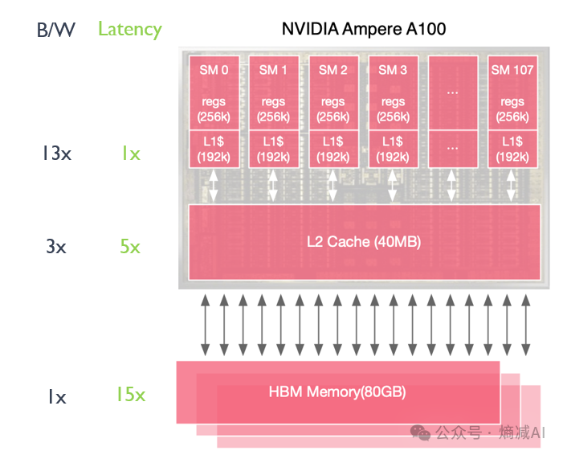

# LLM 推理架构优化 (Infra Architecture)

LLM 推理吞吐量的关键不在模型，而在 Infra 架构。为了应对 KV Cache 带来的显存压力和自回归生成的串行瓶颈，业界演进出了以下核心优化技术。

## 0. 前置知识：LLM 推理的两个阶段

理解所有优化技术的基础，是搞清楚 LLM 推理的两个截然不同的阶段：

| 阶段 | 别名 | 计算特征 | 瓶颈类型 | 说明 |
| :--- | :--- | :--- | :--- | :--- |
| **Prefill** | Prompt Processing | 一次性并行处理所有输入 Token，生成完整的 KV Cache | **计算密集型** (Compute-bound) | 大量矩阵乘法，GPU 算力被充分利用 |
| **Decode** | Token Generation | 逐 Token 自回归生成，每步仅计算 1 个新 Token 的 Attention | **访存密集型** (Memory-bound) | 每步计算量小，但需反复读取整个 KV Cache，受限于显存带宽 |

**关键矛盾**：Prefill 阶段希望尽可能多地使用算力（大矩阵运算），Decode 阶段希望尽可能快地读取显存（高带宽）。这两个阶段对硬件资源的需求是冲突的，这是后续 Prefill/Decode 分离架构的核心动因。

### KV Cache 基础回顾

在 Decode 阶段，为了避免对历史 Token 的重复计算，模型会将每一层 Attention 的 Key 和 Value 向量缓存下来，这就是 **KV Cache**。

**显存占用公式**：

$$
\text{KV Cache Size} = 2 \times L \times n_{\text{heads}} \times d_{\text{head}} \times s \times b \times \text{sizeof(dtype)}
$$

其中：
- $2$：Key 和 Value 各一份
- $L$：Transformer 层数
- $n_{\text{heads}}$：注意力头数（若使用 GQA/MQA，则为 KV 头数）
- $d_{\text{head}}$：每个头的维度
- $s$：序列长度
- $b$：Batch Size
- $\text{sizeof(dtype)}$：数据类型字节数（FP16 = 2 bytes）

**示例**：LLaMA-2 70B（80 层，8 KV 头，128 维/头），单条序列 4096 tokens，FP16：

$$
2 \times 80 \times 8 \times 128 \times 4096 \times 2 \approx 1.28 \text{ GB}
$$

单条请求就占用 1.28 GB 显存——这就是为什么 KV Cache 管理如此重要。

---

## 1. 核心优化技术

### 1.1 Continuous Batching (连续批处理)

#### 痛点：Static Batching 的低效

传统 Static Batching（也叫 Naive Batching）要求一个 Batch 内所有请求同时开始、同时结束。由于不同请求的输出长度差异很大，短请求生成完毕后必须空等最长请求完成，造成严重的 GPU 空闲（Bubble）。

```
Static Batching 时间线：

请求A: [===Prefill===][==Decode==][DONE]............等待B完成..........
请求B: [===Prefill===][============Decode============][DONE]..........
请求C: [===Prefill===][====Decode====][DONE]......等待B完成..........
                                                   ↑ GPU 空转区域
```

#### 原理：Token 级调度

Continuous Batching（也称 **Iteration-level Scheduling**）将调度粒度从"请求级"细化到"Token 级（迭代级）"：

1. 每完成一个 Decode 迭代（所有活跃请求各生成 1 个 Token），调度器重新评估
2. 若某请求已生成 EOS，立即将其移出 Batch，释放资源
3. 若等待队列中有新请求，立即插入 Batch 填补空位

```
Continuous Batching 时间线：

请求A: [Prefill][==Decode==][DONE]
请求B: [Prefill][==============Decode==============][DONE]
请求C: [Prefill][====Decode====][DONE]
请求D:                         [Prefill][==Decode==][DONE]     ← A完成后立即插入
请求E:                                        [Prefill][Decode][DONE] ← C完成后插入
                                               ↑ 无 GPU 空转
```

#### 变体

| 变体 | 说明 |
| :--- | :--- |
| **Orca (Iteration-level)** | 最早提出的 Continuous Batching 方案，每个 Decode 迭代后重新调度 |
| **vLLM Scheduler** | 在 Orca 基础上加入 Paged KV Cache，调度时考虑显存页的分配与回收 |
| **In-flight Batching (TensorRT-LLM)** | NVIDIA 的实现，与 Orca 原理类似，集成在 TensorRT-LLM 框架中 |

#### 效果

- GPU 利用率从 Static Batching 的 30-50% 提升至 **80%+**
- 系统吞吐量提升 **2x-10x**（取决于请求长度分布的方差）
- 请求长度方差越大，收益越显著

---

### 1.2 Paged KV Cache (分页 KV 缓存)

#### 痛点：显存碎片化

传统 KV Cache 分配方式要求为每个请求预分配一段**连续的**显存空间。由于生成长度未知，通常按最大序列长度预分配，导致：

- **内部碎片 (Internal Fragmentation)**：实际生成长度远小于预分配长度，预留的空间被浪费
- **外部碎片 (External Fragmentation)**：请求释放后留下大小不一的空洞，新请求难以利用
- **显存浪费率高达 60%-80%**

#### 原理：借鉴 OS 虚拟内存

vLLM 提出的 **PagedAttention** 借鉴操作系统的虚拟内存分页机制：

1. **物理块 (Physical Block)**：将 GPU 显存划分为固定大小的块（如每块存储 16 个 Token 的 KV 向量）
2. **逻辑块 (Logical Block)**：每个请求的 KV Cache 按逻辑页组织，不要求物理连续
3. **Block Table（页表）**：维护逻辑块到物理块的映射关系，类比 OS 页表

```
传统方式（连续分配）：
请求A: [==============预分配空间==============]  ← 实际只用了一半
请求B:                                          [========预分配========]
       [    已用    |    浪费    ]               [  已用  |   浪费   ]

PagedAttention（分页分配）：
物理块: [A-0][B-0][A-1][C-0][B-1][A-2][C-1][空][空]...
页表A:   0 → 物理块0,  1 → 物理块2,  2 → 物理块5
页表B:   0 → 物理块1,  1 → 物理块4
页表C:   0 → 物理块3,  1 → 物理块6
```

#### PagedAttention 计算过程

标准 Attention 需要连续的 K、V 张量。PagedAttention 修改了 Attention Kernel：

1. 根据页表找到当前请求的所有物理块
2. 对每个物理块独立计算部分 Attention Score
3. 汇总所有块的结果，得到最终的 Attention 输出

$$
\text{Attention}(q, K, V) = \text{softmax}\left(\frac{qK^T}{\sqrt{d_k}}\right)V
$$

在 PagedAttention 中，K 和 V 被分散存储在多个非连续物理块中，Kernel 通过页表逐块访问完成计算。

#### 进阶机制

| 机制 | 说明 |
| :--- | :--- |
| **Copy-on-Write (CoW)** | Beam Search 等场景下多个候选共享前缀的 KV Cache，只在产生分歧时复制物理块 |
| **Swap (换出/换入)** | 显存不足时，将低优先级请求的 KV Cache 换出到 CPU 内存，空闲时换回 |
| **Preemption (抢占)** | 当显存压力极大时，直接终止低优先级请求释放显存 |

#### 效果

- 显存碎片率从 **60-80%** 降至 **<4%**
- 相同显存下 Batch Size 提升 **2x-4x**
- 代表实现：**vLLM**

---

### 1.3 Prefix Cache (前缀缓存)

#### 场景

在以下场景中，多个请求之间存在大量相同的 Prompt 前缀：

- **多轮对话**：System Message + 历史对话轮次是公共前缀
- **Few-shot Learning**：相同的 few-shot 示例反复出现
- **RAG 应用**：相同的检索文档被多个用户查询引用
- **代码补全**：同一文件的上下文在多次补全中重复出现

如果每次请求都从头计算这些公共前缀的 KV Cache，是极大的算力浪费。

#### 原理

将已计算的 KV Cache 按前缀内容进行缓存，后续请求如果匹配到相同前缀，直接复用已有的 KV Cache，跳过 Prefill 阶段中公共前缀的计算。

#### 实现方式

| 方案 | 原理 | 代表 |
| :--- | :--- | :--- |
| **Hash-based Matching** | 对 Token 序列计算哈希值进行匹配，简单高效 | vLLM Automatic Prefix Caching |
| **RadixAttention** | 使用 Radix Tree（基数树）组织所有缓存的 KV Cache，支持最长前缀匹配 | SGLang |
| **Prompt Cache (显式)** | 用户显式指定哪些前缀可复用，API 层面支持 | Anthropic / OpenAI API |

#### RadixAttention 详解

RadixAttention 使用 **Radix Tree（基数树）** 来管理前缀缓存，Radix Tree 是一种前缀压缩的字典树（Trie），特别适合处理具有共同前缀的字符串集合：

```
                        [ROOT]
                       /      \
           [System Prompt]    [其他前缀]
              /        \
    [用户A历史对话]   [用户B历史对话]
         |                |
   [用户A新问题]    [用户B新问题]   ← 仅需计算这一部分
```

- **插入**：新请求到来时，沿树查找最长匹配前缀，匹配部分直接复用 KV Cache，未匹配部分创建新节点
- **淘汰**：采用 LRU 策略，当显存不足时，淘汰最久未使用的叶子节点
- **优势**：支持任意前缀的灵活共享，不仅限于固定的 System Prompt

#### 效果

- 首字延迟 (TTFT) 降低 **50%-90%**（取决于公共前缀长度占比）
- 系统整体吞吐量提升 **2x-5x**（多轮对话场景）
- 对首次请求无加速效果（缓存需要先建立）

---

### 1.4 Prefill / Decode 分离 (Disaggregated Serving)

#### 痛点：资源需求冲突

| 维度 | Prefill 阶段 | Decode 阶段 |
| :--- | :--- | :--- |
| **计算特征** | 大矩阵乘法，高算力需求 | 逐 Token 生成，高带宽需求 |
| **GPU 利用** | 算力利用率高 | 算力利用率低，显存带宽是瓶颈 |
| **延迟特征** | 处理时间与输入长度成正比 | 处理时间与输出长度成正比 |
| **对其他请求影响** | 长 Prefill 会阻塞同 Batch 内的 Decode | Decode 的逐 Token 特性拖慢 Prefill 的并行计算 |

当 Prefill 和 Decode 混合在同一 GPU 上执行时，会产生严重的 **相互干扰（Interference）**：
- 一个长 Prompt 的 Prefill 会导致同 Batch 内正在 Decode 的请求产生明显的生成延迟毛刺
- Decode 阶段的低计算密度拉低了 GPU 整体利用率

#### 原理：物理分离两个阶段

将 Prefill 和 Decode 分配到不同的 GPU 集群（或不同的 GPU 实例）上独立执行：

```
                ┌──────────────────────────┐
  用户请求 ───→ │       调度器/路由         │
                └─────┬────────────┬───────┘
                      │            │
               ┌──────▼──────┐ ┌──▼──────────┐
               │   Prefill   │ │    Decode    │
               │    集群     │ │     集群     │
               │  (算力型)   │ │   (带宽型)   │
               └──────┬──────┘ └──────▲──────┘
                      │               │
                      └───────────────┘
                   KV Cache 传输 (高速互联)
```

#### 工作流程

1. **请求到达**：调度器将请求发送到 Prefill 集群
2. **Prefill 执行**：Prefill 集群并行处理输入 Token，生成 KV Cache
3. **KV Cache 迁移**：通过 NVLink / RDMA / PCIe 等高速互联将 KV Cache 传输到 Decode 集群
4. **Decode 执行**：Decode 集群执行自回归生成
5. **结果返回**：生成完毕后将结果返回用户

#### 关键挑战

| 挑战 | 说明 | 解决方案 |
| :--- | :--- | :--- |
| **KV Cache 传输开销** | KV Cache 可能很大（GB 级），传输延迟不可忽略 | 使用 NVLink/InfiniBand 高速互联；流式传输，边算边传 |
| **负载均衡** | Prefill 和 Decode 的负载比例随请求特征动态变化 | 弹性伸缩 Prefill/Decode 节点比例 |
| **调度复杂度** | 需要协调两个集群的任务分配与 KV Cache 生命周期 | 全局调度器 + 分布式 KV Cache 存储 |

#### 代表工作

- **Splitwise** (Microsoft)：最早系统化提出 Prefill/Decode 分离架构
- **DistServe**：通过 Goodput 优化来确定最佳的资源分配比例
- **Mooncake** (月之暗面)：Kimi 的生产级实现，以 KV Cache 为中心的分离式架构
- **TetriInfer**：动态调整 Prefill/Decode 的 GPU 分配比例

#### 效果

- TTFT 降低 **30%-60%**（Prefill 不再被 Decode 干扰）
- Decode 吞吐量提升 **2x-3x**（Decode 集群可以优化内存带宽利用）
- 资源利用率更高，可按需独立扩缩两个集群

---

### 1.5 Speculative Decoding (投机解码)

#### 痛点：自回归的串行瓶颈

标准自回归生成每步仅输出 1 个 Token，而每步都需要加载完整的模型权重。对于大模型，Decode 阶段严重受限于显存带宽，大量算力被浪费——即 **Arithmetic Intensity（算术强度）** 很低。

#### 核心思想

利用一个**小而快**的 Draft Model（草稿模型）"猜测"未来多个 Token，然后由大模型（Target Model / Oracle Model）一次性**并行校验**这些猜测。由于校验 N 个 Token 和生成 1 个 Token 的成本几乎相同（都是一次前向传播），所以如果猜对率高，就能一次确认多个 Token，打破串行限制。

#### 工作流程

```
步骤1: Draft Model 快速生成 K 个候选 Token
  Draft: "The" → "cat" → "sat" → "on" → "the"

步骤2: Target Model 一次前向传播并行校验所有候选
  Target 校验: "The" → ✓"cat" → ✓"sat" → ✗"on"(应为"is") → 停止

步骤3: 接受连续正确的前缀，从第一个错误处重新开始
  确认: "The cat sat"（接受3个Token，等效于3步Decode压缩为1步）

步骤4: 从 "is" 开始新一轮投机
```

#### 接受/拒绝策略

为了保证输出质量与原始大模型**完全一致**（无损），采用如下拒绝采样策略：

对于 Draft Model 在位置 $t$ 预测的 Token $x_t$：

$$
P(\text{accept } x_t) = \min\left(1, \frac{p_{\text{target}}(x_t)}{p_{\text{draft}}(x_t)}\right)
$$

- 若 $p_{\text{target}} \geq p_{\text{draft}}$：100% 接受（大模型认为此 Token 概率更高）
- 若 $p_{\text{target}} < p_{\text{draft}}$：以一定概率拒绝，拒绝后从修正分布中重新采样

这保证了最终输出的分布与仅使用 Target Model 时**完全相同**。

#### 方案变体

| 方案 | Draft Model 来源 | 特点 |
| :--- | :--- | :--- |
| **标准投机解码** | 独立的小模型（如 LLaMA-68M draft for LLaMA-70B） | 需要单独训练/部署 Draft Model |
| **Self-Speculative** | 大模型自身的浅层子网络 / 跳层 | 无需额外模型，但猜测质量受限 |
| **Medusa** | 在大模型最后一层接多个预测头，每个头预测不同位置的 Token | 无需 Draft Model，训练成本低，tree attention 并行校验 |
| **EAGLE / EAGLE-2** | 轻量级自回归头 + 特征级预测（而非 Token 级） | 猜测准确率高，加速比领先 |
| **Lookahead Decoding** | 基于 Jacobi 迭代的并行解码，无需 Draft Model | 数学上优雅，但实际加速有限 |
| **Prompt Lookup** | 直接从输入 Prompt 中查找 N-gram 匹配作为候选 | 零额外成本，适合摘要/复述类任务 |

#### 效果

- 生成速度提升 **1.5x-3x**（取决于 Draft Model 的猜测准确率）
- **无损**：输出质量与原模型完全一致
- 猜测准确率（Acceptance Rate）通常在 **60%-85%** 之间
- 适合大模型 + 低并发场景，高并发下收益递减（因为 Batch 计算已经较高效）

---

## 2. 注意力计算优化

### 2.1 FlashAttention

#### 痛点：标准 Attention 的 HBM 瓶颈

标准 Attention 实现需要将完整的 $N \times N$ 注意力矩阵写入 GPU 显存（HBM），然后再读出来做 Softmax 和矩阵乘法。这导致：

- **显存占用**：$O(N^2)$，序列长度增加时爆炸增长
- **带宽瓶颈**：大量中间结果在 SRAM ↔ HBM 之间搬运，受限于 HBM 带宽

#### 原理：IO-Aware Tiling

FlashAttention 的核心洞察是：**Attention 的计算瓶颈不在算力，而在 IO（数据搬运）**。

通过 **分块计算（Tiling）** + **在线 Softmax（Online Softmax）** 技术：

1. 将 Q、K、V 矩阵分成小块，每块大小适配 GPU 的 **SRAM**（片上高速缓存，约 20MB）
2. 在 SRAM 中完成一个块的完整 Attention 计算（QK^T → Scale → Softmax → ×V）
3. 使用 Online Softmax 算法实现分块 Softmax 的精确计算（非近似）
4. **永不将完整的 $N \times N$ 注意力矩阵写入 HBM**

```
GPU 内存层次：

┌─────────────────────────────────┐
│          HBM (显存)              │  容量大(80GB), 带宽低(~3TB/s)
│  存储: 模型权重, KV Cache, 输入  │
└────────────┬────────────────────┘
             │ 数据搬运 (瓶颈!)
┌────────────▼────────────────────┐
│       SRAM (L1$片上缓存)         │  容量小(~20MB), 带宽高(~19TB/s)
│  FlashAttention 在这里完成计算   │
└─────────────────────────────────┘
```


#### 版本演进

| 版本 | 关键改进 |
| :--- | :--- |
| **FlashAttention v1** | 提出 Tiling + Online Softmax，避免 $O(N^2)$ HBM 读写 |
| **FlashAttention v2** | 优化并行度（序列维度并行）、减少非矩阵运算开销，速度提升 **2x** |
| **FlashAttention v3** | 针对 Hopper 架构（H100）优化，利用 FP8 Tensor Core 和异步流水线 |

#### 效果

- 训练速度提升 **2x-4x**，推理速度提升 **1.5x-2x**
- 显存占用从 $O(N^2)$ 降至 $O(N)$
- 支持更长的上下文窗口（从 2K 到 128K+）
- 计算结果与标准 Attention **精确一致**（非近似算法）

---

### 2.2 Multi-Query / Grouped-Query Attention

这是一组从模型架构层面减少 KV Cache 大小的优化，直接影响推理效率。

| 方案 | KV 头数 | KV Cache 大小 | 说明 |
| :--- | :--- | :--- | :--- |
| **Multi-Head Attention (MHA)** | $n_{\text{heads}}$ | 1x（基准） | 标准 Attention，每个查询头有独立的 K/V 头 |
| **Multi-Query Attention (MQA)** | 1 | $\frac{1}{n_{\text{heads}}}$x | 所有查询头共享同一组 K/V，KV Cache 极小 |
| **Grouped-Query Attention (GQA)** | $g$（分组数） | $\frac{g}{n_{\text{heads}}}$x | 折中方案，每 $\frac{n_{\text{heads}}}{g}$ 个查询头共享一组 K/V |

```
MHA:  Q1→K1,V1  Q2→K2,V2  Q3→K3,V3  Q4→K4,V4    (4组KV)
GQA:  Q1→K1,V1  Q2→K1,V1  Q3→K2,V2  Q4→K2,V2    (2组KV, g=2)
MQA:  Q1→K1,V1  Q2→K1,V1  Q3→K1,V1  Q4→K1,V1    (1组KV)
```

**应用**：
- MQA：PaLM、StarCoder
- GQA：LLaMA-2 70B（8 KV heads / 64 Q heads）、Mistral、Qwen-2

### 2.3 Multi-head Latent Attention (MLA)

DeepSeek-V2/V3 提出的注意力机制，通过**低秩联合压缩** KV Cache，在保持模型表达能力的同时大幅减少 KV Cache 显存占用。

#### 核心思想

MQA/GQA 通过减少 KV 头数来压缩 KV Cache，但这会损失模型容量。MLA 采用了不同的思路：**将 KV Cache 压缩到一个低维的潜在向量（Latent Vector）中**，推理时再通过上投影矩阵恢复出 K 和 V。

$$
c_t = W_{DKV} \cdot h_t \quad \text{(下投影：将隐藏状态压缩到低维潜在向量 } c_t \text{)}
$$

$$
K_t = W_{UK} \cdot c_t, \quad V_t = W_{UV} \cdot c_t \quad \text{(上投影：从潜在向量恢复 K 和 V)}
$$

**KV Cache 中只需存储低维的 $c_t$**，而非完整的 K 和 V 向量。

#### 与 MQA/GQA 对比

| 方案 | KV Cache 压缩方式 | KV Cache 大小 | 模型表达能力 |
| :--- | :--- | :--- | :--- |
| **MHA** | 无压缩 | 1x（基准） | 最强 |
| **GQA** | 减少 KV 头数（分组共享） | $\frac{g}{n_{\text{heads}}}$x | 略有损失 |
| **MQA** | KV 头数降为 1 | $\frac{1}{n_{\text{heads}}}$x | 损失较大 |
| **MLA** | 低秩压缩到潜在空间 | $\frac{d_c}{n_{\text{heads}} \times d_{\text{head}}}$x | 接近 MHA |

#### 效果

- DeepSeek-V2 中 KV Cache 压缩为 GQA 的 **~60%**，同时模型性能优于 GQA
- 与吸收（Absorbed）优化结合后，上投影矩阵可融入 Attention 计算，无额外推理开销
- 已被 vLLM、SGLang 等主流推理框架支持

---

## 3. 模型压缩与量化

量化是将模型权重和/或激活值从高精度（FP16/BF16）转换为低精度（INT8/INT4）的技术，直接减少显存占用和访存带宽需求。

### 3.1 量化基础

| 精度 | 字节数 | 动态范围 | 说明 |
| :--- | :--- | :--- | :--- |
| FP32 | 4 | 高 | 训练时的标准精度 |
| BF16 | 2 | 高（与 FP32 相同的指数位） | 训练推理主流精度 |
| FP16 | 2 | 中 | 推理常用 |
| INT8 | 1 | 低 | 权重量化主流 |
| INT4 | 0.5 | 很低 | 激进量化，需配合特殊算法 |
| FP8 | 1 | 中 | H100 原生支持，训练推理均可用 |

### 3.2 主流量化方案

| 方案 | 类型 | 原理 | 特点 |
| :--- | :--- | :--- | :--- |
| **GPTQ** | Weight-only，Post-Training | 基于 OBS（Optimal Brain Surgeon）框架，逐层量化权重并用 Hessian 信息补偿误差 | 4-bit 权重，质量好，需校准数据集 |
| **AWQ** | Weight-only，Post-Training | 观察到 1% 的"显著权重"对质量至关重要，对其保留高精度缩放 | 4-bit 权重，比 GPTQ 更快且质量略优 |
| **SmoothQuant** | Weight + Activation | 将激活中的量化难度"迁移"到权重上（通过数学等价的缩放变换） | 支持 W8A8，适合高吞吐部署 |
| **GGUF (llama.cpp)** | Weight-only | 多种量化粒度（Q4_0, Q4_K_M, Q5_K_M 等），CPU 友好 | 适合消费级硬件和边缘部署 |
| **FP8** | Weight + Activation | H100 原生支持 FP8 Tensor Core | 几乎无损，硬件原生加速 |

### 3.3 量化对性能的影响

以 LLaMA-2 70B 为例：

| 配置 | 显存占用 | 最低 GPU 配置 | 吞吐量变化 |
| :--- | :--- | :--- | :--- |
| FP16 | ~140 GB | 2×A100 80GB | 1x（基准） |
| INT8 | ~70 GB | 1×A100 80GB | ~1.5x |
| INT4 (GPTQ/AWQ) | ~35 GB | 1×A100 40GB / 1×A6000 | ~2x |
| INT4 (GGUF, CPU) | ~35 GB | 64GB RAM（无 GPU） | 0.05x-0.1x |

### 3.4 KV Cache 量化与压缩

除了对模型权重量化外，KV Cache 本身也可以压缩，从而在相同显存下支持更大的 Batch Size 或更长的上下文。

| 方案 | 原理 | 特点 |
| :--- | :--- | :--- |
| **KV Cache INT8/FP8 量化** | 将 KV Cache 从 FP16 降为 INT8/FP8 存储，Attention 计算时反量化 | 实现简单，vLLM/TensorRT-LLM 已原生支持，几乎无损 |
| **KIVI** | 对 Key Cache 逐 channel 量化、Value Cache 逐 token 量化，2-bit 极限压缩 | KV Cache 缩减至 1/8，长上下文场景收益显著 |
| **Gear** | 利用低秩近似 + 稀疏残差补偿量化误差 | 在极低比特下保持较高精度 |
| **KVQuant** | 逐通道 Key 量化 + 非均匀量化 + 预 RoPE Key 量化 | 针对 KV Cache 分布特点定制的量化方案 |
| **Streaming LLM** | 仅保留 Attention Sink (前几个 Token) + 滑动窗口，丢弃中间 KV Cache | 支持无限长度流式生成，但会丢失中间信息 |

---

## 4. 分布式推理

当单卡无法容纳完整模型时，需要使用并行策略将模型分布到多张 GPU 上。

### 4.1 Tensor Parallelism (张量并行, TP)

将单个层内的矩阵运算切分到多张 GPU 上并行计算。

**原理**：对线性层的权重矩阵按列或行切分：

- **列并行 (Column Parallel)**：将权重矩阵按列切分，每个 GPU 计算部分输出，最后 AllGather
- **行并行 (Row Parallel)**：将权重矩阵按行切分，输入被分片，最后 AllReduce

```
Column Parallel (以 2 GPU 为例):

输入 X ──→ GPU0: X × W[:,0:N/2] = Y0 ─┐
       └─→ GPU1: X × W[:,N/2:N] = Y1 ─┤→ AllGather → [Y0, Y1] = Y
```

**特点**：
- 通信量较大（每层都需要 AllReduce/AllGather），需要高速互联（NVLink）
- 通常 TP 度 = 单机 GPU 数（如 8）
- 延迟最优的并行策略

### 4.2 Pipeline Parallelism (流水线并行, PP)

将模型的不同层分配到不同 GPU 上，形成流水线。

```
GPU0: Layer 0-19  →  GPU1: Layer 20-39  →  GPU2: Layer 40-59  →  GPU3: Layer 60-79
```

**特点**：
- 通信量小（仅传递层间的隐藏状态），适合跨机并行
- 存在流水线气泡（Pipeline Bubble），可通过 Micro-batch 缓解
- 通常用于多机场景

### 4.3 Expert Parallelism (专家并行, EP)

针对 **MoE（Mixture-of-Experts）模型**（如 Mixtral、DeepSeek-V2/V3）的并行策略。MoE 模型的 FFN 层包含多个专家子网络，每个 Token 仅激活其中少数几个。

**原理**：将不同的专家分配到不同的 GPU 上，Token 通过 All-to-All 通信路由到对应专家所在的 GPU。

```
EP (以 8 专家, 4 GPU 为例):

GPU0: Expert 0, 1  ──┐
GPU1: Expert 2, 3  ──┤  All-to-All: Token 根据 Router 结果
GPU2: Expert 4, 5  ──┤  发送到对应专家所在的 GPU
GPU3: Expert 6, 7  ──┘
```

**特点**：
- 通信模式为 All-to-All，对网络带宽和延迟敏感
- 通常与 TP/PP 组合使用：机内 TP + EP，机间 PP
- 负载均衡是关键挑战——热门专家可能成为瓶颈

### 4.4 混合并行策略

生产环境通常组合使用：

```
典型配置（4机32卡部署 70B Dense 模型）：
- 机内: TP=8 (NVLink 高速互联)
- 机间: PP=4 (InfiniBand 互联)
- 可选: 配合 Continuous Batching 的数据并行

典型配置（MoE 模型，如 DeepSeek-V3）：
- 机内: TP + EP (NVLink)
- 机间: PP + EP (InfiniBand)
- 专家并行度取决于专家数量和 GPU 数量
```

---

## 5. 主流推理框架对比

| 框架 | 开发者 | 核心特性 | 适用场景 |
| :--- | :--- | :--- | :--- |
| **vLLM** | UC Berkeley | PagedAttention, Continuous Batching, 丰富的模型支持 | 通用在线推理，开源首选 |
| **TensorRT-LLM** | NVIDIA | 深度优化的 CUDA Kernel, In-flight Batching, FP8 | 极致性能，NVIDIA GPU 专用 |
| **SGLang** | UC Berkeley | RadixAttention (高效前缀缓存), 结构化生成加速 | 复杂 Prompt 工程，Agent 场景 |
| **Text Generation Inference (TGI)** | Hugging Face | Flash Attention, Continuous Batching, 易部署 | HuggingFace 生态，快速上手 |
| **llama.cpp** | Georgi Gerganov | CPU/Metal 推理, GGUF 量化, 极致轻量 | 消费级硬件，边缘设备 |
| **Ollama** | Ollama | 基于 llama.cpp, 一键部署, Docker 化 | 个人开发者，本地体验 |
| **DeepSpeed-FastGen** | Microsoft | Splitwise 分离架构, Dynamic SplitFuse | 微软生态, 研究导向 |

---

## 6. 性能指标体系

### 6.1 核心指标定义

| 指标 | 全称 | 定义 | 优化方向 |
| :--- | :--- | :--- | :--- |
| **TTFT** | Time To First Token | 从请求发出到收到第一个生成 Token 的时间 | 越小越好，影响用户体感 |
| **TPOT** | Time Per Output Token | 生成每个输出 Token 的平均时间 | 越小越好，决定流式输出速度 |
| **TPS** | Tokens Per Second | 每秒生成的 Token 数（单请求） | 越大越好 |
| **Throughput** | 系统吞吐量 | 单位时间内系统处理的总 Token 数 | 越大越好，衡量整体效率 |
| **QPS** | Queries Per Second | 每秒完成的请求数 | 越大越好 |
| **P99 Latency** | 第 99 百分位延迟 | 99% 的请求在该时间内完成 | 越小越好，衡量尾延迟 |

### 6.2 性能对比参考 (vLLM vs 原始 Transformers)

| 指标 | Transformers (naive) | vLLM (Optimized) | 提升幅度 |
| :--- | :--- | :--- | :--- |
| **吞吐量 (Tokens/s)** | 低 (1x) | 高 (2x - 4x) | 2-4 倍 |
| **显存利用率** | 碎片化严重 (~30%) | 极高 (~95%+, Paged) | ~3 倍 |
| **TTFT** | 随 Batch Size 剧增 | 相对稳定 | 显著 |
| **最大 Batch Size** | 受碎片限制 | 受物理显存限制 | 2-4 倍 |
| **长序列支持** | OOM 频繁 | 稳定（分页 + Swap） | 质变 |

---

## 7. 技术演进总结

```
2022 ─── FlashAttention v1: IO-Aware Attention, 长序列训练成为可能
  │
  ├── 2023.06 ── vLLM (PagedAttention): KV Cache 显存管理革命
  │
  ├── 2023.09 ── Speculative Decoding 走向实用
  │
  ├── 2023.11 ── Continuous Batching 成为标配 (vLLM, TGI, TensorRT-LLM)
  │
  ├── 2024.01 ── SGLang (RadixAttention): 前缀缓存的系统化方案
  │
  ├── 2024.03 ── Splitwise / DistServe: Prefill-Decode 分离架构
  │
  ├── 2024.06 ── FlashAttention v3: H100 FP8 深度优化
  │
  ├── 2024.09 ── Mooncake: 生产级分离式推理架构 (Kimi)
  │
  ├── 2024.12 ── DeepSeek-V3: MLA + FP8 训练推理一体化，MoE 大规模落地
  │
  ├── 2025.03 ── vLLM 0.7+: 支持 MLA、FP8 KV Cache、自动前缀缓存成熟
  │
  ├── 2025.06 ── KV Cache 压缩 (KIVI/Gear/KVQuant) 进入生产环境
  │
  └── 2025+ ─── 趋势: 端到端编译优化、FP4 原生支持、
                       更激进的投机解码、长上下文 KV 管理
```

---
> **相关文档**：
> - 了解解码原理：[Transformer.md](./Transformer.md)
> - 了解受限解码：[Transformer.md#8-受限解码深度解析-fsm-vs-cfg](./Transformer.md#8-受限解码深度解析-fsm-vs-cfg)
