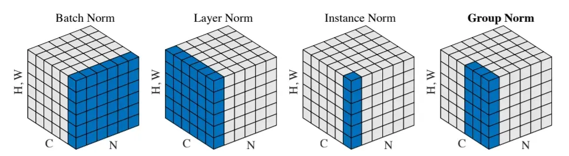
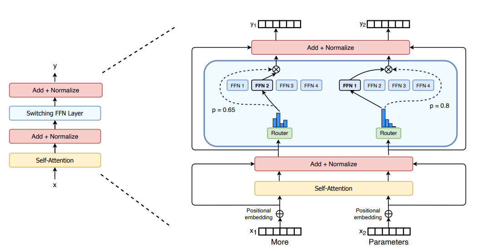
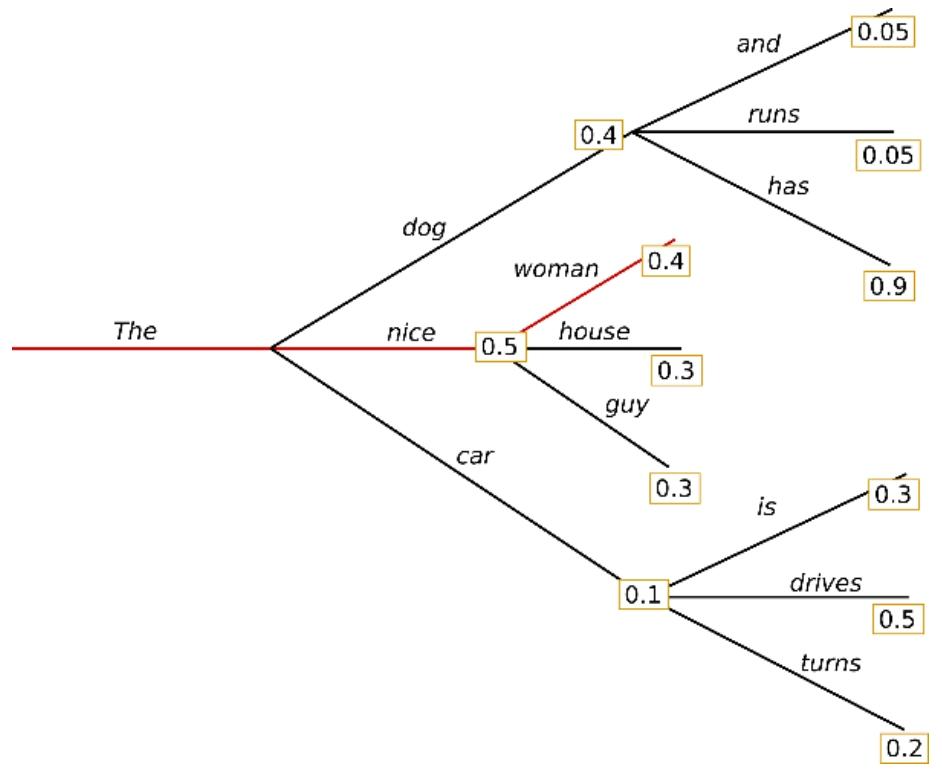

# 背景
Transformer结构是当前大模型的核心架构，自2017年被提出以来，已成为自然语言处理领域最重要的基础技术之一。其设计初衷是为了解决传统循环神经网络在序列建模中存在的长期依赖问题与训练效率瓶颈。相比于RNN与LSTM，Transformer完全抛弃了时间步迭代结构，采用**全并行的自注意力机制**，使得模型在序列建模中**兼顾了建模能力与计算效率**，成为后续BERT、GPT、T5等主流模型的基础结构。
Transformer的核心在于其堆叠式的编码器−解码器架构与全局注意力机制，能够实现对输入序列中任意位置信息的建模，是支持语言理解与生成任务的关键机制，其架构的模块化、层级化特点也极大地增强了系统的可扩展性，便于与其他智能体组件协同构建复杂任务流程。

# 架构


## 核心组件介绍

### 1. Embedding (嵌入层)
- **Token Embedding**: 将输入的离散 Token（如单词或字符）映射为高维连续向量空间。通过学习到的权重矩阵，将每个 Token 转换为固定维度（如 $d_{\text{model}}=512$）的特征表示。
- **Output Embedding**: 在解码阶段，将目标 Token 也转换为向量表示，以便与编码器的输出进行交互。

#### 1.1 分词算法变体 (Tokenization)
- **BPE (Byte Pair Encoding)**: 通过合并高频字节对实现子词切分。
  - **核心原理**: 从字符级开始，不断统计并合并训练语料中相邻频率最高的两个子词（Token），直到达到预设的词表大小。
  - **核心步骤**:
    1. 准备语料，将单词拆分为字符序列，并添加结束符 `</w>`。
    2. 统计所有相邻子词对的频率。
    3. 找到频率最高的子词对，将其合并为一个新的 Token。
    4. 重复上述步骤，直到词表达到设定大小或无法再合并。
  - **具体示例**:
    - 假设语料中有 `{"hug": 10, "pug": 5, "pun": 12, "bun": 4}`。
    - 第一步合并频率最高的 `u` 和 `n`（共 $12+4=16$ 次），得到 `un`。
    - 接着合并 `h` 和 `ug` 等。
  - **优点**: 能够有效处理未登录词（OOV），平衡了字符级（太碎）和词级（词表太大）的缺点。
  - **应用**: GPT 系列、LLaMA、Baichuan。
- **WordPiece**: 类似于 BPE，但基于似然度选择合并项。
  - **应用**: BERT。
- **Unigram**: 基于概率语言模型。
  - **应用**: T5、XLNet。

#### 1.2 词表与权重变体
- **Tie Embedding**: 共享输入与输出层的 Embedding 权重，减少模型参数量。
  - **应用**: GPT-2、PaLM。
- **Scaling**: 在 Embedding 后乘以 $\sqrt{d_{\text{model}}}$。
  - **应用**: 原始 Transformer。

#### 1.3 中文向量化策略 (Chinese Vectorization Strategies)
针对中文特有的语言特性，常见的向量化（分词）策略包括：

- **字级别 (Character-level)**: 将每个汉字作为一个 Token。
  - **优点**: 词表小（几千个常用字），无 OOV 问题。
  - **缺点**: 无法有效捕捉词组级别的语义信息。
  - **应用**: BERT-base-chinese。
- **词级别 (Word-level)**: 先使用分词工具（如 Jieba、HanLP）进行分词，再进行向量化。
  - **优点**: 语义明确。
  - **缺点**: 词表极其庞大，存在严重的 OOV 问题和分词歧义。
- **子词级别 (Subword-level - 主流)**:
  - **BBPE (Byte-level BPE)**: 直接在字节流上运行 BPE。
    - **特点**: 通过将 UTF-8 编码的字节合并，可以表示任何字符（包括罕见字、Emoji、代码），彻底解决 OOV 问题。
    - **应用**: GPT-3/4、LLaMA、DeepSeek。
  - **SentencePiece**: 一种集成化的分词框架，支持 BPE 和 Unigram。
    - **特点**: 不需要预分词，直接将原始文本（含空格）处理为子词序列，对中英文混合语料支持极佳。
    - **应用**: LLaMA-chinese、Baichuan、ChatGLM 系列。
- **中文字词兼顾策略**: 部分模型在词表中显式加入高频中文词汇（如“人工智能”），以提升中文处理效率和理解深度。

#### 1.4 Token 数计算逻辑 (Token Calculation Logic)
在实际应用中，准确估算 Token 数对于成本控制和上下文管理至关重要。

- **中英文差异估算**:
  - **英文**: 经验上，1000 个 Token 约等于 750 个英文单词（1 word ≈ 1.33 tokens）。
  - **中文**: 取决于分词器，通常 1 个汉字 ≈ 1.2 到 2 个 Tokens。
    - **字级别分词**: 1 汉字 = 1 Token。
    - **子词级别 (BPE/SentencePiece)**: 由于存在词组合并，1 汉字可能占用 1.5 到 2 个字节编码后的 Tokens。
- **影响因素**:
  - **词表大小**: 词表越大，单个 Token 承载的信息量通常越多，总 Token 数越少。
  - **特殊字符**: 空格、换行符、Emoji、特殊符号（如代码中的缩进）都会占用独立的 Tokens。
- **计算公式示例**:
  - 文本总 Token 数 = $\sum (\text{分词后的子词数量}) + \text{特殊占位符数量 (如 [CLS], [SEP])}$。
- **实用工具**:
  - **Tiktoken**: OpenAI 提供的 BPE 分词器工具。
  - **HuggingFace Tokenizers**: 支持多种主流开源模型的分词计算。

### 2. Positional Encoding (位置编码)
- **核心作用**: 由于 Transformer 的自注意力机制（Self-Attention）是位置无关的（置换不变性），它无法感知序列中词汇的先后顺序。位置编码通过在 Embedding 中注入位置信息，使模型能够区分不同位置的词。

#### 2.1 绝对位置编码 (Absolute PE)
- **Sinusoidal (正余弦编码)**: 原始 Transformer 采用的方法，使用不同频率的正余弦函数生成固定编码。优点是无需学习，且理论上具有一定的长度外推性。
- **公式**:
$$
PE_{(pos, 2i)} = \sin(pos / 10000^{2i/d_{\text{model}}})
$$
$$
PE_{(pos, 2i+1)} = \cos(pos / 10000^{2i/d_{\text{model}}})
$$
- **Learned (可学习编码)**: 为每个位置（如 0-511）分配一个可学习的向量（如 BERT、GPT-2）。缺点是无法处理超过训练时最大长度的序列。

#### 2.2 旋转位置编码 (RoPE - Rotary Positional Embedding)
- **核心思想**: 通过旋转矩阵将相对位置信息注入到 Query 和 Key 中。它在保持绝对位置信息的同时，通过旋转角度的差值体现相对位置。
- **优点**: 
  - 具有良好的**长度外推性**（模型可以处理比训练时更长的序列）。
  - 随着距离增加，注意力分数的衰减更自然。
- **代表模型**: LLaMA、PaLM、GLM、DeepSeek。

#### 2.3 相对位置偏差 (ALiBi - Attention with Linear Biases)
- **核心思想**: 不在 Embedding 上加位置信息，而是直接在计算 Attention Score ($QK^T$) 时，根据距离添加一个线性惩罚项。
- **优点**: 极强的外推性，即使在极长序列下也能保持稳定。
- **代表模型**: BLOOM、Falcon、Baichuan2-13B。

#### 2.4 相对位置编码 (Relative PE)
- **核心思想**: 不考虑绝对坐标，只考虑词与词之间的相对距离（如 $i-j$）。
- **代表模型**: T5 (使用可学习的相对位置偏置)。

### 3. Attention Mechanism (注意力机制)
- **自注意力 (Self-Attention)**: 通过计算查询（Query）、键（Key）和值（Value）之间的关联度，让模型在处理当前词时，能够“关注”到序列中其他相关的词。
- **公式**:

$$
\text{Attention}(Q, K, V) = \text{softmax}\left(\frac{QK^T}{\sqrt{d_k}}\right)V
$$

#### 3.1 多头注意力变体 (Multi-Head Variants)
为了平衡计算效率（尤其是推理时的 KV Cache 占用）与模型性能，演化出了以下变体：

- **MHA (Multi-Head Attention)**: 每个 Query 头都有对应的 Key 和 Value 头。参数量大，但表达能力最强。
- **MQA (Multi-Query Attention)**: 所有的 Query 头共享同一组 Key 和 Value 头。极大压缩了 KV Cache，提升了推理吞吐，但模型精度略有下降。
  - **代表模型**: PaLM、Falcon、GPT-NeoX。
- **GQA (Grouped-Query Attention)**: MHA 与 MQA 的折中方案。将 Query 头分组，每组共享一组 Key 和 Value 头。在保持接近 MHA 性能的同时，获得接近 MQA 的速度。
  - **代表模型**: LLaMA-2 (70B)、LLaMA-3。
- **MLA (Multi-head Latent Attention)**: 通过低秩投影对 KV 进行压缩和解压。显著降低了 KV Cache 的显存占用，同时保持了高性能。
  - **代表模型**: DeepSeek-V3。

#### 3.2 稀疏注意力 (Sparse Attention)
旨在解决自注意力机制中 $O(L^2)$ 的复杂度问题，使其能处理更长的序列：

- **Sliding Window Attention (滑窗注意力)**: 每个 Token 只关注其前后固定范围内的 Token。将复杂度降为 $O(L \times W)$。
  - **代表模型**: Mistral、Longformer。
- **Global + Sliding Window**: 在滑窗基础上，指定部分 Token（如 `[CLS]` 或特定关键词）具有全局视野，关注所有位置。
- **BigBird / Longformer**: 结合了随机注意力、滑窗注意力和全局注意力，实现对超长序列的高效建模。
- **FlashAttention**: 虽然不是算法层面的稀疏，但通过 IO 感知的显存优化，极大地提升了标准注意力的计算速度，是大模型训练的标配。

#### 3.3 KV Cache (键值缓存)
**一句话理解**：KV Cache 是将 Transformer 历史 Token 的 Key 和 Value 缓存起来，避免每次生成新 Token 时重复计算，是 LLM 推理最重要的优化技术。

- **为什么需要 KV Cache？**
  LLM 推理本质是**自回归生成 (Next-token prediction)**。
  例如生成 "I love machine learning"：
  1. `I` -> `love`
  2. `I love` -> `machine`
  3. `I love machine` -> `learning`
  每生成一个新 Token，模型都要执行一次完整的 Forward 过程。在计算 Attention ($QK^T$)V 时，若无缓存，生成第 $n$ 个 Token 需要重新计算前 $n-1$ 个 Token 的 K 和 V。这导致计算量随序列长度呈平方级增长 ($O(n^2)$)。

- **核心思想：缓存不变项**
  关键观察：**历史 Token 的 K 和 V 在生成后续 Token 时是不会改变的**。
  因此可以将其缓存：
  - **K-cache** = $[K_1, K_2, \dots, K_{n-1}]$
  - **V-cache** = $[V_1, V_2, \dots, V_{n-1}]$
  生成新 Token 时，只需计算当前 Token 的 $Q_{\text{new}}$，然后与缓存进行计算：
  $\text{Attention}(Q_{\text{new}}, \text{K}_{\text{cache}}, \text{V}_{\text{cache}})$。

- **性能提升：$O(n^2) \to O(n)$**
  - **无 KV Cache**：每一步重算全部 Token，复杂度 $O(n^2)$。
  - **有 KV Cache**：每一步只算当前 Token，复杂度降为 $O(n)$。
  这极大提升了推理速度，是所有主流框架（如 OpenAI, vLLM）的标配。

- **显存挑战 (The Memory Wall)**
  虽然快，但 KV Cache 极度消耗显存。缓存大小计算公式：
  $$\text{Size} \approx 2 \times \text{layers} \times \text{tokens} \times \text{hidden}_{\text{dim}} \times \text{precision}_{\text{bytes}}$$
  例如一个 7B 模型（4096 上下文），KV Cache 可能占用 3GB - 5GB 显存。
  **工程优化方案**：
  - **Paged KV Cache (vLLM)**：解决显存碎片。
  - **量化 (KV Cache Quantization)**：如使用 FP8/INT8 存储。
  - **Prefix Cache**：共享公共前缀缓存。

- **直观类比：做数学题的草稿纸**
  - **无草稿纸**：每算下一步都要重新推导前面所有的步骤。
  - **有草稿纸**：只需在前面已有的结果上继续往下算，保存了历史计算成果。

### 4. Add & Norm (残差连接与层归一化)
- **Add (残差连接)**: 借鉴 ResNet 思想，将子层（Attention 或 Feed Forward）的输入直接与其输出相加（$x + \text{Sublayer}(x)$）。这有助于缓解深层网络中的梯度消失问题，使训练更稳定。
- **Norm (层归一化)**: 在每一层之后进行 Layer Normalization，将神经元的激活值归一化到均值为 0、方差为 1 的分布，加速模型收敛。

#### 4.1 归一化变体 (Normalization Variants)
- **LayerNorm (LN)**：标准层归一化。在每层对所有神经元的输出进行规范化。在处理序列数据等不适合批处理的情况下，可以作为替代方案使用。
- **RMSNorm (Root Mean Square Layer Normalization)**：只做缩放不做平移，计算开销更小。
  - **应用**：LLaMA 系列、DeepSeek、Gemma。
- **DeepNorm**：一种特殊的初始化和归一化策略，允许训练极深（如 1000 层）的 Transformer。
  - **应用**：GLM-130B。
- **Batch Normalization (BN)**：批归一化。通过在每个批次中对输入数据进行规范化，加速网络收敛，降低对初始化和学习率的敏感性，具有一定的正则化效果。
- **Group Normalization (GN)**：组归一化。介于 BN 和 LN 之间的方法，将输入数据分成多个小组并对组内进行归一化，提高网络学习能力。



#### 4.2 归一化位置 (Normalization Position)
- **Post-LN**: Norm 放在残差连接之后。容易导致梯度爆炸，训练不稳定，但性能可能略优。
  - **应用**: 原始 Transformer、BERT。
- **Pre-LN**: Norm 放在子层之前。训练极其稳定，是大模型的标准配置。
  - **应用**: GPT-2、LLaMA、Baichuan。
- **Sandwich-LN**: 在 Pre-LN 基础上，在子层输出后再加一层 LN，防止值溢出。
  - **应用**: CogView。

### 5. Feed Forward (前馈神经网络)
- **结构**: 每个位置独立经过一个两层的全连接网络（MLP），中间包含一个非线性激活函数。
- **作用**: 提供非线性映射能力，对注意力机制提取的特征进行进一步的变换和抽象。
- **公式**:

$$
\text{FFN}(x) = \max(0, xW_1 + b_1)W_2 + b_2
$$

#### 5.1 激活函数变体 (Activation Variants)
- **ReLU**: 原始 Transformer 使用。
- **GELU (Gaussian Error Linear Unit)**: 平滑版的 ReLU，在零点附近具有非零梯度。
  - **应用**: BERT、GPT 系列。
- **SwiGLU**: GLU (Gated Linear Unit) 的变体，使用 Swish 激活函数。显著提升模型表现。
  - **应用**: LLaMA、PaLM、Baichuan。

#### 5.2 架构变体 (Architecture Variants)
- **Standard FFN**: 两层全连接。
- **MoE (Mixture of Experts)**: 将 FFN 替换为多个专家网络，通过路由（Router）选择部分专家激活。
  - **优点**: 极大增加模型参数量的同时，保持较低的推理计算量。
  - **代表模型**: GPT-4 (据传)、Mixtral、DeepSeek-V3。

##### 5.2.1 MoE 核心组件
混合专家模型主要由两个关键部分组成：
- **稀疏 MoE 层 (Sparse MoE Layer)**：这些层代替了传统 Transformer 模型中的前馈网络 (FFN) 层。MoE 层包含若干“专家”(Experts，例如 8 个)，每个专家本身是一个独立的神经网络（通常也是 FFN）。
- **门控网络或路由 (Gating Network / Router)**：决定哪些词元 (Token) 被分发到哪个专家。
  - 例如：“More” 令牌可能被发送到 Expert 2，而 “Parameters” 词元被发送到 Expert 1。
  - 一个词元有时可以分发给多个专家制。路由方式是 MoE 的核心，路由器由可学习参数组成，与网络其他部分同步预训练。



##### 5.2.2 MoE 的优缺点
**优点：**
- **降低推理耗时**：
  - 在 Transformer 的推理过程中，FFN 的权重维度较大 ($d_{\text{model}} \times d_{\text{ff}}$)，耗时占比高。
  - MoE 虽然总参数量更多，但推理时仅激活少数专家，因此实际计算量（FLOPs）远小于同等规模的稠密模型。
- **参数量扩展性**：可以在不增加计算成本的前提下，通过增加专家数量来极大提升模型的知识容量。

**缺点：**
- **显存占用大**：需要提前加载所有专家的参数，对显存容量要求极高。
- **训练/微调困难**：稀疏模型（Sparse Model）更容易过拟合，且路由器的负载均衡（Load Balancing）难以优化。
- **目前尚不成熟**：在微调（Fine-tuning）阶段的稳定性不如稠密模型。


### 6. Linear (线性层)
- **作用**: 在解码器的顶层，通过一个全连接层将隐藏状态映射到词表大小（Vocabulary Size）的维度。每个维度的数值代表对应词的未归一化得分（Logits）。

### 7. SoftMax (归一化层)
- **作用**: 将 Linear 层的输出 Logits 转换为概率分布。通过指数运算使得分高的词概率更大，且所有词的概率之和为 1，从而选出概率最高的词作为预测结果。


# 大模型生成参数配置
目前主流的大型语言模型 (LLM) 在生成文本时，主要采用以下四种解码策略：**贪心搜索 (Greedy search)**、**波束搜索 (Beam search)**、**Top-K 采样 (Top-K sampling)** 以及 **Top-p 采样 (Top-p sampling)**。

## 1. 贪心搜索 (Greedy Search)
贪心搜索在每个时间步 $t$ 都简单地选择概率最高的 Token 作为当前输出：
$$w_{t} = \text{argmax}_{w} P(w | w_{1:t-1})$$

| 初始词 | 第一步候选及概率 | 第二步候选及概率 |
| :--- | :--- | :--- |
| **The** | nice (0.5)、dog (0.3)、car (0.1) | is (0.4)、drives (0.5)、turns (0.2)<br>has (0.9)、and (0.05)、runs (0.05)<br>woman (0.4)、house (0.3)、guy (0.3) |



从单词 **The** 开始，算法在第一步贪心地选择条件概率最高的词 **nice** 作为输出，依此类推。最终生成的序列为 `(The, nice, woman)`，其联合概率为 $0.5 \times 0.4 = 0.2$。

使用 `transformers` 库进行贪心搜索的示例如下（默认配置）：

```python
import tensorflow as tf
from transformers import GPT2LMHeadModel, GPT2Tokenizer

tokenizer = GPT2Tokenizer.from_pretrained("gpt2")
model = GPT2LMHeadModel.from_pretrained("gpt2", pad_token_id=tokenizer.eos_token_id)

# 编码上下文
input_ids = tokenizer.encode('I enjoy walking with my cute dog', return_tensors='tf')

# 生成文本，直到长度达到 50
greedy_output = model.generate(input_ids, max_length=50)

print("Output:\n" + 100 * '-')
print(tokenizer.decode(greedy_output[0], skip_special_tokens=True))
```

**Output**:
```text
I enjoy walking with my cute dog, but I'm not sure if I'll ever be able to 
walk with my dog. I'm not sure if I'll ever be able to walk with my dog.
I'm not sure if I'll
```

**缺点分析**：
贪心搜索的主要问题是容易陷入局部最优，错过隐藏在低概率词后面的高概率词。例如：在 $t=1$ 时，虽然 **dog** (0.3) 低于 **nice** (0.5)，但 **dog** 之后的 **has** 概率极高 (0.9)，其序列 `(The, dog, has)` 的联合概率为 $0.3 \times 0.9 = 0.27$，优于贪心搜索的结果 (0.2)。此外，贪心搜索极易导致生成的文本出现循环重复。

## 2. 波束搜索 (Beam Search)
波束搜索通过在每个时间步保留最可能的 `num_beams` 个词（假设为 2），从而降低丢失高概率序列的风险：

| 初始词 | 分支 1 (概率) | 分支 2 (概率) | 最终选择 |
| :--- | :--- | :--- | :--- |
| **The** | nice (0.5) → woman (0.4) | dog (0.3) → has (0.9) | **(The, dog, has)** |
| **序列概率** | 0.2 | **0.36** | (更优序列) |

在时间步 1，波束搜索同时跟踪 `(The, nice)` 和 `(The, dog)`。到时间步 2，它发现序列 `(The, dog, has)` 的联合概率 (0.36) 高于 `(The, nice, woman)` (0.2)，成功找到了更优路径。

### 基础用法
设置 `num_beams > 1` 和 `early_stopping=True`：

```python
# 激活波束搜索
beam_output = model.generate(
    input_ids, 
    max_length=50, 
    num_beams=5, 
    early_stopping=True
)

print("Output:\n" + 100 * '-')
print(tokenizer.decode(beam_output[0], skip_special_tokens=True))
```

### 优化：n-gram 惩罚
为了解决重复问题，可以引入 `no_repeat_ngram_size`。它通过将已出现的 n-gram 候选词概率设为 0 来强制不重复。

```python
# 设置 no_repeat_ngram_size=2，确保任意 2-gram 不重复出现
beam_output = model.generate(
    input_ids, 
    max_length=50, 
    num_beams=5, 
    no_repeat_ngram_size=2, 
    early_stopping=True
)
```

**注意**：n-gram 惩罚需谨慎使用。例如在生成关于“纽约 (New York)”的文章时，若设置 `no_repeat_ngram_size=2`，则该地名只能出现一次。

### 局限性
尽管波束搜索比贪心搜索更稳健，但在开放域文本生成（如对话、故事）中仍有不足：
1.  **惊喜度低**：波束搜索倾向于生成最可能的、中规中矩的词，这往往使生成的文本显得枯燥、不具“人性”。
2.  **长度偏差**：在生成长度不固定的任务中，波束搜索难以平衡。
3.  **重复风险**：即便有惩罚机制，依然难以完全消除循环生成的倾向。

下图展示了人类文本与波束搜索生成文本的概率分布差异：人类语言的“惊喜度”（概率波动）远高于波束搜索：

```text
          BeamSearch vs Human (Surprise Level)
P (Probability)
1.0 ─┐
0.8 ─┤          /--\      Human (High Variance)
0.6 ─┤   /--\--/    \--
0.4 ─┤  ----------------  BeamSearch (Flat/Predictable)
0.2 ─┤
0.0 ─┴──────────────────────────────────────
      0  20  40  60  80  100 (Timestep)
```
因此，若希望生成的文本更有创意，可引入随机性。

## 3. 随机采样 (Sampling)
采样意味着根据当前条件概率分布随机选择下一个 Token：
$$w_{t} \sim P(w | w_{1:t-1})$$

以初始词 **The** 为例，采样过程如下：

| 初始词 | 采样候选及概率 | 生成序列 (示例) |
| :--- | :--- | :--- |
| **The** | nice (0.5)、dog (0.3)、car (0.1)、is (0.05) | **The → car → drives** |

采样引入了非确定性，使生成的文本更多样。

### 基础用法
在 `transformers` 中设置 `do_sample=True`：

```python
# 设置随机种子以复现结果
tf.random.set_seed(0)

# 激活采样，并关闭 top_k (通过设为 0)
sample_output = model.generate(
    input_ids, 
    do_sample=True, 
    max_length=50, 
    top_k=0
)
```

**问题**：直接采样往往会导致文本不连贯，甚至出现乱码（如 `new hand sense`），这是因为低概率的词被意外选中。这也是导致大模型输出 JSON 等结构化数据时格式不稳定的根源（详见实战案例：[LLM输出JSON稳定性实战.md](../../资料/网页图书资料/model/LLM输出JSON稳定性实战.md)）。

### 优化：温度调节 (Temperature)
通过 **Temperature ($T$)** 缩放 Softmax 分布，可以调节生成的“创造力”：
$$P_i = \frac{\exp(z_i / T)}{\sum_j \exp(z_j / T)}$$

-   **低温度 ($T < 1$)**：使分布更“尖锐”，高概率词概率更高，结果更保守连贯。
-   **高温度 ($T > 1$)**：使分布更“平坦”，低概率词机会增加，结果更多样但也更易乱码。
-   **当 $T \to 0$**：退化为贪心搜索。

```python
# 设置 temperature=0.7 使生成更平稳
sample_output = model.generate(
    input_ids, 
    do_sample=True, 
    max_length=50, 
    top_k=0, 
    temperature=0.7
)
```

## 4. Top-K 采样
Top-K 采样通过将采样池限制在概率最大的 $K$ 个词中，并重新归一化概率，从而过滤掉低概率的“长尾”噪声词。

### Top-K 局限性
固定 $K$ 值无法适应不同的概率分布：
-   **分布陡峭时**：前 1-2 个词就占据了绝大部分概率，设置 $K=50$ 会引入过多的干扰词。
-   **分布平坦时**：前 50 个词的概率可能都很接近，设置 $K=50$ 又会限制模型的发挥。

## 5. Top-p (核) 采样 (Nucleus Sampling)
Top-p 采样解决了固定 $K$ 的问题。它根据累积概率动态选择采样池：
1.  将词按概率降序排列。
2.  选取最小的集合 $V_{\text{top-p}}$，使得其累积概率和 $\ge p$。

### 动态采样池对比
假设 $p=0.92$：
-   **预测较难时**（如 $P(w | \text{The})$）：分布平坦，采样池可能包含 100 个词。
-   **预测较易时**（如 $P(w | \text{The, car})$）：分布陡峭，采样池可能仅包含 2-3 个词。

**分布可视化**：

```text
       Flat Distribution (p=0.92)        Sharp Distribution (p=0.92)
P 1.0 ─┐                          P 1.0 ─┐
       │   ________                      │   __
       │  |        | (Pool: 50 tokens)   │  |  | (Pool: 3 tokens)
       └─┴──────────┴──────              └─┴──┴────────
```

### 基础用法
在 `transformers` 中设置 `0 < top_p < 1`：

```python
# 激活 Top-p 采样
sample_output = model.generate(
    input_ids, 
    do_sample=True, 
    max_length=50, 
    top_p=0.92, 
    top_k=0
)
```

## 6. 综合建议：Top-K + Top-p + Temperature
在实际应用中，通常会将三者结合使用，以达到最佳的平衡。

```python
from transformers import GenerationConfig

# 使用 GenerationConfig 进行统一管理
gen_config = GenerationConfig(
    do_sample=True,
    top_k=50,
    top_p=0.95,
    temperature=0.8,
    repetition_penalty=1.2,
    max_new_tokens=100,
    pad_token_id=tokenizer.eos_token_id
)

output = model.generate(input_ids, generation_config=gen_config)
```

## 7. 解码策略对比总结

| 策略 | 核心思想 | 优点 | 缺点 | 适用场景 |
| :--- | :--- | :--- | :--- | :--- |
| **贪心搜索** | 每步取最高概率 | 速度快，逻辑简单 | 易陷入局部最优，易重复 | 确定性任务（如公式推导） |
| **波束搜索** | 保留多条路径 | 序列联合概率高 | 缺乏多样性，计算量大 | 翻译、摘要、QA |
| **Top-K 采样** | 限制前 K 个词 | 过滤长尾噪声 | $K$ 值固定，适应性差 | 创意写作、故事生成 |
| **Top-p 采样** | 动态累积概率 | 适应性强，文本连贯 | 采样池大小不确定 | 通用对话、开放式生成 |
| **受限解码** | FSM 状态机约束 | **100% 格式正确** | 首次编译延迟 | **JSON 提取、结构化输出** |

> **提示**：在生产环境中，若需模型稳定返回 JSON 格式，传统的贪心或采样策略往往不够彻底。建议参考 [LLM输出JSON稳定性实战.md](../../资料/网页图书资料/model/LLM输出JSON稳定性实战.md) 了解 **Structured Output (结构化输出)** 的实现原理与最佳实践。

## 8. 受限解码深度解析 (FSM vs CFG)

受限解码的工程实现主要基于两种计算模型：**有限状态机（Finite State Machine，FSM）** 和 **上下文无关文法（Context-Free Grammar，CFG）**。

### 8.1 FSM 与 CFG 核心对比

| 特性 | **FSM (有限状态机)** | **CFG (上下文无关文法)** |
| :--- | :--- | :--- |
| **定义** | 有限状态自动机，通过状态转移判断输入合法性 | 通过递归规则描述语言结构的语法系统 |
| **特点** | 无栈结构，状态数固定 | 支持递归，带栈自动机 (Pushdown Automaton) |
| **表达能力** | 正则语言 (Regular Language) | 上下文无关语言 (Context-Free Language) |
| **适合场景** | 正则表达式、固定格式、简单 JSON、Tool Call 参数 | 复杂 JSON、SQL、编程语言、复杂 DSL |
| **优点** | 推理速度快，实现简单，工程稳定 | 表达能力强，支持无限嵌套 |
| **缺点** | 无法表达无限嵌套结构 | 推理开销大，实现复杂 |

### 8.2 在 LLM 受限解码中的作用

LLM 结构化输出的通用工程流程如下：
`Schema / Grammar` → `CFG 或 FSM 编译` → `生成 Token Mask` → `Logit Masking` → `受限解码输出`

**核心作用**：在生成每个 Token 时，动态限制模型只能输出符合语法规则的 Token。从而保证：
- JSON 100% 合法
- Tool Call 参数结构正确
- SQL 语法无误

### 8.3 业界方案分布

| 方案类别 | 厂商 / 框架 | 应用场景 |
| :--- | :--- | :--- |
| **CFG 方案** | **OpenAI** | Structured Outputs, JSON Schema, Tool Calling |
| | **Anthropic** | Claude 的 Tool Use, Structured Output (Grammar-based) |
| | **Microsoft** | Guidance, Semantic Kernel |
| **FSM / Regex 方案** | **vLLM** | Guided Decoding (FSM/Regex/JSON) |
| | **Hugging Face** | Transformers Constrained Decoding, Outlines |
| | **Mistral AI** | Function Calling, Structured Outputs |

### 8.4 工程实践建议

实际系统中通常根据复杂度和性能要求进行选择：
- **简单 JSON / Regex / 固定格式**：优先选择 **FSM**。
- **复杂 JSON Schema / SQL / DSL**：必须使用 **CFG**。
- **混合模式**：许多现代系统（如 OpenAI）采用 **CFG → 编译 → FSM** 的链路，既保证了表达能力，又兼顾了推理速度。

**一句话总结**：
FSM 快但有限，适合简单约束；CFG 强但略慢，适合复杂嵌套。现代 LLM 的结构化输出本质上就是：**语言模型 + 语法约束解码 (FSM/CFG)**。

## 9. 实际业务应用示例

### 场景 1：追求精确性的提取任务
如从文本中提取关键信息，需要模型尽量保守：
```python
# 业务配置：低温度波束搜索
output_texts = model.generate(
    input_ids=input_ids,
    num_beams=5,
    do_sample=False,
    temperature=0.1,
    early_stopping=True
)
```

### 场景 2：追求多样性的创意生成
如写诗、写故事，需要模型有更多发挥空间：
```python
# 业务配置：高温度 + Top-K + Top-p
output_texts = model.generate(
    input_ids=input_ids,
    do_sample=True,
    top_k=50,
    top_p=0.9,
    temperature=0.9,
    repetition_penalty=1.1
)
```