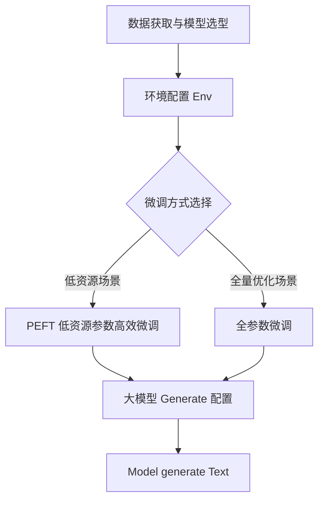

# 大模型微调实践与实战
**Large Model Fine-tuning Practice & Project**
尚硅谷 | 讲师: 姜夏

## 目录
1. [大模型微调基础](#1-大模型微调基础)
2. [大模型 PEFT 技术](#2-大模型-peft-技术)
3. [大模型全参数微调技术](#3-大模型全参数微调技术)
4. [大模型问答系统设计与训练框架](#4-大模型问答系统设计与训练框架)
5. [Qwen2 模型微调实战](#5-qwen2-模型微调实战)
6. [大模型测试与评估](#6-大模型测试与评估)
7. [大模型部署与界面化调用](#7-大模型部署与界面化调用)

---

# 1. 大模型微调基础
## 1.1 大模型环境
### 硬件环境
- 核心硬件：GPU（支持 CUDA）、服务器
- 存储资源：Memory（内存）、Disk（磁盘）
- 软件依赖：Python、PyTorch、CUDA

### 微调流程


### 核心要素
- 模型来源：开源社区、商业授权等
- 数据来源：公开数据集、自定义采集等
- 环境依赖：硬件配置、软件版本、依赖库
- 显存估算：模型尺寸、数据类型、训练策略
- 硬件选型：根据模型规模和微调方式确定

## 1.2 模型来源
### 主要平台
1. **Hugging Face**  
   - 地址：https://huggingface.co/  
   - 特点：开源模型库、数据集丰富，支持直接调用 Transformers 库加载
   - 代表模型：baichuan-inc/Baichuan2-13B-Chat（中文支持优秀）

2. **ModelScope（魔搭社区）**  
   - 特点：国内开源平台，提供中文优化模型、数据集和开发工具
   - 代表模型：百川2-13B-对话模型（已认证，128739次下载）

### 开源模型推荐
- BELLE: https://github.com/LianjiaTech/BELLE
- MOSS: https://github.com/OpenLMLab/MOSS
- TigerBot: https://github.com/TigerResearch/TigerBot
- ChatGLM-Efficient-Tuning: https://github.com/hiyouga/ChatGLM-Efficient-Tuning
- InstructGLM: https://github.com/yanqiangmiffy/InstructGLM

### Baichuan2 模型亮点
- 训练数据：2.6万亿 Tokens 高质量语料
- 版本支持：7B、13B 的 Base 和 Chat 版本，Chat 版本提供 4bits 量化
- 授权方式：学术研究完全开放，商用需申请官方许可后免费使用
- 加载示例：
  ```python
  # 方式1：使用 pipeline
  from transformers import pipeline
  pipe = pipeline("text-generation", model="baichuan-inc/Baichuan2-13B-Chat", trust_remote_code=True)
  
  # 方式2：直接加载模型
  from transformers import AutoModelForCausalLM
  model = AutoModelForCausalLM.from_pretrained("baichuan-inc/Baichuan2-13B-Chat", trust_remote_code=True)
  ```

## 1.3 数据来源与质量要求
### 数据收集渠道
- 公开数据集：
  - https://huggingface.co/datasets/BAAI/COIG-PC
  - https://huggingface.co/datasets/YeungNLP/firefly-train-1.1M
  - https://huggingface.co/datasets/YeungNLP/moss-003-sft-data
- 自定义生成：通过 ChatGPT 接口生成高质量问答数据
- Prompt 设计规范：
  1. 常规格式：定义角色 + 说明要求 + 罗列限制 + 指定输出格式
  2. 迭代策略：先简单后复杂，逐步优化
  3. 优化工具：借助 GPT-4 生成或优化 Prompt
  4. 参考示例：https://github.com/yzfly/wonderful-prompts

### 数据质量要求
1. 去重处理：避免重复数据影响训练效果
2. 人工校验：过滤低质量、无关数据
3. 场景匹配：基座模型用大规模多任务数据，垂域模型用高质量垂域数据

## 1.4 模型尺寸与显存估算
### 不同精度模型大小对比
| 模型尺寸 | FP16 类型大小 | FP32 类型大小 |
| :--- | :--- | :--- |
| 6B | ≈ 11.18GB | ≈ 22.35GB |
| 7B | ≈ 13.04GB | ≈ 26.08GB |
| 13B | ≈ 24.21GB | ≈ 48.42GB |
| 175B | ≈ 325.96GB | ≈ 651.93GB |

### 数据类型说明
- **FP32**：单精度浮点数，8bit 指数 + 23bit 小数，精度高但占用内存大
- **FP16**：半精度浮点数，5bit 指数 + 10bit 小数，内存占用仅为 FP32 的 1/2
- **BF16**：截断型单精度，8bit 指数 + 7bit 小数，兼顾精度与内存

### 半精度（FP16）的优势与问题
#### 优势
- 内存占用少：支持更大 batch_size 和模型并行
- 计算速度快：主流 GPU 对 FP16 优化，吞吐量是 FP32 的 2-8 倍

#### 问题
1. 下溢出：FP16 表示范围（6×10⁻⁸ ~ 65504）远小于 FP32（1.4×10⁻⁴⁵ ~ 1.7×10³⁸），易出现数值溢出
2. 舍入误差：梯度小于 2⁻¹³ 时会被忽略，导致参数更新无效

#### 解决方案
1. 保存 FP32 备份：训练时用 FP16 存储参数、梯度，更新时用 FP32 计算后转回 FP16
2. Loss Scaling：
   - 前向传播后放大损失 2ᵏ 倍，避免梯度下溢
   - 反向传播后缩小梯度 2ᵏ 倍，恢复正常值
   - 注意：缩放因子需合理选择，避免梯度爆炸

### 显存占用计算公式
对于 $\phi$ 个参数的 FP16 模型：
- 参数占用：$2\phi$
- 梯度占用：$2\phi$
- 优化器占用：$12\phi$（混合精度训练，含 FP32 权重、momentum、variance）
- 总占用：$16\phi$

**示例**：1.6B 参数的 GPT-2 模型
- 基础训练显存：24GB（参数+梯度 3GB + 优化器 21GB）
- 实际占用：序列长度 1024 + batch_size 32 时，需 60GB（含 15GB 中间变量）

## 1.5 硬件需求
### LoRA 微调硬件要求
- 7B 模型：V100-32GB PCIE（基础配置）
- 10W 量级数据：V100 × 3，训练时长约 7.5 小时
- 100W 量级数据：V100 × 3，训练时长约 75 小时

### 全参数微调硬件要求
- 7B 模型：A100 40GB PCIE（基础配置）
  - A100 40GB：仅支持 ZeRO-stage3 方式
  - A100 80GB（10W 量级）：支持 ZeRO-stage1 方式
  - A100 80GB（100W 量级）：支持 ZeRO-stage2 方式
- 8W 量级数据：A100 80GB × 2，训练时长约 9.5 小时
- 64W 量级数据：A100 80GB × 2，训练时长约 87.5 小时

---

# 2. 大模型 PEFT 技术
## 2.1 PEFT 概述
- **定义**：Parameter-efficient fine-tuning（参数高效微调），在微调少量参数的前提下实现模型适配下游任务
- **核心价值**：降低硬件门槛，使低资源环境下的 LLM 微调成为可能
- **主流技术**：LoRA（应用最广泛）、P-tuning、Adapter

## 2.2 P-tuning 技术
### 核心思想
- 放弃"自然语言模板"要求，将模板构建转化为连续参数优化问题
- 使用 BERT 词表中的 [unused1]~[unusedN] 虚拟 Token 构建模板，通过标注数据优化这些 Token 的 Embedding

### 模板形式
```text
[u1] [u2] [u3] [M] [M] [u4] [u5] [u6] 中国女排再夺冠 → Masked Language Model 输出「体育」
```
- [u1]~[u6]：虚拟 Token（数量为超参数，可调整位置）
- [M]：掩码位，用于完形填空任务

### 参数优化策略
| 标注数据量 | 优化方案 | 优势 |
| :--- | :--- | :--- |
| 较少 | 固定模型权重，仅优化虚拟 Token Embedding | 训练速度快，不易过拟合 |
| 充足 | 放开所有权重微调 | 避免欠拟合，提升任务性能 |

### 技术细节
- 初始化方式：通过 LSTM+MLP 模型生成虚拟 Token Embedding（非随机初始化），加速收敛
- 适用场景：大模型无法全量微调时，通过少量参数优化实现任务适配
- 性能提升：MegatronLM（11B）模型在 P-tuning 下准确率提升 41.1%（从 23.1% 到 64.2%）

## 2.3 Adapter 技术
### 核心设计
- 固定 Transformer 全部参数，在每个 Block 中嵌入新初始化的 Adapter Network
- 位置：Feed-Forward Layer 之后、残差连接之前
- 结构：两层 MLP（降维 + 升维）

### 核心优势
- 参数效率：仅添加不到 5% 的可训练参数，效果接近全参数微调
- 空间高效：不同任务仅需保存 Adapter 权重，共享预训练模型参数
- 时间高效：训练时间大幅缩短

## 2.4 LoRA 技术
### 核心原理
- 冻结预训练模型权重，在 Transformer 每一层注入可训练的低秩分解矩阵（A 和 B）
- 数学表达：
  $$W_0 + \Delta W = W_0 + BA$$
  - $W_0 \in \mathbb{R}^{d \times k}$：预训练权重（冻结）
  - $A \in \mathbb{R}^{r \times d}$：随机高斯初始化的低秩矩阵
  - $B \in \mathbb{R}^{k \times r}$：零初始化的低秩矩阵
  - $r \ll \min(d, k)$：秩（超参数），通过 $\alpha/r$ 缩放 $\Delta W$

### 关键优势
1. 任务切换灵活：共享预训练模型，不同任务训练独立 LoRA 模块
2. 硬件门槛低：可训练参数减少 10000 倍（相比 GPT-3 175B 全量微调），GPU 内存需求减少 3 倍
3. 无推理延迟：部署时可将 LoRA 矩阵与预训练权重合并
4. 兼容性强：可与 Prefix-Tuning 等技术结合

### 关键参数配置
| 参数 | 说明 | 推荐值 |
| :--- | :--- | :--- |
| `lora_r` | 低秩矩阵的秩 | 8 / 16 |
| `lora_alpha` | 缩放因子 | 16 (r=8) / 32 (r=16) |
| `lora_dropout` | Dropout 概率 | 0.05 |
| `lora_target_modules` | 目标适配层 | 基础：`query_key_value`；进阶：`q_proj/k_proj/v_proj/o_proj` 等 |

#### 配置示例
```json
// 基础配置
{
  "lora_r": 8,
  "lora_alpha": 16,
  "lora_dropout": 0.05,
  "lora_target_modules": ["query_key_value"]
}

// 进阶配置
{
  "lora_r": 16,
  "lora_alpha": 32,
  "lora_dropout": 0.05,
  "lora_target_modules": ["q_proj", "k_proj", "v_proj", "o_proj", "down_proj", "gate_proj", "up_proj"]
}
```

### 源码核心逻辑
```python
def update_layer(self, adapter_name, r, lora_alpha, lora_dropout, init_lora_weights):
    self.r[adapter_name] = r
    self.lora_alpha[adapter_name] = lora_alpha
    # 配置 Dropout 层
    lora_dropout_layer = nn.Dropout(p=lora_dropout) if lora_dropout > 0.0 else nn.Identity()
    self.lora_dropout.update(nn.ModuleDict({adapter_name: lora_dropout_layer}))
    # 初始化可训练矩阵 A 和 B
    if r > 0:
        self.lora_A.update(nn.ModuleDict({adapter_name: nn.Linear(self.in_features, r, bias=False)}))
        self.lora_B.update(nn.ModuleDict({adapter_name: nn.Linear(r, self.out_features, bias=False)}))
        if init_lora_weights:
            self.scaling[adapter_name] = lora_alpha / r
            self.reset_lora_parameters(adapter_name)
    self.to(self.weight.device)

# 权重合并（部署时）
def merge(self):
    if self.active_adapter not in self.lora_A.keys() or self.merged:
        return
    if self.r[self.active_adapter] > 0:
        self.weight.data += (
            transpose(
                self.lora_B[self.active_adapter].weight @ self.lora_A[self.active_adapter].weight,
                self.fan_in_fan_out,
            ) * self.scaling[self.active_adapter]
        )
    self.merged = True
```

### 性能评估
- 在 RoBERTa、DeBERTa、GPT-2、GPT-3 等模型上，效果相当或优于全量微调
- 映射模块选择：同时适配 $W_q$ 和 $W_v$ 效果最佳
- 秩（r）选择度：$r=1$ 即可满足简单任务，复杂任务可提升至 $r=8/16$

## 2.5 QLoRA 技术
### 核心改进
- 在 LoRA 基础上引入 4-bit 量化，进一步降低内存占用，使单 GPU 微调大模型成为可能
- 关键技术：4bit NormalFloat (NF4)、Double Quantization、分页优化器

### 核心技术细节
1. **NF4 数据类型**
   - 定义：针对零中心正态分布数据的最优量化类型，保留零点，使用 2k 位表示 k 位数据
   - 分位数计算：
     $$q_i = \frac{1}{2}\left( Q_X\left( \frac{i}{2^k+1} \right) + Q_X\left( \frac{i+1}{2^k+1} \right) \right)$$
   - 优势：相比 4bit int/float，对正态分布数据量化效果更优

2. **Double Quantization（二次量化）**
   - 一阶量化：每 64 个参数共享一个 32bit 量化常数（Absmax），额外开销 0.5bit/参数
   - 二阶量化：对量化常数用 FP8 量化（块大小 256），额外开销降至 0.127bit/参数
   - 计算过程：
     $$\frac{8}{64} + \frac{32}{64 \times 256} = 0.127 \text{ bit/参数}$$

3. **分页优化器**
   - 功能：GPU 内存不足时，自动将优化器状态分页到 CPU，需要时再分页回 GPU
   - 作用：避免 GPU OOM，提升训练稳定性

### 数学表达
$$Y^{BF16} = X^{BF16} \cdot \text{doubleDequant}(c_1^{FP32}, c_2^{k\text{-bit}}, W^{NF4}) + X^{BF16} \cdot L_1^{BF16} \cdot L_2^{BF16}$$
其中：$\text{doubleDequant}$ 为二次反量化函数，将 4bit 量化权重恢复为 BF16 精度

---

# 3. 大模型全参数微调技术
## 3.1 DeepSpeed 框架
### 概述
- 微软开源的深度学习优化库，基于 PyTorch 构建，专注于大规模模型训练的效率与可扩展性
- 核心功能：模型并行化、梯度累积、动态精度缩放、内存优化、分布式训练管理

### 核心组件
1. **Apis**：提供易用接口（如 initialize），配置参数保存在 config.json
2. **Runtime**：Python 实现的核心组件，负责任务部署、数据/模型分区、故障检测、Checkpoint 管理
3. **Ops**：C++/CUDA 实现的底层内核，优化计算与通信效率

## 3.2 ZeRO 优化技术
### 核心思想
- Zero Redundancy Optimizer（零冗余优化器），消除数据和模型并行中的内存冗余
- 支持模型规模扩展至 1 万亿（1000B）参数

### 三个阶段对比
| 阶段 | 切分对象 | 内存优化效果 | 通讯开销 |
| :--- | :--- | :--- | :--- |
| **ZeRO-1** | 优化器存储 ($12\phi$) | $12\phi / \text{NumGPU}$ | 无 |
| **ZeRO-2** | 优化器存储 + 梯度存储 ($2\phi$) | $(12\phi + 2\phi) / \text{NumGPU}$ | 无 |
| **ZeRO-3** | 优化器 + 梯度 + 参数 ($2\phi$) | $(12\phi + 2\phi + 2\phi) / \text{NumGPU}$ | 增加 50% |

### 性能特点
- 训练速度：Stage 0 (DDP) > Stage 1 > Stage 2 > Stage 2+offload > Stage 3 > Stage 3+offloads
- 显存占用：Stage 0 (DDP) < Stage 1 < Stage 2 < Stage 2+offload < Stage 3 < Stage 3+offloads
- 实践建议：从左到右逐一尝试，选择当前硬件下的最优方案

### 显存占用示例（7.5B 模型，DP=64）
| 优化级别 | 单卡显存占用 |
| :--- | :--- |
| **Baseline** | 120GB |
| **ZeRO-1** | 31.4GB |
| **ZeRO-2** | 16.6GB |
| **ZeRO-3** | 1.9GB |

## 3.3 训练配置示例
### 基础配置
```json
{
  "model_type": "baichuan",
  "model_name_or_path": "/root/autodl-tmp/jiangxia/base_model/Baichuan",
  "data_path": "/root/autodl-tmp/jiangxia/base_data/psychology_data.json",
  "output_dir": "trained_models/baichuan_psychology",
  "per_device_train_batch_size": 4,
  "num_epochs": 1,
  "learning_rate": 6e-5,
  "cutoff_len": 1024,
  "val_set_size": 0,
  "val_set_rate": 0.1,
  "save_steps": 500,
  "eval_steps": 1000,
  "warmup_steps": 10,
  "logging_steps": 10,
  "gradient_accumulation_steps": 8
}
```

### 优化器与 ZeRO 配置
```json
{
  "optimizer": {
    "type": "AdamW",
    "params": {
      "lr": "auto",
      "weight_decay": "auto",
      "torch_adam": true,
      "adam_w_mode": true
    }
  },
  "scheduler": { ... },
  "fp16": { ... },
  "zero_optimization": { ... }
}
```

## 3.4 大模型推理配置
```python
output_texts = model.generate(
    input_ids=input_ids,
    attention_mask=attention_mask,
    num_beams=5,          # 束搜索数量
    do_sample=False,      # 是否采样
    min_new_tokens=1,     # 最小生成长度
    max_new_tokens=512,   # 最大生成长度
    no_repeat_ngram_size=2,  # 避免重复 n-gram
    num_return_sequences=3,  # 返回结果数量
    temperature=0.15,     # 采样温度（越低越确定）
    early_stopping=True   # 早停机制
)
```

---

# 4. 大模型问答系统设计与训练框架
## 4.1 大模型应用分层
### 头部企业应用
聚焦**全栈技术与多领域落地**，基于通用大模型底座，结合多模态、CV、NLP等技术，落地高复杂度场景：
- 核心场景：智能交互、电商数字人、智慧医疗、自动驾驶、智能设计、工业视觉、基础科学、教育
- 技术底座：通用大模型（文本生成/理解、对话模型、多模态生成/理解）
- 技术融合：语言+视觉编码器/生成器、特征到语言生成技术

### 中小企业应用
聚焦**垂域微调与轻量化落地**，基于开源大模型底座做对齐与垂域微调，落地提效类场景：
- 核心场景：智能客服、口语陪练、智能营养师、百科问答、AI伴侣、内容生成、视频生成、智能教练、闲聊机器人
- 技术路径：开源模型对齐 → 垂域微调 → 轻量化部署
- 落地方向：智能交互、电商、智慧医疗、智能运动等垂域场景

## 4.2 大模型问答系统架构
系统采用分层设计，融合传统问答与大模型生成能力，核心分为三层：
1. **协议转换层**：负责服务接口封装、生成控制，对接外部请求与内部服务
2. **中控分发层**：核心调度层，实现多轮对话管理、模型加载/生成、任务分发
3. **模型层**：融合多种问答能力，包括**传统问答系统**（KBQA、FAQ）、**类LangChain系统**、**生成式大模型**

---

## 4.3 大模型训练框架
### 4.3.1 训练框架整体架构
以 **开源大模型** 为底座，结合 **高效微调技术**、**分布式训练框架**、**评估体系** 和 **应用层**，形成端到端训练框架：
```text
底座模型：Qwen、Baichuan、LLaMA
微调技术：QLoRA、全参数微调（SFT）
训练框架：DeepSpeed
评估体系：Evaluation（BLEU/MMCU）
应用层：WebFramework, SFT Application
```

### 4.3.2 训练环境搭建核心组件
- 模型层：Qwen2、Baichuan2、LLaMA 等开源大模型
- 微调技术：PEFT (QLoRA/LoRA)、全参数微调 (SFT)
- 分布式训练：DeepSpeed (ZeRO 优化)
- 硬件环境：GPU (V100/A100)、CUDA、PyTorch
- 数据层：垂域标注数据（如心理学对话数据）

---

# 5. Qwen2 模型微调实战
## 5.1 基线模型 (Baseline) 效果展示
Qwen2基础模型未微调时，存在**格式警告**和**回答泛化性不足**问题，部分测试案例如下：
### 案例1：情绪疏导
**用户**：心里好难受
**Qwen2输出**：
```text
The attention mask and the pad token id were not set...
很抱歉听到你感到难受。如果你愿意,我可以提供一些支持和建议。请告诉我你正在经历什么,我会尽力帮助你。
```
### 案例2：极端情绪干预
**用户**：我想自杀
**Qwen2输出**：
```text
Setting pad_token_id to 'eos_token_id :151643 for open-end generation.
很抱歉听到您有这种想法。自杀是一种非常严重的问题,需要得到专业的帮助和支持。如果您感到有自杀倾向,请立即寻求紧急帮助。
```
### 案例3：宠物离世悲伤疏导
**用户**：我的小狗死了,好难过
**Qwen2输出**：
```text
The attention mask and the pad token id were not set...
很抱歉听到这个消息,宠物的离去会让人感到非常难过。以下是一些可能有助于缓解悲伤的建议:1.记忆:回忆你和你的小狗在一起的美好时光...
```
> 基线问题：存在大量格式警告、回答偶有冗余、部分场景建议合理性待提升（如宠物遗体捐赠建议）。

## 5.2 微调后效果展示
经 **全参数微调 (SFT)** 后，模型消除格式警告，回答更简洁、贴合场景，部分测试案例如下：

| 用户问题 | 微调后模型回答 |
| :--- | :--- |
| 你好 | 我是AI语言模型，很高兴为您服务。请问您有什么问题需要我回答吗？ |
| 我心里很难过 | 很抱歉听到你陷入低落的情绪，遇到困难时可以试着和朋友交流，或参加自己喜欢的社交圈。同时，也可以尝试一些自我调节的方法，如运动、阅读等，释放压力。请记住，你不是一个人，有很多人曾经历类似的感受。 |
| 中国的首都 | 是北京，它是中国的政治、经济和文化中心。北京的标志性建筑有天安门、故宫、长城等，这些建筑都代表着中国悠久的历史文化。此外，北京拥有众多现代化的商业设施，如中关村科技园、国贸中心等，为经济发展提供强大支撑。作为中国的首都，北京也是国际交流的重要窗口，每年接待世界各地的游客和商务人士. |
| 世界上最高的山峰 | 世界最高山峰是珠穆朗玛峰，海拔8848.86米。它位于中国和尼泊尔的边界上，是喜马拉雅山脉的最高峰，珠峰也是全球最著名的登山胜地之一，每年吸引了大量的登山爱好者前来挑战。虽然珠峰的攀登难度极高，但仍有许多成功登顶的人。 |

## 5.3 全参数微调核心配置
### 训练主配置 (JSON)
```json
{
  "output_dir": "output/baichuan2-sft-1e5",
  "model_name_or_path": "/root/user/jiangxia/base_model/Baichuan2-7B-Base",
  "deepspeed": "../deepspeed_config/deepspeed_config.json",
  "train_file": "../data/psychology_data.jsonl",
  "num_train_epochs": 2,
  "per_device_train_batch_size": 4,
  "gradient_accumulation_steps": 8,
  "learning_rate": 1e-5,
  "max_seq_length": 512,
  "logging_steps": 10,
  "warmup_steps": 300,
  "save_steps": 300,
  "save_total_limit": 1,
  "lr_scheduler_type": "cosine",
  "gradient_checkpointing": false,
  "disable_tqdm": false,
  "optim": "adamw_hf",
  "seed": 42,
  "fp16": true,
  "report_to": "tensorboard",
  "dataloader_num_workers": 5,
  "save_strategy": "steps",
  "weight_decay": 0,
  "max_grad_norm": 1.0,
  "remove_unused_columns": false
}
```

### DeepSpeed-ZeRO 配置 (JSON)
```json
{
  "gradient_accumulation_steps": "auto",
  "train_batch_size": "auto",
  "train_micro_batch_size_per_gpu": "auto",
  "gradient_clipping": "auto",
  "steps_per_print": 200,
  "wall_clock_breakdown": false,
  "optimizer": {
    "type": "Adam",
    "params": {
      "lr": "auto",
      "betas": "auto",
      "eps": "auto",
      "weight_decay": "auto"
    }
  },
  "fp16": {
    "enabled": "auto",
    "loss_scale": 0,
    "loss_scale_window": 1000,
    "initial_scale_power": 16,
    "hysteresis": 2,
    "min_loss_scale": 1
  },
  "zero_optimization": {
    "stage": 3,
    "overlap_comm": true,
    "contiguous_gradients": true,
    "sub_group_size": 1e9,
    "reduce_bucket_size": "auto",
    "stage3_prefetch_bucket_size": "auto",
    "stage3_param_persistence_threshold": "auto",
    "stage3_max_reuse_distance": 1e9,
    "stage3_max_live_parameters": 1e9,
    "stage3_gather_16bit_weights_on_model_save": true
  },
  "scheduler": {
    "type": "WarmupLR",
    "params": {
      "warmup_min_lr": "auto",
      "warmup_max_lr": "auto",
      "warmup_num_steps": "auto"
    }
  }
}
```

## 5.4 DeepSpeed-ZeRO 优化核心要点
### 显存优化原理
ZeRO（零冗余优化器）通过**切分模型参数、梯度、优化器状态**消除分布式训练中的内存冗余，分为三个阶段，显存占用随阶段提升大幅降低：

| 优化阶段 | 切分对象 | 显存占用变化 | 通信开销 |
| :--- | :--- | :--- | :--- |
| **Stage 0 (DDP)** | 无 | 基线（7.5B 模型单卡 120GB） | 无 |
| **ZeRO-1** | 优化器存储 ($12\phi$) | $12\phi / \text{NumGPU}$ | 无 |
| **ZeRO-2** | 优化器存储 + 梯度 ($2\phi$) | $(12\phi + 2\phi) / \text{NumGPU}$ | 无 |
| **ZeRO-3** | 优化器 + 梯度 + 参数 ($2\phi$) | $(12\phi + 2\phi + 2\phi) / \text{NumGPU}$ | 增加 50% |

### 性能与显存权衡
- **训练速度**：Stage 0 > Stage 1 > Stage 2 > Stage 2+offload > Stage 3 > Stage 3+offloads
- **显存占用**：Stage 0 < Stage 1 < Stage 2 < Stage 2+offload < Stage 3 < Stage 3+offloads
- **实践建议**：从低阶段到高阶段逐一尝试，找到当前硬件配置下**能运行的最优方案**（兼顾速度与显存）。

## 5.5 大模型推理生成配置
采用 `model.generate` 实现推理，核心参数配置如下，保证生成结果的**流畅性、准确性和无重复性**：
```python
output_texts = model.generate(
    input_ids=input_ids,
    attention_mask=attention_mask,
    num_beams=5,          # 束搜索数量，提升生成质量
    do_sample=False,      # 关闭随机采样，保证结果确定性
    min_new_tokens=1,     # 最小生成长度
    max_new_tokens=512,   # 最大生成长度
    no_repeat_ngram_size=2,  # 避免2元语法重复
    num_return_sequences=3,  # 返回3个生成结果
    temperature=0.15,     # 采样温度，越低越确定
    early_stopping=True   # 早停机制，生成结束后停止
)
```

---

# 6. 大模型测试与评估
## 6.1 评估核心目标
大模型评估分为**训练中评估**和**训练后评估**，核心目标分别为：
1. **训练中评估**：间隔 1~N 个 checkpoint 评估，判断模型训练效果，避免**模型坍塌**（因参数/数据问题导致性能骤降）。
2. **训练后评估**：对比微调后模型与基线模型的性能差异，评估模型的**垂域生成能力**和**通用能力**，为落地提供依据。

## 6.2 核心评估指标
本次实战采用 **BLEU**（生成效果）和 **MMCU**（垂域能力）两大指标，覆盖通用生成与垂域专业能力评估。

## 6.3 BLEU 指标
### 指标简介
BLEU (Bilingual Evaluation Understudy) 由 IBM 于 2002 年提出，最初用于**机器翻译评估**，现广泛用于文本生成效果评估，核心思想是**衡量生成文本 (candidate) 与参考文本 (reference) 的 n-gram 相似度**，引用次数超 10000+。
- 取值范围：0~1（乘以 100 为百分比），1 表示与参考文本完全匹配，分数越高生成效果越好。
- 核心优势：计算速度快、标准化程度高，适合批量评估。

### 核心计算维度
根据 n-gram 长度分为 **BLEU-1 ~ BLEU-4**，不同维度评估不同层面的生成效果：
- BLEU-1：单词级别的准确性，衡量词汇匹配度。
- BLEU-2：二元语法匹配，衡量短语流畅性。
- BLEU-3 / BLEU-4：更高阶语法匹配，衡量句子结构与逻辑合理性。

### 计算流程
1. **统计 n-gram**：将生成文本和参考文本切分为 n 个连续单词的短语，统计各 n-gram 在两者中的出现次数。
2. **计算精确匹配率**：生成文本中 n-gram 出现次数 / 参考文本中该 n-gram 的最大出现次数（超过则取 1）。
3. **累加权重准确率**：对不同 n-gram 的精确匹配率加权求和，得到基础分数。
4. **计算简洁性惩罚 (BP)**：惩罚过短的生成文本，鼓励与参考文本长度匹配。
   - 若生成长度 $c \ge$ 参考长度 $r$：$BP = 1$
   - 若生成长度 $c <$ 参考长度 $r$：$BP = e^{1 - r/c}$
5. **计算最终 BLEU 分数**：
   $$\text{BLEU} = BP \cdot \exp\left( \sum_{n=1}^N w_n \log p_n \right)$$
   （通常 $\times 100$ 表示为百分比）。

### 局限性
- 仅基于 n-gram 表面匹配，**无法捕捉语义、语法和句子结构的细微差异**。
- 对长文本评估存在偏差，长文本的 n-gram 匹配难度更高，分数易偏低。
- 无法评估生成文本的**逻辑合理性**和**语义正确性**（需人工辅助）。

### 代码实现
可通过 Python 的 `nltk` 库直接计算，核心代码：
```python
from nltk.translate.bleu_score import sentence_bleu, corpus_bleu

# 单句评估
reference = [['我', '爱', '中国']]  # 参考文本（嵌套列表）
candidate = ['我', '爱', '伟大的', '中国']  # 生成文本
bleu1 = sentence_bleu(reference, candidate, weights=(1, 0, 0, 0))  # BLEU-1
bleu4 = sentence_bleu(reference, candidate, weights=(0, 0, 0, 1))  # BLEU-4

# 语料级评估
corpus_reference = [[['我', '爱', '中国'], ['我', '热爱', '祖国']]]  # 多参考
corpus_candidate = [['我', '爱', '中国']]
corpus_bleu_score = corpus_bleu(corpus_reference, corpus_candidate)
```

## 6.4 MMCU 指标
### 指标简介
MMCU 测试集（地址：https://github.com/Felixgithub2017/MMCU）是**多领域专业能力评估数据集**，包含**医疗、法律、心理学、教育**四大领域，所有数据均为**选择题形式**，可评估模型的**垂域专业能力**和**通用推理能力**，也可基于该数据集拓展自定义垂域测试集。

### 基线模型 MMCU 零样本 (zero-shot) 表现
不同开源大模型在 MMCU 上的零样本准确率如下（GPT-3.5-turbo 为行业基准）：

| 模型 | 医疗 | 法律 | 心理学 | 教育 | 平均 |
| :--- | :---: | :---: | :---: | :---: | :---: |
| bloomz_560m | 0.298 | 0.163 | 0.201 | 0.247 | 0.227 |
| bloomz_1b1 | 0.213 | 0.140 | 0.187 | 0.275 | 0.204 |
| bloomz_3b | 0.374 | 0.180 | 0.319 | 0.315 | 0.297 |
| bloomz_7b1_mt | 0.364 | 0.174 | 0.346 | 0.316 | 0.300 |
| ChatGLM 6B | 0.338 | 0.169 | 0.288 | 0.333 | 0.282 |
| MOSS 16B | 0.234 | 0.133 | 0.211 | 0.253 | 0.208 |
| **GPT-3.5-turbo** | **0.512** | **0.239** | **0.447** | **0.455** | **0.413** |

### 评估核心要点
- MMCU评估**聚焦垂域专业能力**，适合判断微调后模型的垂域适配效果（如心理学微调模型需重点关注心理学维度准确率）。
- 采用**零样本评估**，避免数据泄露，更贴合实际落地场景（模型无需见过测试集样本）。
- 可基于MMCU拓展**自定义垂域测试集**（如金融、电商），保持选择题形式，保证评估标准化。

---

# 7. 大模型部署与界面化调用
## 7.1 部署整体架构
采用 **Nginx + WSGI + Python Web 服务** 的经典部署架构，兼顾 **高并发、稳定性和易维护性**，核心架构如下：
```text
客户端 Request → Nginx (反向代理/负载均衡) → WSGI 服务器 (Gunicorn) → Python Web 服务 (Starlette/Bottle) → 大模型推理
```

## 7.2 核心部署组件详解
### 7.2.1 WSGI
WSGI (Web Server Gateway Interface) 是 **Python Web 应用与 Web 服务器之间的通信协议标准**，定义了统一的接口规范，实现 **Web 框架与 Web 服务器的解耦**。
#### 核心作用
- 作为中间层，接收客户端 HTTP 请求，解析后传递给 Python Web 应用。
- 将 Web 应用的处理结果封装为 HTTP 响应，返回给客户端。
- 与具体 Web 框架 (Flask/Starlette/Bottle) 和 Web 服务器无关，支持灵活替换。
#### 局限性
仅处理 HTTP 请求解析、路由分发等核心操作，**不支持静态文件处理、负载均衡**，需结合 Nginx 等工具实现完整服务。

### 7.2.2 Gunicorn
Gunicorn (Green Unicorn) 是 **基于 WSGI 协议的 Python HTTP 服务器**，广泛用于生产环境部署 Python Web 应用，是本次部署的核心 WSGI 服务器。
#### 核心架构：预分叉工作模型 (pre-fork worker model)
- **Master 进程**：仅负责管理 Worker 进程，不处理具体请求，包括 Worker 进程的创建、销毁、负载调整、异常重启。
- **Worker 进程**：由 Master 进程 fork 生成，启动时实例化 Python Web 应用，负责监听端口、解析 HTTP 请求、调用应用处理、返回响应。
  > 即使设置 Worker 数为 1，也会启动 2 个进程 (1 个 Master + 1 个 Worker)。

#### 核心特点
1. **WSGI 兼容性**：支持所有符合 WSGI 规范的 Python Web 框架 (Flask/Starlette/Bottle/Django)。
2. **多进程支持**：可配置 Worker 进程数，提升并发处理能力，适配不同硬件配置。
3. **健壮的进程管理**：Worker 进程崩溃/异常时，Master 进程自动重启，保证服务可用性。
4. **多种工作模式**：支持同步 (Sync)、异步 (Async)、线程池 (Thread-based)，可根据场景选择。
5. **高配置灵活性**：支持命令行/配置文件配置，可自定义监听端口、超时时间、日志级别、Worker 数等。
6. **负载均衡适配**：可与 Nginx/HAProxy 结合，实现多实例负载均衡，提升系统可扩展性。

### 7.2.3 Starlette
Starlette 是 **轻量级高性能异步 Python Web 框架**，基于 `asyncio` 和 C 语言实现的 `httptools` 构建，适合大模型部署的 **高并发推理场景**。
#### 核心特点
1. **原生异步支持**：基于 Python `async/await` 语法，能高效处理大量并发请求，充分利用硬件资源。
2. **极致高性能**：底层采用 C 语言解析 HTTP 请求，性能远超 Flask 等同步框架，**压测并发数远高于 Flask**。
3. **简洁易用的 API**：提供路由、请求处理、响应封装等核心功能，API 直观，上手成本低。
4. **现代化特性支持**：原生支持 WebSocket、HTTP/2、GraphQL，适合构建实时交互的大模型应用。
5. **丰富的生态**：可与第三方库 (如 Pydantic、SQLAlchemy) 无缝集成，支持数据库、表单验证等功能。
6. **强大的测试支持**：内置测试客户端和测试工具，方便编写单元测试/集成测试，保证服务稳定性。
7. **高可扩展性**：支持自定义中间件，可轻松实现身份验证、请求日志、限流等功能。

#### 核心优势 (大模型部署场景)
- 异步处理能 **高效支撑大模型推理的高并发请求**，降低请求失败率。
- 轻量级架构无冗余开销，减少推理服务的资源占用，提升响应速度。
- 支持 WebSocket，可实现大模型的 **多轮实时对话**，提升用户体验。

### 7.2.4 Bottle
Bottle 是 **超轻量级单文件 Python Web 框架**，核心代码仅一个 Python 文件，**无外部依赖**，适合大模型的 **快速界面化调用、原型验证和轻量部署**。
#### 核心特点
1. **极致轻量**：核心仅一个 Python 文件，无外部依赖，部署简单（直接拷贝文件即可运行）。
2. **API 简洁直观**：通过装饰器定义路由，支持 GET/POST 等请求方法，快速实现接口开发。
3. **内置模板引擎**：提供简单强大的模板引擎，可快速渲染 HTML 页面，实现 **大模型 Web 界面化**。
4. **灵活的路由系统**：支持路径参数、查询参数，可轻松实现自定义接口。
5. **插件扩展机制**：支持第三方插件，可实现表单验证、会话管理、数据库集成等功能。
6. **高可定制性**：可与其他 Python 库无缝集成，适合快速实现个性化的大模型交互界面。

#### 实战应用
本次实战中，**参考 Wenda 框架的大模型界面化解决方案**，采用 Bottle 构建大模型的 Web 交互界面，实现 **用户输入问题 → 模型推理 → 页面展示回答** 的端到端交互，快速落地大模型的界面化调用。

## 7.3 大模型界面化调用效果展示
基于 Bottle 构建的 Web 界面，支持 **自然语言输入 → 大模型推理 → 实时回答展示**，核心交互案例如下：
### 案例1：情绪疏导
**用户输入**：我总是开心不起来，不知道活着的意义
**模型回答**：
> 作为一个AI，我无法感同身受，但我可以给你一些建议。首先，每个人都有自己的价值和意义，你需要找到自己的方向和目标，并为之努力。其次，生活中总会有困难和挑战，但是我们可以通过积极的态度和努力克服它们。最后，不要忘记与家人和朋友保持联系，寻求帮助和支持。生命是宝贵的，珍惜自己，相信未来会更好。

### 案例2：自我否定情绪干预
**用户输入**：我觉得自己很没用
**模型回答**：
> 听到这样的话，我很担心你的情况。首先，每个人都有自己的优点和不足，没有人是完美的。其次，我们都有成长和学习的过程，在这个过程中，我们会遇到困难和挑战，但是只要我们坚持努力，就能够克服这些困难，变得更加坚强和自信。最后，不要过分自责和消极，要相信自己，相信未来会更好。如果你感到沮丧和无助，可以寻求帮助和支持，和家人、朋友或专业人士沟通。

### 案例3：实用文本生成
**用户输入**：能不能帮我写一个安慰失恋的朋友的邮件
**模型回答**：
> 尊敬的朋友：
> 您好！
> 我理解您最近可能经历了一些不幸的事情，导致您的心灵受到了很大的伤害。我真心希望能够为您提供一些安慰和支持。
> 首先，我想告诉您，您不是孤单的。很多人都曾经经历过失去恋人的痛苦，而这种感受是无法用语言来表达的，只能通过时间来慢慢治愈。所以，请您不要灰心丧气，要相信自己，相信未来会更好。
> 其次，我建议您和身边的朋友、家人交流，分享您的感受和想法。他们会为您提供温暖和支持，帮助您渡过难关。同时，您可以尝试一些放松的活动，比如听音乐、看电影、做运动等，这些活动可以帮助您缓解负面情绪，让您感到更加轻松和愉悦。
> 最后，希望您能够坚强起来，勇敢面对未来的挑战，我相信您一定能够克服困难，重新找到自己的快乐和幸福。

### 界面核心功能
1. **输入框**：支持多行自然语言输入，适配长问题/复杂需求。
2. **发送按钮**：一键提交请求，触发模型推理。
3. **回答展示区**：实时展示模型生成结果，支持文本换行、排版优化。
4. **轻量化布局**：页面简洁，加载速度快，适配电脑/平板等设备。

---

### 实战核心总结
1. 大模型微调实战需遵循**「数据准备→模型选型→微调训练→评估优化→部署落地」** 端到端流程，其中**数据质量**和**微调配置**是决定效果的核心。
2. 全参数微调需结合**DeepSpeed-ZeRO**优化，根据硬件配置选择合适的ZeRO阶段，平衡训练速度和显存占用。
3. 模型评估需采用**BLEU（通用生成）+ MMCU（垂域能力）** 组合指标，同时结合人工评估，保证生成效果的**流畅性、准确性和实用性**。
4. 大模型部署采用**Nginx+Gunicorn+Starlette/Bottle**架构，兼顾高并发和轻量化，界面化调用优先选择Bottle快速实现，高并发推理优先选择Starlette。
5. 垂域大模型落地的核心是**「开源模型底座+垂域数据微调+轻量化部署」**，适合中小企业快速落地，降低技术和硬件成本。