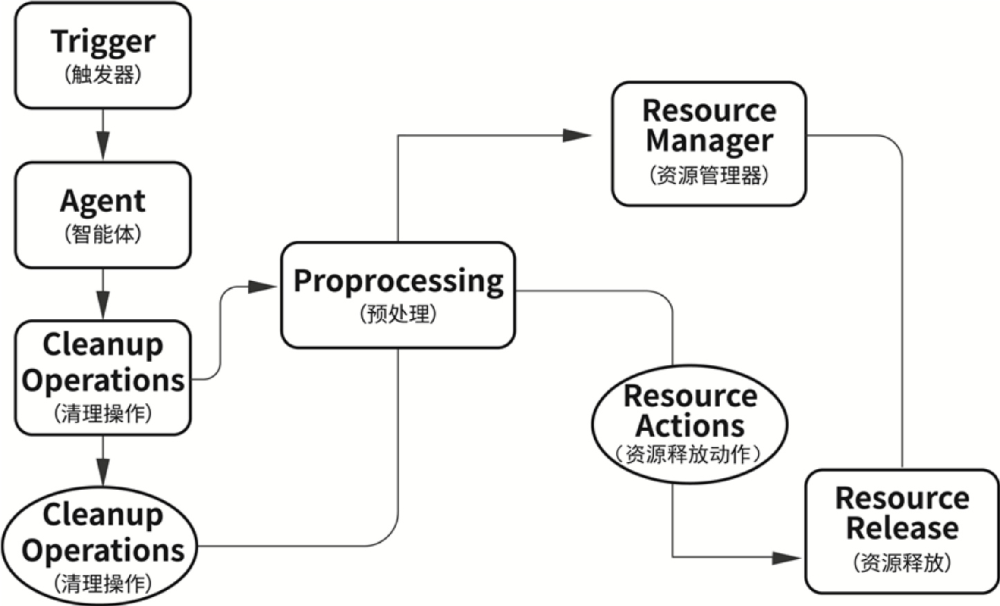

# 2 智能体组成与运行机制
## 2.1 智能体核心模块构成
- 感知模块：输入与解析
- 决策模块：推理与规划逻辑
- 行动模块：工具与响应
- 记忆模块：上下文与持久状态

## 2.2 智能体生命周期管理
### 2.2.1 启动与初始化过程
在Qwen智能体的架构中，智能体对象的初始化通常包括4个关键环节：
(1)加载模型配置，包括模型名称、温度、最大Token长度等推理相关参数。
(2)注册工具函数并声明其功能及参数结构，供后续模型调用。
(3)加载默认记忆(Memory)或上下文(Context)，以支持上下文拼接与长期记忆初始化。
(4)定义智能体的元信息，包括名称、角色设定与行为边界。

### 2.2.2 对话状态追踪机制

对话状态追踪 (Dialogue State Tracking, DST) 是智能体在多轮交互中维持连贯性与任务推进能力的核心大脑。在复杂的业务场景下,智能体不仅要理解当前这一句话的意思,更要精准掌握对话的"上下文进度"。

**1. DST 的核心定义与价值**

其本质是在每一轮对话中捕获、更新并维护一个**结构化的状态表示 (State Representation)**。通过这一机制,智能体能够实现以下核心目标:
- **意图连贯性**:即使在用户中途转换话题或追问时,依然能找回原始任务目标。
- **信息累积**:自动识别并填充任务所需的槽位(Slots),如订票场景中的"时间""地点""人数",避免重复询问。
- **任务阶段识别**:明确当前处于任务的哪个阶段(如"需求采集""方案推荐"或"确认下单"),从而调用正确的工具或回复策略。

**2. 从传统 DST 到大模型 Agent 的演进**

与传统基于规则或简单分类模型的对话系统不同,基于 Qwen 等大模型的 Agent 在 DST 上具备更高的灵活性:
- **非结构化到结构化的转化**:大模型能直接从自然语言中提取复杂的结构化状态,无需预定义繁琐的正则表达式。
- **动态状态迁移**:Agent 可以根据对话内容自主决定状态的跳转,而不是死板地遵循状态机路径。
- **长程依赖处理**:利用大模型的长文本处理能力,DST 可以跨越数十轮对话依然保持关键信息的准确性。

**3. 对话状态的组成要素**

一个完整的对话状态通常包含以下三部分:
- **用户约束 (Constraints)**:用户明确提出的要求(如"只要 500 元以内的酒店")。
- **任务槽位 (Slots)**:执行特定功能必须具备的参数及其当前取值。
- **会话历史摘要 (Summary)**:对过往复杂对话的精炼总结,用于节省 Token 并防止上下文偏移。

---

**1. 基于 Memory 模块的状态快照构建**

在 Qwen 智能体框架中，状态追踪主要依赖记忆管理 (Memory) 模块实现。该模块通过以下方式构建状态快照：
- **回合内容注入**：将每一轮的用户输入与模型输出以结构化格式写入记忆队列，保留完整的对话历史。
- **关键标记提取**：从对话中识别并标记关键实体、槽位值(Slot Values)和意图标签，例如在表单填报场景中追踪"姓名=张三""电话=已填写"等状态变量。
- **上下文变量管理**：维护一组动态键值对(Context Variables)，记录任务进度、分支条件、用户偏好等元信息，供后续推理使用。

这些信息在每轮交互中进行动态拼接与提取，形成闭环式上下文感知逻辑——即智能体不仅能回溯历史，还能据此判断当前所处的任务阶段。

**2. 结合Function Call的状态驱动决策**

状态追踪的价值不仅在于"记住"，更在于"驱动行动"。配合函数调用(Function Call)机制，智能体可根据当前状态做出以下决策：
- **条件性工具调用**：当检测到某个槽位尚未填充时，自动调用信息采集工具；当所有必填项齐备时，触发提交动作。
- **子任务流程跳转**：在复杂任务中，根据状态变量判断是否需要进入子流程（如身份验证、二次确认），或从子流程返回主流程。
- **回退与纠错**：当用户表达修改意图或状态出现矛盾时，回退到前一步重新执行，而非从头开始。

**3. 典型应用场景**

这一状态追踪与状态驱动机制广泛应用于：
- **对话表单填报**：逐步引导用户填写多字段表单，自动跳过已填项，提示缺失项。
- **多轮知识问答**：在追问与澄清中维持话题焦点，避免上下文漂移。
- **复杂检索任务**：根据用户逐步细化的检索条件，动态调整查询策略并呈现结果。
- **人机协同流程自动化**：在审批、工单处理等流程中，追踪每个节点的完成状态，协调人工介入与自动处理的切换。

```python
def process_input(self, user_input: str) -> str:
    """
    处理用户输入，返回智能体回复。
    这是智能体的主循环入口。
    """
    # 1. 感知：记录用户输入到 Memory
    self.memory.add_turn("user", user_input)
    interaction_count = self.memory.get_var("interaction_count", 0) + 1
    self.memory.set_var("interaction_count", interaction_count)

    # 2. 决策：根据当前阶段和输入内容决定动作
    action = self._decide_action(user_input)

    # 3. 行动：执行动作并生成回复
    response = self._execute_action(action, user_input)

    # 4. 记录回复到 Memory
    self.memory.add_turn("assistant", response)
    self.memory.set_var("phase", self.phase)

    return response
```
### 2.2.3 中断恢复与持久化上下文机制

在实际应用中,智能体任务往往跨越多个会话周期——用户可能中途离开、系统可能重启、或任务本身需要分阶段完成。中断恢复与持久化上下文机制确保智能体能够"记住过去",在任何时刻恢复到之前的工作状态,而非每次都从零开始。

**1. 持久化机制的核心设计**

在Qwen智能体框架中,持久化机制通过自定义Memory子类实现,该类需具备以下核心能力:

- **状态序列化与存储**:将当前会话的完整状态(包括对话历史、上下文变量、任务进度、已调用的工具及其结果)序列化为结构化数据(如JSON),并持久化到存储层(数据库、Redis、文件系统等)。
- **状态反序列化与加载**:根据会话唯一标识符(Session ID)从存储层读取历史状态,并将其反序列化为Memory对象,恢复智能体的完整上下文。
- **增量更新机制**:每轮对话后仅更新变化的部分,而非全量覆盖,以提升性能并支持并发场景下的状态一致性。

**2. 中断恢复的工作流程**

当用户重新发起会话或系统从故障中恢复时,中断恢复机制按以下步骤执行:

**(1) 会话识别与状态检索**
- 通过Session ID(可由用户ID + 任务ID组合生成)唯一定位历史会话。
- 从持久化存储中查询该会话的最新状态快照,包括对话轮次、已完成的子任务、待处理的槽位等。

**(2) 上下文重建与提示词拼接**
- 将历史对话记录重新注入到Memory模块,恢复完整的上下文窗口。
- 根据任务状态快照,重建当前所处的任务阶段标识(如"等待用户确认"、"处理表单"等)。
- 若存在未完成的子任务,则根据其状态恢复执行流程(如"已填写姓名"、"已提交表单"等)。

**(3) 智能体回复生成**
- 根据重建的上下文,智能体利用预训练模型生成回复。
- 若任务状态要求用户确认或填写槽位值,则在回复中提示用户输入。

**3. 典型应用场景**

这一中断恢复与持久化上下文机制广泛应用于需要长期记忆与任务状态管理的场景,例如:

- **多轮对话表单填报**：用户在多轮对话中填写复杂表单,系统需记住已填写项、当前阶段、待处理槽位等状态。
- **复杂任务协调**：在审批、工单处理等场景中,智能体需根据用户指令协调多个子任务,并在中断后恢复执行。

### 2.2.4 智能体注销与资源释放机制

智能体生命周期的终点是注销与资源释放阶段。高效的注销机制不仅能防止内存泄漏和资源锁死,还能确保多用户并发环境下系统的长期稳定运行。

**1. 注销触发机制 (Trigger)**

注销过程通常由以下三类事件触发:
- **主动触发**:用户发送"退出""再见"或点击关闭按钮,明确要求结束会话。
- **被动触发**:系统监测到长时间无响应(会话超时)或底层模型服务抛出不可恢复的致命错误。
- **外部调度**:在多智能体系统中,由管理节点(Coordinator)根据任务完成情况统一调度注销。

**2. 注销执行流程**

注销流程分为预处理、资源释放和状态收敛三个核心阶段:

**(1) 预处理阶段 (Preprocessing)**
- **任务状态回收**:扫描当前待处理的异步任务,决定是强行终止还是等待其完成最后一步持久化。
- **缓存同步**:将 Memory 中的临时上下文、用户偏好等关键变量最后一次写入持久化存储。

**(2) 资源释放阶段 (Resource Release)**
- **连接关闭**:主动断开与大模型 API、向量数据库、关系型数据库及文件系统的连接句柄。
- **内存回收**:清理当前 Session 对象占用的临时变量、大对象缓存以及线程本地存储(Thread Local Storage)。
- **信号广播**:向系统内核或资源管理器发出资源释放信号,释放所占用的端口或计算资源。

**(3) 状态收敛与通知 (Convergence)**
- **事件通知**:在多智能体场景下,通过消息总线通知相关协作智能体,避免其继续向已注销的节点发送请求。
- **审计日志记录**:记录本次会话的最终状态(成功/失败/异常中断)、Token 消耗统计及生命周期耗时。

**3. 资源释放分类表**

| **资源类型** | **释放动作** | **重要性** |
| :--- | :--- | :--- |
| **计算资源** | 终止未完成的线程、销毁协程池、释放 GPU 显存 | 高 |
| **IO 连接** | 关闭 HTTP 链接、数据库连接池回收、文件描述符归还 | 极高 |
| **内存对象** | 清理 Prompt 模板缓存、中间结果、Session 上下文 | 中 |
| **协同信号** | 发送注销广播、更新注册中心状态、释放分布式锁 | 高 |

**4. 最佳实践建议**

- **设计幂等性注销**:确保注销接口可以被多次调用而不产生副作用,防止因重复触发导致的系统崩溃。
- **异常捕获与强制回收**:即使注销过程中某个子环节出错,也必须确保后续的资源释放动作能继续执行(使用 `try...finally` 结构)。
- **资源使用监控**:结合 AgentOps 监控,实时观察每个 Session 后的资源回收率,及时发现内存泄露隐患。
- **优雅停机支持**:在系统整体重启时,应支持批量触发所有活跃智能体的优雅注销,确保数据不丢失。



## 2.3 与外部系统的集成方式
