## 目录

-   [零、开场：AI Coding 的过去与现在](#零开场ai-coding-的过去与现在)

-   [一、AI 工具安装与配置](#一ai-工具安装与配置)

-   [二、AI 工具基础使用](#二ai-工具基础使用)

-   [三、MCP 与 Skill：扩展 AI 的能力边界](#三mcp-与-skill扩展-ai-的能力边界)

-   [四、Vibe Coding vs Spec Coding](#四vibe-coding-vs-spec-coding)

-   [五、工具性价比分析](#五工具性价比分析)

-   [六、展望与总结](#六展望与总结)

-   [附录](#附录)

## 零、开场：AI Coding 的过去与现在

### 0.1 AI Coding 简史

AI 辅助编程并非一夜之间出现，而是经历了多年的技术积累和演进：

| **时间节点** | **里程碑事件** | **意义** |
| :--- | :--- | :--- |
| **2021** | GitHub Copilot 首发 | 开启 AI 辅助编程时代，让开发者首次体验到 AI 补全代码的魔力 |
| **2023** | ChatGPT 爆发 | 催生对话式编程范式，开发者可以用自然语言与 AI 讨论代码问题 |
| **2024** | Claude 3.5 Sonnet 发布 | Agent 能力突破，AI 开始展现自主规划和执行任务的能力 |
| **2025-2026** | Claude Code、Codex、Kiro 等工具涌现 | 从 "辅助" 走向 "自主"，AI 成为真正的编程伙伴 |


### 0.2 AI Coding 的三个阶段

我们可以将 AI Coding 的发展划分为三个明显的阶段：

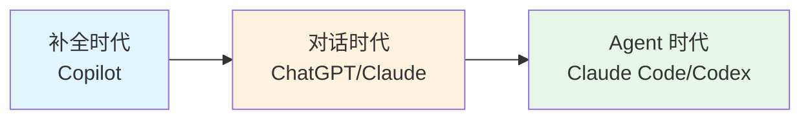

| **阶段** | **代表工具** | **核心能力** | **用户角色** | **典型场景** |
| :--- | :--- | :--- | :--- | :--- |
| **补全时代** | Copilot | 行级/块级代码补全 | 主导者 | 写代码时 AI 自动补全下一行 |
| **对话时代** | ChatGPT/Claude Chat | 问答式生成代码 | 指挥者 | 询问 "如何实现 XXX 功能" |
| **Agent 时代** | Claude Code/Codex/Kiro | 理解上下文、自主规划执行 | 审核者 | 描述需求后 AI 自主完成开发 |

### 0.3 今天的核心观点

[!IMPORTANT]

**AI Coding 不是取代程序员，而是让程序员成为 10x 工程师。**

关键在于：**选对工具 + 用对方法 + 建立工作流**。

今天的分享将围绕这个核心观点展开，帮助大家：

1.  了解当前主流的 AI Coding 工具

2.  掌握这些工具的安装、配置和基础使用

3.  理解 MCP 和 Skill 如何扩展 AI 的能力

4.  学会根据不同场景选择 Vibe Coding 或 Spec Coding

5.  合理规划工具投入，控制使用成本

## 一、AI 工具安装与配置

### 1.1 OpenRouter：统一的 API 入口

🔗 **官网**：[OpenRouter](https://openrouter.ai/)

#### 是什么？

OpenRouter 是一个 LLM API 聚合网关，通过一个统一的接口调用多个 AI
模型提供商的服务。

#### 架构图

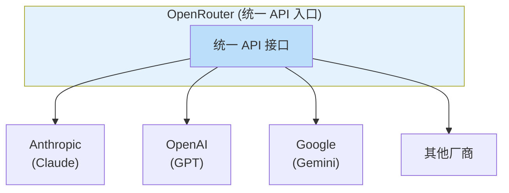

#### 为什么要用 OpenRouter？

| **优势** | **说明** |
| :--- | :--- |
| **统一入口** | 一个 API Key 调用多个模型（Claude、GPT、Gemini 等） |
| **灵活计费** | 按使用量付费，无需多个订阅 |
| **模型切换** | 轻松切换不同模型，寻找最佳性价比 |
| **稳定可靠** | 多个提供商备份，服务更稳定 |

#### 快速开始

1.  访问 [OpenRouter](https://openrouter.ai/) 注册账号

2.  进入 Dashboard → API Keys → Create Key

3.  充值适量金额（建议先充 \$10 试用）

4.  在 AI 工具中配置 base_url 为 https://openrouter.ai/api/v1

编码推荐模型：anthropic/claude-sonnet-4.5 性价比最高

### 1.2 GitHub Copilot

🔗 **官网**：[GitHub Copilot · Your AI pair programmer ·
GitHub](https://github.com/features/copilot)

#### 安装步骤

[!TIP]

🎬 **演示提醒**：此处建议使用 VSCode 打开项目进行现场演示

**Step 1: 安装 VSCode 插件**

1.  打开 VSCode

2.  进入插件市场（Cmd+Shift+X）

3.  搜索 "GitHub Copilot"

4.  点击 Install 安装以下两个插件： GitHub Copilot

    a.  GitHub Copilot Chat

**Step 2: 登录 GitHub 账号**

1.  安装完成后，点击右下角的 Copilot 图标

2.  按提示完成 GitHub 账号授权

**Step 3: 开启 Agent 模式（重要！）**

1.  打开 VSCode 设置（Cmd+,）

2.  搜索 "Copilot Agent"

3.  确保 GitHub Copilot: Enable Agent Mode 已勾选

#### 订阅方案（2026 最新）

| **版本** | **价格** | **特点** | **适用对象** |
| :--- | :--- | :--- | :--- |
| **Free** | 免费 | 每月 2000 补全 + 50 聊天 | 学生/开源维护者 |
| **Pro** | $10/月 | 无限补全 + 300 高级请求/月 | 个人开发者 |
| **Pro+** | $39/月 | 1500 高级请求/月 + 高级模型 | 重度用户 |
| **Business** | $19/用户/月 | 审计日志 + 策略控制 | 企业团队 |
| **Enterprise** | $39/用户/月 | SSO + 自定义 SLA | 大型组织 |

### 1.3 Claude Code

🔗 **官网**：[claude.ai/code](https://claude.ai/code) \|
**文档**：[docs.anthropic.com/claude-code](https://docs.anthropic.com/claude-code)

Claude Code 是 Anthropic 官方出品的 CLI
开发工具，拥有强大的代码理解和生成能力。

#### 安装步骤（2026 最新 - 原生安装器）

[!IMPORTANT]

npm 安装方式已弃用，推荐使用原生安装器，无需
Node.js，支持自动更新。**macOS / Linux / WSL：**

**Windows PowerShell：**

**验证安装：**

#### 配置 API Key

#### 项目级配置：CLAUDE.md

[!IMPORTANT]

CLAUDE.md 是 Claude Code 最重要的配置文件，它让 AI 更好地理解你的项目！

在项目根目录创建 CLAUDE.md 文件：

```markdown
# 项目名称

## 项目简介
这是一个 xxx 项目，使用 xxx 技术栈开发。

## 技术栈
- 语言：Go 1.22
- 框架：Gin + Ent
- 数据库：PostgreSQL

## 目录结构
- `/cmd` - 应用入口
- `/internal/domain` - 领域模型
- `/internal/app` - 应用服务层
- `/internal/infra` - 基础设施层

## 代码规范
- 使用 xxx 命名规范
- 错误处理使用 xxx 模式

## 常用命令
- `make build` - 构建项目
- `make test` - 运行测试
```

### 进阶工具：cc-switch

🔗
**官网**：[github.com/nicepkg/cc-switch](https://github.com/nicepkg/cc-switch)

cc-switch 是一个**跨平台桌面应用**，用于管理和切换 Claude
Code、Codex、Gemini 等 AI 编程工具的 API 配置。

**核心功能**：

| **功能** | **说明** |
| :--- | :--- |
| **多配置管理** | 存储多个 API 配置（官方、OpenRouter、自建代理等） |
| **一键切换** | 通过图形界面快速切换不同配置 |
| **跨平台** | 支持 macOS、Windows、Linux |
| **配置别名** | 自定义配置别名便于识别 |

**安装方式**：

访问 [GitHub Releases](https://github.com/nicepkg/cc-switch/releases)
下载对应平台的安装包：

-   macOS: .dmg 文件

-   Windows: .exe 安装程序

-   Linux: .AppImage 或 .deb

[!TIP]

🎬 **演示提醒**：此处建议打开 cc-switch 桌面应用进行配置切换演示

### 1.4 其他工具速览

除了上述核心工具，还有一些值得了解的 AI Coding 工具：

| **工具** | **类型** | **特点** | **订阅价格** | **官网** |
| :--- | :--- | :--- | :--- | :--- |
| **Codex** | CLI Agent | OpenAI 出品，强推理能力 | ChatGPT Plus $20/月起 | [openai.com/codex](https://openai.com/codex) |
| **Gemini CLI** | CLI Agent | Google 出品，免费额度慷慨 | 免费（60次/分钟, 1000次/天） | [Gemini CLI](https://github.com/google-gemini/gemini-cli) |
| **OpenCode** | CLI Agent | 开源可自托管，支持 75+ LLM | 开源免费 | [OpenCode](https://opencode.ai/) |
| **Cursor** | IDE | AI-first 编辑器 | Hobby 免费 / Pro $20/月 | [Cursor](https://cursor.com/) |
| **Antigravity** | IDE | Google 出品，基于 VSCode | 完全免费 | [antigravity.google](https://antigravity.google/) |
| **Kiro** | IDE | AWS 出品，Spec-Driven 开发 | Free 50 积分 / Pro $20/月 | [Kiro](https://kiro.dev/) |

这些工具的详细使用可以根据个人需求进一步探索，今天主要演示 Copilot 和
Claude Code。

## 二、AI 工具基础使用

### 2.1 GitHub Copilot 实战

[!TIP]

🎬 **演示提醒**：此处建议使用 VSCode 打开项目进行 Copilot 功能演示

#### 基础功能速览

| **功能** | **快捷键** | **说明** |
| :--- | :--- | :--- |
| **Tab 补全** | Tab / Esc | 编写代码时自动补全，Tab 接受，Esc 拒绝 |
| **Inline Chat** | Cmd+I | 选中代码后用自然语言修改 |
| **Chat Panel** | Cmd+Shift+I | 打开侧边栏对话面板 |

#### 三大 Chat Mode（重点！）

Copilot Chat 提供三种工作模式，满足不同复杂度的需求：

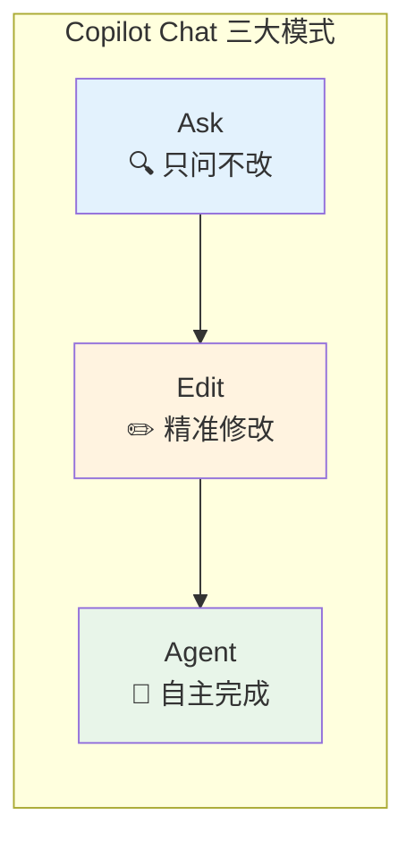

#### 1️⃣ Ask 模式：只问不改

**定位**：对话式查询引擎，获取答案和解释，**不修改任何代码**。

**适用场景**：

-   理解代码逻辑：「这段代码做了什么？」

-   学习新概念：「Go 的 context 包怎么用？」

-   调试思路：「为什么这里会 panic？」

-   架构咨询：「微服务拆分有什么建议？」

**示例**：

##### 2️⃣ Edit 模式：精准修改

**定位**：用自然语言指令修改代码，**以 Diff 形式展示变更**供你审核。

**适用场景**：

-   单文件或多文件的定向修改

-   重构特定函数

-   添加错误处理、日志、注释

-   代码格式调整

**特点**：

-   生成修改后展示 Diff，由你决定接受或拒绝

-   对修改范围有精确控制

-   适合已知要改什么、只需 AI 执行的场景

**示例**：

##### 3️⃣ Agent 模式：自主完成（核心重点）

**定位**：自主编程伙伴，能够**理解项目上下文、自动迭代、执行终端命令**。

**核心能力**：

| **能力** | **说明** |
| :--- | :--- |
| **多文件重构** | 跨文件理解和修改代码 |
| **自动纠错** | 检测错误并自动修复，持续迭代直到完成 |
| **执行命令** | 运行构建、测试等终端命令（需确认） |
| **任务推断** | 推断未明确要求但必要的子任务 |

**适用场景**：

-   从零创建新功能模块

-   迁移旧代码到新框架

-   编写并运行测试用例

-   复杂的多步骤开发任务

**示例**：

#### 模式选择指南

| **场景** | **推荐模式** |
| :--- | :--- |
| 「这段代码什么意思？」 | Ask |
| 「给这个函数加个注释」 | Edit |
| 「帮我实现用户登出功能」 | Agent |
| 「项目架构有什么问题？」 | Ask |
| 「重命名这个变量」 | Edit / Inline Chat |
| 「写个 CRUD 接口并测试」 | Agent |

**演示内容**：用 Agent 模式完成一个完整功能（如添加一个带测试的 API
端点）

### 2.2 Claude Code 实战

[!TIP]

🎬 **演示提醒**：此处建议使用 VSCode 的终端运行 Claude
Code，演示完整的开发流程

#### 基础命令

#### 核心能力展示

**1. 读取和理解项目**

**2. 自主搜索代码**

**3. 直接编辑代码**

**4. 运行命令并分析结果**

#### CLAUDE.md 的作用

CLAUDE.md 文件让 Claude Code 更好地理解你的项目：

| **配置项** | **作用** |
| :--- | :--- |
| 项目简介 | 快速了解项目背景 |
| 技术栈 | 生成符合项目风格的代码 |
| 目录结构 | 知道代码放在哪里 |
| 代码规范 | 遵循团队约定 |
| 常用命令 | 知道如何构建、测试 |

**演示内容**：用 Claude Code
完成一个需求（基于公司项目），展示完整的"理解需求 → 分析代码 → 编写实现
→ 运行测试"流程。

### 2.3 工具选择心法

根据不同场景选择最合适的工具：

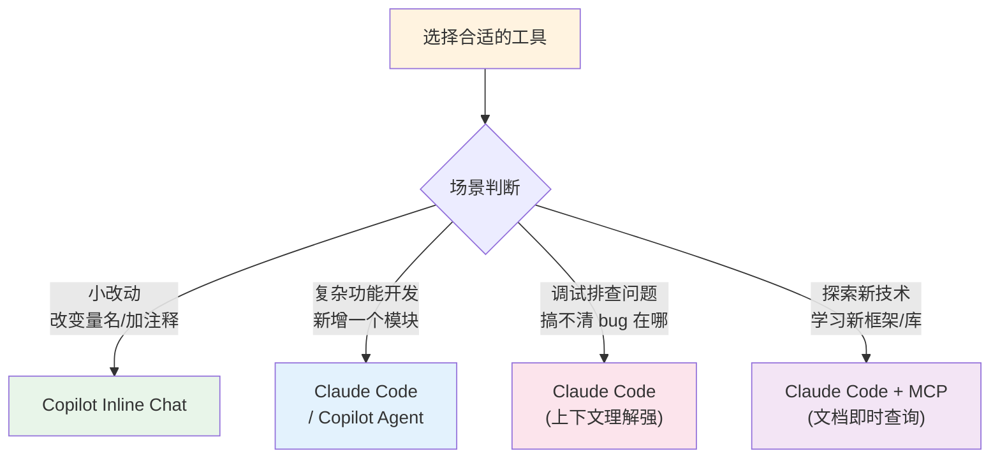
**关键原则**：

1.  **小任务用轻量工具**：简单修改用 Copilot Inline Chat，几秒钟搞定

2.  **大任务用强力工具**：复杂功能用 Claude Code，它能理解更多上下文

3.  **不确定时先问再做**：用 Chat 讨论方案，确认后再动手

## 三、MCP 与 Skill：扩展 AI 的能力边界

### 3.1 MCP 是什么？

**MCP** (Model Context Protocol，模型上下文协议) 是一个让 AI
工具调用外部能力的标准协议。

#### 类比理解

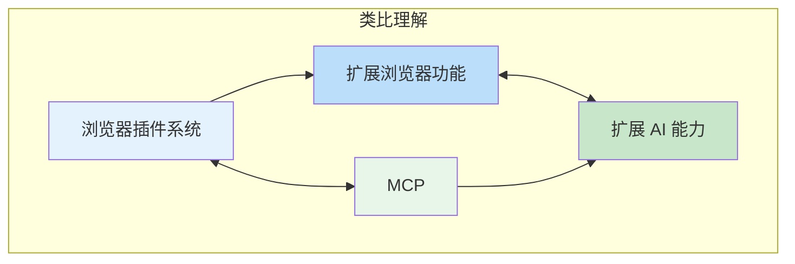

#### 架构图

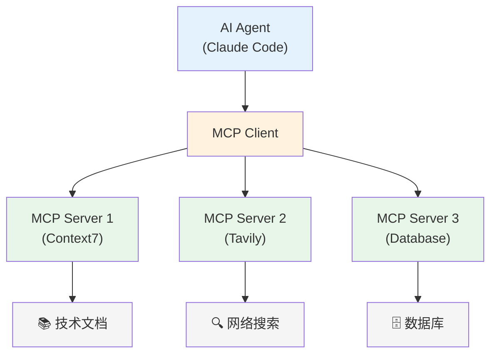

#### MCP 能做什么？

| **能力类别** | **示例** |
| :--- | :--- |
| 获取信息 | 读取文档、搜索网络、查询数据库 |
| 操作资源 | 创建文件、发送请求、管理 Git |
| 集成服务 | 连接 Slack、Jira、Notion 等 |

### 3.2 常用 MCP 工具推荐

| **MCP 工具** | **功能** | **使用场景** | **推荐度** |
| :--- | :--- | :--- | :--- |
| **Context7** | 实时获取最新技术文档 | 使用新框架/库时获取最新 API 文档 | ⭐⭐⭐⭐⭐ |
| **Tavily** | AI 优化的网络搜索 | 查找解决方案、最佳实践 | ⭐⭐⭐⭐⭐ |
| **Filesystem** | 文件系统操作 | 批量文件处理、模板生成 | ⭐⭐⭐⭐ |
| **PostgreSQL** | PostgreSQL 数据库操作 | 数据查询、Schema 理解 | ⭐⭐⭐⭐ |
| **MySQL** | MySQL 数据库操作 | 数据查询、Schema 理解 | ⭐⭐⭐⭐ |
| **Fetch** | HTTP 请求 | API 调试、数据获取 | ⭐⭐⭐ |
| **GitHub** | GitHub 仓库操作 | PR 管理、Issue 处理 | ⭐⭐⭐⭐ |

#### Context7 使用示例

#### Tavily 使用示例

### 3.3 Skill 是什么？

**Skill** 是预定义的指令集 + 脚本，让 AI 按照特定方式完成任务。

#### MCP vs Skill


#### 典型 Skill 示例

**1. planning-with-files**：先规划、再执行的任务处理模式

**2. superpowers**：一套增强 Agent 能力的 Skill 集合

### 3.4 如何配置 MCP（以 Claude Code 为例）

[!TIP]

🎬 **演示提醒**：此处建议使用 VSCode 打开 MCP 配置文件进行现场演示

#### 配置文件位置

#### 配置示例

#### 验证 MCP 配置

## 四、Vibe Coding vs Spec Coding

### 4.1 两种编程范式对比

在 AI 辅助编程时代，出现了两种主要的工作范式：

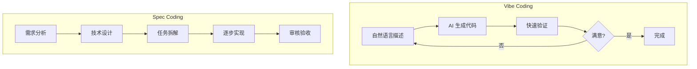

| **维度** | **Vibe Coding** | **Spec Coding** |
| :--- | :--- | :--- |
| **核心理念** | 自然语言驱动，快速迭代 | 规范先行，结构化开发 |
| **工作流程** | 描述 → 生成 → 调整 → 循环 | 规范 → 任务拆解 → 逐步实现 |
| **适用场景** | 原型开发、小型项目、探索性编码 | 复杂功能、团队协作、长期维护 |
| **优势** | 速度快、门槛低、适合探索 | 可控性强、质量稳定、易于维护 |
| **风险** | 可能失控、代码质量不稳定 | 前期投入大、灵活性较低 |

### 4.2 Vibe Coding 实践要点

Vibe Coding 的精髓在于"**快速迭代，频繁验证**"：

#### 最佳实践

#### Vibe Coding 的"氛围感"

### 4.3 Spec Coding 与 OpenSpec

#### OpenSpec 是什么？

OpenSpec 是一套规范化的 AI 编程工作流框架，它通过结构化的文档驱动 AI
开发。

#### OpenSpec 核心流程

OpenSpec 1.0
采用"**行为，而非阶段**"的理念------任何制品都可以随时修订，根据实现中学到的内容改进。

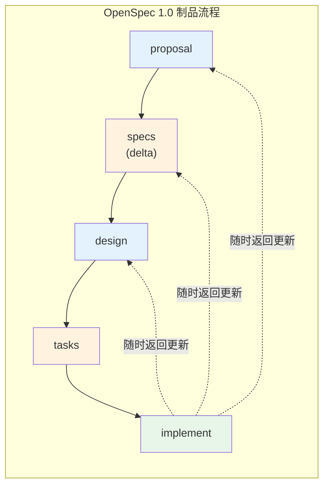

**核心命令**：

| **命令** | **用途** |
| :--- | :--- |
| `/opsx:new` | 创建新变更 |
| `/opsx:ff` | 快进生成所有规划制品 |
| `/opsx:continue` | 逐步创建下一个制品 |
| `/opsx:apply` | 实现任务 |
| `/opsx:archive` | 归档变更，合并规范 |

#### OpenSpec 项目结构示例

OpenSpec 将工作组织为两个主要区域：specs/（系统当前行为的真实来源）和
changes/（提议的修改）。

**Delta Specs**（增量规范）是 OpenSpec
的关键创新：只描述添加/修改/删除的需求，而非重述整个规范，特别适合棕地项目。

#### OpenSpec 的优势

| **优势** | **说明** |
| :--- | :--- |
| **可追溯** | 每个决策都有文档记录 |
| **可复现** | 同样的规范可得到一致的结果 |
| **易协作** | 团队成员可以基于文档讨论 |
| **质量可控** | 分阶段审核，及时发现问题 |

[!TIP]

🎬 **演示提醒**：此处建议使用 VSCode 打开一个使用 OpenSpec
的项目，演示完整的开发流程

**演示内容**：展示一个 OpenSpec 驱动的开发过程（需求文档 → 设计文档 →
任务分解 → AI 执行）

### 4.4 我的建议

[!IMPORTANT]

**小需求 Vibe，大功能 Spec**

不要教条，根据任务复杂度灵活选择。

#### 选择指南

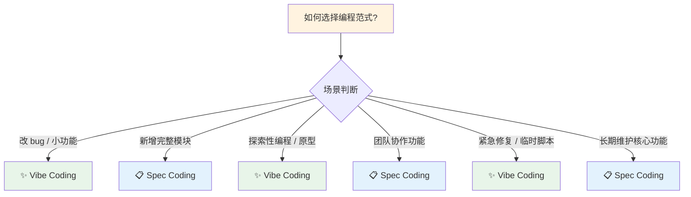

## 五、工具性价比分析

### 5.1 综合评估表

| **工具** | **价格** | **效果** | **申请难度** | **综合推荐度** | **备注** |
| :--- | :--- | :--- | :--- | :--- | :--- |
| **Claude Code** | 按 token 计费 | ⭐⭐⭐⭐⭐ | 简单 | ⭐⭐⭐⭐⭐ | 可用 OpenRouter 降低成本 |
| **Antigravity** | 完全免费 | ⭐⭐⭐⭐ | 简单 | ⭐⭐⭐⭐⭐ | Google 出品，独立 IDE |
| **GitHub Copilot** | Free/$10/$39/月 | ⭐⭐⭐⭐ | 简单 | ⭐⭐⭐⭐ | 最成熟的 AI Coding 工具 |
| **Kiro** | Free 50积分/$20/月 | ⭐⭐⭐⭐ | 简单 | ⭐⭐⭐⭐ | Spec-Driven 开发首选 |
| **Codex** | ChatGPT Plus $20/月起 | ⭐⭐⭐⭐ | 需订阅 | ⭐⭐⭐ | 推理能力强 |
| **OpenCode** | 开源免费 | ⭐⭐⭐ | 需配置 | ⭐⭐⭐ | 支持 75+ LLM 可高度定制 |
| **Gemini CLI** | 免费 | ⭐⭐⭐⭐ | 简单 | ⭐⭐⭐⭐ | 免费额度慷慨 |
| **Cursor** | Free/$20/月 | ⭐⭐⭐⭐ | 简单 | ⭐⭐⭐⭐ | AI-first IDE |

### 5.2 我的组合推荐

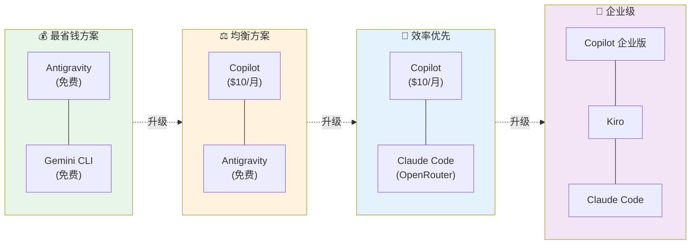

### 5.3 成本控制技巧

#### 技巧一：合理选择模型

| **任务类型** | **推荐模型** | **成本对比** |
| :--- | :--- | :--- |
| 简单补全/修改 | claude-haiku-4.5 | x0.33 |
| 日常开发 | claude-sonnet-4.5 | x1 |
| 复杂推理 | claude-opus-4.5 | x3 |

简单任务用 Haiku，成本只有 Sonnet 的 1/10！

#### 技巧二：使用 OpenRouter 按需付费

#### 技巧三：充分利用免费额度

#### 技巧四：优化 Prompt 减少 Token

## 六、展望与总结

### 6.1 2026 年 AI Coding 趋势预测

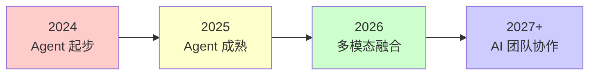

| **趋势** | **当前状态** | **未来方向** |
| :--- | :--- | :--- |
| **Agent 化加速** | 从 "生成代码" 到 "自主完成任务" | 更复杂的自主规划和执行 |
| **多模态融合** | 文本为主 | 图片、语音、视频作为输入 |
| **IDE 深度整合** | AI 作为插件存在 | AI 成为 IDE 的核心能力 |
| **团队协作** | 单人使用 AI | 多 Agent 协同，AI 参与 Code Review |

### 6.2 AI 时代程序员的核心能力

能力结构正在发生变化：

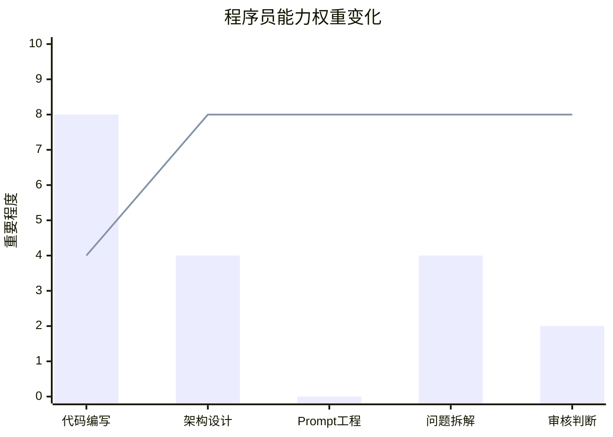

📊
**图表说明**：柱状图表示"以前"的能力权重，折线图表示"现在/未来"的能力权重

**代码编写**：还是要会，但不再是唯一核心

**架构设计**：越来越重要，AI 还不擅长

**Prompt 工程**：新的核心技能，决定 AI 输出质量

**问题拆解**：让 AI 更好执行的关键

**审核判断**：最后的质量把关，必须人来做

### 6.3 给大家的建议

[!IMPORTANT]

AI 是工具，人是决策者。**四点建议**：

| **#** | **建议** | **行动** |
| :--- | :--- | :--- |
| 1 | **现在就开始用** | 不要等，AI Coding 的学习曲线在实践中 |
| 2 | **建立自己的工作流** | 找到适合自己的工具组合和使用习惯 |
| 3 | **保持学习** | 这个领域变化极快，持续关注新工具和最佳实践 |
| 4 | **保持思考** | 不要依赖 AI 而放弃思考，要理解 AI 生成的代码 |

**"AI Coding 不是让你写更少的代码，而是让你思考更多的可能性。"**

## 附录

### A. 资源链接

| **资源** | **链接** | **说明** |
| :--- | :--- | :--- |
| OpenRouter | [OpenRouter](https://openrouter.ai/) | API 聚合平台 |
| Claude Code | [claude.ai/code](https://claude.ai/code) | Anthropic 官方 CLI 工具 |
| GitHub Copilot | [GitHub Copilot](https://github.com/features/copilot) | AI 代码补全 |
| Gemini CLI | [Gemini CLI](https://github.com/google-gemini/gemini-cli) | Google 开源 CLI 工具 |
| OpenCode | [OpenCode](https://opencode.ai/) | 开源 AI Coding Agent |
| Cursor | [Cursor](https://cursor.com/) | AI-first IDE |
| Antigravity | [Antigravity](https://antigravity.google/) | Google 出品 AI IDE |
| Kiro | [Kiro](https://kiro.dev/) | AWS Spec-Driven IDE |
| MCP 官方规范 | [MCP Protocol](https://modelcontextprotocol.io/) | MCP 协议文档 |
| cc-switch | [cc-switch](https://github.com/nicepkg/cc-switch) | API 配置切换工具 |

### B. 分享中涉及的演示

[!TIP]

🎬 以下演示需要使用 VSCode 打开项目进行

| **#** | **演示内容** | **使用工具** | **时长** |
| :--- | :--- | :--- | :--- |
| 1 | Copilot 基础功能演示 | VSCode + Copilot | 5min |
| 2 | Copilot Agent 模式功能开发 | VSCode + Copilot | 5min |
| 3 | Claude Code 需求实现全流程 | VSCode Terminal + Claude Code | 5min |
| 4 | MCP 配置与使用演示 | VSCode + Claude Code | 3min |
| 5 | OpenSpec 工作流演示 | VSCode + Claude Code | 5min |

### C. 常见问题 FAQ

**Q1: Claude Code 和 GitHub Copilot 有什么区别？**

A: Copilot 更适合日常编码辅助（补全、小修改），Claude Code
更适合复杂任务（自主理解项目、执行多步骤操作）。建议两者配合使用。

**Q2: OpenRouter 安全吗？会不会泄露代码？**

A: OpenRouter 是比较成熟的服务，但如果涉及敏感代码，建议使用官方 API
或自部署方案。

**Q3: 如何估算 AI Coding 的成本？**

A: 建议先用小额预算试用（如
\$10），了解自己的使用模式后再决定订阅方案。OpenRouter
可以看到每次调用的成本。

**Q4: AI 生成的代码出了 bug 谁负责？**

A: 你负责。AI 是助手不是责任人，所有代码最终都要经过你的审核。
